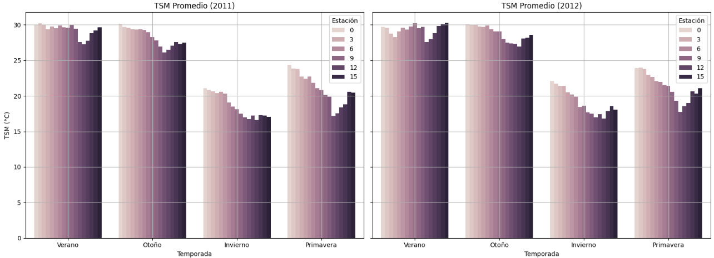
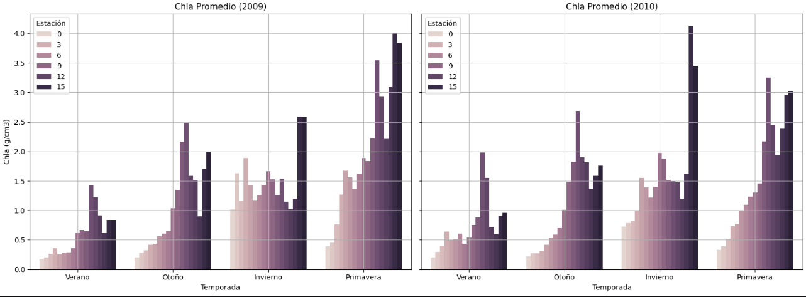
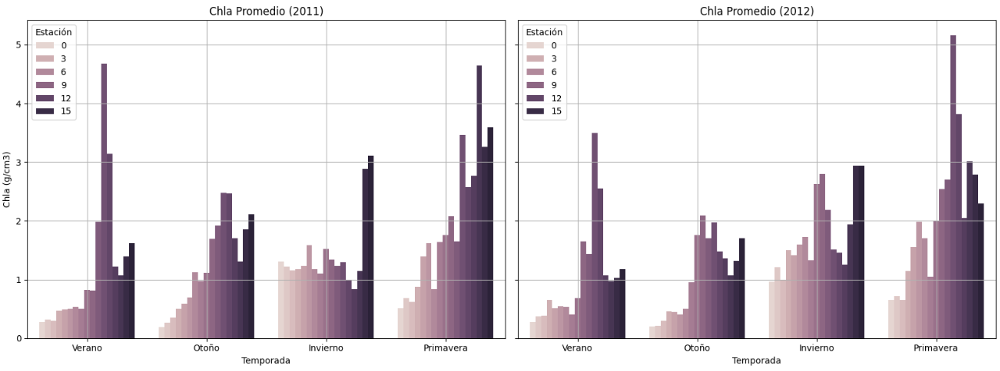
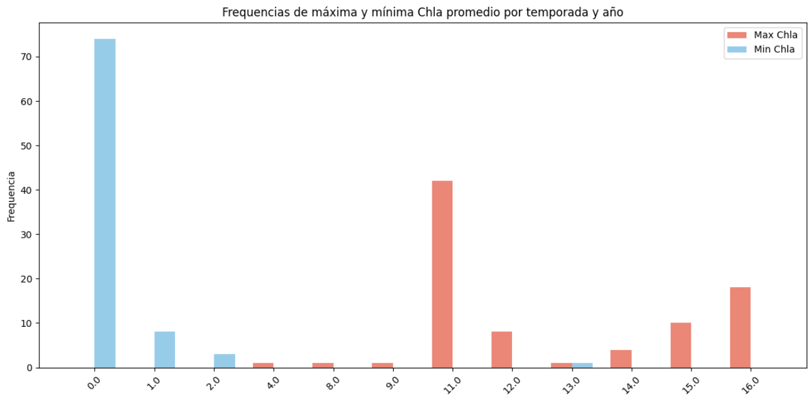
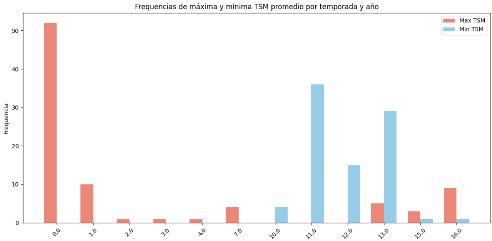

# 1. Variabilidad en TSM y Chla

---

## Variación en las Estaciones 11-15: Posible Influencia Insular

Durante el análisis de las estaciones 11 a 15, se ha identificado una **variación atípica** en comparación con el resto del transecto costero. Estas estaciones presentan comportamientos distintos, posiblemente debido a su **proximidad a islas** o formaciones insulares cercanas. Las formaciones que se encuentran cerca a estas estaciones son la Isla San Lorenzo y la Isla Ángel de la Guarda.

### Posibles causas:
- **Efecto sombra** de las islas, alterando la dinámica local de circulación.
- **Aporte de nutrientes** desde las islas o zonas intermareales, lo que puede aumentar la productividad biológica.

Estas influencias pueden provocar tanto **anomalías térmicas**, como se reflejan en las gráficas:

como **incrementos localizados de clorofila**, reflejando un ecosistema parcialmente desconectado del patrón general de la costa abierta.

##  Frecuencias de Mayor Temperatura y Clorofila: Estaciones 11-15

- Las **estaciones 11 a 15** muestran una mayor frecuencia de eventos con **altas concentraciones de clorofila** por año y por temporada.
  - Esto sugiere una zona de **alta productividad primaria**, posiblemente sostenida por procesos locales como afloramiento, retención costera o subsidios insulares.

- Por el contrario, en estas mismas estaciones se observa una **frecuencia menor de temperaturas superficiales elevadas**.
  - Este patrón es consistente con zonas donde el afloramiento de aguas profundas frías es frecuente, lo cual también explicaría la alta clorofila observada.

Este **gradiente inverso** (↓ TSM / ↑ Chl-a) refuerza la hipótesis de una **dinámica oceanográfica particular** en este sector del transecto, probablemente influenciada por factores físicos y topográficos locales.

---

