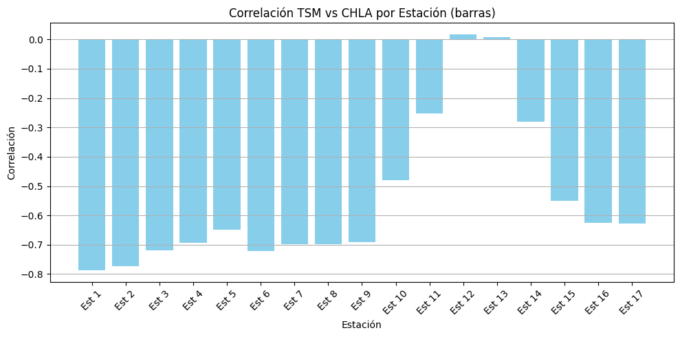

# Análisis de Variabilidad de TSM y CHLA en el Pacífico Colombiano (1981–2018)

Este cuaderno tiene como objetivo explorar y analizar la **variabilidad espacial y temporal** de la **temperatura superficial del mar (TSM)** y la **clorofila (CHLA)** en función de los eventos climáticos del **ENSO** (*El Niño*, *La Niña* y *Neutro*), desde septiembre de 1981 hasta octubre de 2018.

Se aplican análisis estadísticos, pruebas no paramétricas y visualizaciones interactivas para identificar patrones de respuesta en diferentes estaciones geográficas y temporadas climáticas.

El análisis incluye:

- Estadísticas por evento ENSO
- Variabilidad mensual y estacional
- Comparaciones entre estaciones
- Mapas interactivos de TSM y CHLA
- Evaluación de la variabilidad por estación


```python
import pandas as pd
import numpy as np
import matplotlib.pyplot as plt
import seaborn as sns
from pathlib import Path
import geopandas as gpd
from shapely.geometry import Point
from unidecode import unidecode
from scipy import stats
from scipy.stats import zscore, kruskal, shapiro
import folium
from folium.features import DivIcon
import scikit_posthocs as sp
```

## Carga y Preparación de Datos

En esta sección, vamos a:

1. **Cargar los archivos de datos**:  
   - TSM (Temperatura Superficial del Mar)  
   - CHLA (Clorofila)  
   - Coordenadas de estaciones

2. **Unificar los datos en un solo DataFrame** combinando TSM y CHLA mediante un `outer join`, alineados por **fecha** y **estación**.

3. Realizar un **análisis descriptivo inicial** para comprender la estructura de los datos, valores faltantes, distribución general de TSM y CHLA, y la clasificación por eventos ENSO (`Niño`, `Niña`, `Neutro`).

Este paso establece la base para todos los análisis posteriores.


```python
ruta_actual = Path.cwd()
PROJECT_DIR = ruta_actual.parents[1]
RAW_DIR     = PROJECT_DIR / 'data' / 'raw'

```


```python
tsm = pd.read_excel(RAW_DIR / 'Base de datos TSM consultoria estadística.xlsx')
chla = pd.read_excel(RAW_DIR / 'Base de datos Chla consultoria estadística.xlsx')
coordenadas = pd.read_csv(RAW_DIR / 'Coordenadas zona costera occidental GC.csv', header=None, names=['longitud', 'hola', 'latitud'], index_col=False)
coordenadas =  coordenadas.drop("hola", axis=1)

oni = pd.read_csv(RAW_DIR / 'oni-Cold & Warm Episodes by Season.csv - Sheet1.csv')

tsm.columns = tsm.columns.str.strip().str.replace('°', '', regex=False)
chla.columns = chla.columns.str.strip().str.replace('°', '', regex=False)


oni = oni[oni['Year'].apply(lambda x: str(x).isdigit())].copy()
oni['Year'] = oni['Year'].astype(int)

# Formato largo
oni_long = oni.melt(id_vars='Year', var_name='Season', value_name='ONI')

# Mapeo estaciones móviles a meses
season_to_month = {
    'DJF': 1, 'JFM': 2, 'FMA': 3, 'MAM': 4,
    'AMJ': 5, 'MJJ': 6, 'JJA': 7, 'JAS': 8,
    'ASO': 9, 'SON': 10, 'OND': 11, 'NDJ': 12
}
oni_long['Month'] = oni_long['Season'].map(season_to_month)

# Crear columna de fecha
oni_long['Fecha'] = pd.to_datetime(dict(year=oni_long['Year'],
                                        month=oni_long['Month'],
                                        day=15))

# Limpiar y ordenar
oni_long = oni_long[['Fecha', 'ONI']].dropna().sort_values('Fecha').reset_index(drop=True)

# --- Alinear FECHAS para hacer merge ---
# Convertir FECHA a periodo mensual (año-mes) para tsm y chla
tsm['FECHA'] = pd.to_datetime(tsm['FECHA']).dt.to_period('M').dt.to_timestamp()
chla['FECHA'] = pd.to_datetime(chla['FECHA']).dt.to_period('M').dt.to_timestamp()
oni_long['Fecha'] = oni_long['Fecha'].dt.to_period('M').dt.to_timestamp()

# --- Merge de datos ---
merged_tsm = pd.merge(tsm, oni_long, left_on='FECHA', right_on='Fecha', how='inner')
merged_chla = pd.merge(chla, oni_long, left_on='FECHA', right_on='Fecha', how='inner')
merged_tsm = merged_tsm.drop("Fecha", axis=1)
merged_chla = merged_chla.drop("Fecha", axis=1)

```

### Renombrar columnas

Para facilitar el análisis y garantizar consistencia en el procesamiento, se renombrarán algunas columnas de los archivos cargados. Esto incluye estandarizar nombres como `est_1`, `oni`, `evento`, `fecha`, entre otros, y asegurar que no existan columnas duplicadas o mal definidas.

Este paso permite trabajar de forma más ordenada y aplicar transformaciones, agrupaciones y visualizaciones sin ambigüedad.


```python
def clean_df(df: pd.DataFrame) -> pd.DataFrame:
    """
    Normaliza nombres de columnas y acorta 'estacion_del_ano' y 'evento_interanual'.
    """
    # 1) Normalizar: quita tildes, espacios, pone minúsculas y guiones bajos
    df = df.rename(columns=lambda x: (
        unidecode(x)
        .strip()
        .lower()
        .replace(' ', '_')
    ))
    # 2) Acortar nombres específicos
    df = df.rename(columns={
        'estacion_del_ano':  'estacion',
        'evento_interanual': 'evento'
    })
    return df
```


```python
try:
    # Limpia ambos DataFrames
    merged_tsm  = clean_df(merged_tsm)
    merged_chla = clean_df(merged_chla)

except Exception as e:
    print("❌ Ocurrió un error al normalizar los DataFrames:", e)
```

### Conversión a datos geoespaciales

Para realizar análisis y visualizaciones espaciales, convertimos las columnas `latitud` y `longitud` del archivo de coordenadas en una geometría de tipo `Point` usando la librería `geopandas`.

Esto nos permite trabajar con las estaciones como objetos geográficos, habilitando operaciones espaciales, creación de mapas interactivos y futuras exportaciones en formatos geoespaciales (como GeoJSON o Shapefile).

El sistema de coordenadas asignado fue **EPSG:4326** (WGS84), estándar para datos geográficos globales.


```python
geometry = [Point(lon, lat) for lat, lon in zip(coordenadas["latitud"], coordenadas["longitud"])]

# Crear GeoDataFrame con sistema de referencia geográfico WGS84
gdf = gpd.GeoDataFrame(coordenadas, geometry=geometry, crs="EPSG:4326")

centro = [
    gdf.to_crs(epsg=4326)["geometry"].y.mean(),
    gdf.to_crs(epsg=4326)["geometry"].x.mean()
]

# 2) Crea el mapa
m = folium.Map(location=centro, zoom_start=10, tiles="OpenStreetMap")

# 3) Añade cada punto con etiqueta numérica
#    Iteramos sobre el GeoDataFrame en coordenadas geográficas (EPSG:4326)
gdf_wgs = gdf.to_crs(epsg=4326).reset_index(drop=True)
for idx, row in gdf_wgs.iterrows():
    lat, lon = row.geometry.y, row.geometry.x
    numero = idx + 1  # de 1 a 17 (o N)
    folium.CircleMarker(
        location=(lat, lon),
        radius=6,
        color="red",
        fill=True,
        fill_opacity=0.8
    ).add_to(m)
    # Etiqueta con DivIcon justo encima del marcador
    folium.map.Marker(
        [lat, lon],
        icon=DivIcon(
            icon_size=(30,30),
            icon_anchor=(15, -10),
            html=f'<div style="font-size:14pt; color:blue; font-weight:bold">{numero}</div>'
        )
    ).add_to(m)

# 4) Muestra el mapa
m  # en Jupyter aparece embebido; en script, usa m.save("mapa.html")
```


<div style="width:100%;"><div style="position:relative;width:100%;height:0;padding-bottom:60%;"><span style="color:#565656">Make this Notebook Trusted to load map: File -> Trust Notebook</span><iframe srcdoc="&lt;!DOCTYPE html&gt;
&lt;html&gt;
&lt;head&gt;

    &lt;meta http-equiv=&quot;content-type&quot; content=&quot;text/html; charset=UTF-8&quot; /&gt;

        &lt;script&gt;
            L_NO_TOUCH = false;
            L_DISABLE_3D = false;
        &lt;/script&gt;

    &lt;style&gt;html, body {width: 100%;height: 100%;margin: 0;padding: 0;}&lt;/style&gt;
    &lt;style&gt;#map {position:absolute;top:0;bottom:0;right:0;left:0;}&lt;/style&gt;
    &lt;script src=&quot;https://cdn.jsdelivr.net/npm/leaflet@1.9.3/dist/leaflet.js&quot;&gt;&lt;/script&gt;
    &lt;script src=&quot;https://code.jquery.com/jquery-3.7.1.min.js&quot;&gt;&lt;/script&gt;
    &lt;script src=&quot;https://cdn.jsdelivr.net/npm/bootstrap@5.2.2/dist/js/bootstrap.bundle.min.js&quot;&gt;&lt;/script&gt;
    &lt;script src=&quot;https://cdnjs.cloudflare.com/ajax/libs/Leaflet.awesome-markers/2.0.2/leaflet.awesome-markers.js&quot;&gt;&lt;/script&gt;
    &lt;link rel=&quot;stylesheet&quot; href=&quot;https://cdn.jsdelivr.net/npm/leaflet@1.9.3/dist/leaflet.css&quot;/&gt;
    &lt;link rel=&quot;stylesheet&quot; href=&quot;https://cdn.jsdelivr.net/npm/bootstrap@5.2.2/dist/css/bootstrap.min.css&quot;/&gt;
    &lt;link rel=&quot;stylesheet&quot; href=&quot;https://netdna.bootstrapcdn.com/bootstrap/3.0.0/css/bootstrap-glyphicons.css&quot;/&gt;
    &lt;link rel=&quot;stylesheet&quot; href=&quot;https://cdn.jsdelivr.net/npm/@fortawesome/fontawesome-free@6.2.0/css/all.min.css&quot;/&gt;
    &lt;link rel=&quot;stylesheet&quot; href=&quot;https://cdnjs.cloudflare.com/ajax/libs/Leaflet.awesome-markers/2.0.2/leaflet.awesome-markers.css&quot;/&gt;
    &lt;link rel=&quot;stylesheet&quot; href=&quot;https://cdn.jsdelivr.net/gh/python-visualization/folium/folium/templates/leaflet.awesome.rotate.min.css&quot;/&gt;

            &lt;meta name=&quot;viewport&quot; content=&quot;width=device-width,
                initial-scale=1.0, maximum-scale=1.0, user-scalable=no&quot; /&gt;
            &lt;style&gt;
                #map_7a5e181a7639742015ae643dff235b5c {
                    position: relative;
                    width: 100.0%;
                    height: 100.0%;
                    left: 0.0%;
                    top: 0.0%;
                }
                .leaflet-container { font-size: 1rem; }
            &lt;/style&gt;

&lt;/head&gt;
&lt;body&gt;


            &lt;div class=&quot;folium-map&quot; id=&quot;map_7a5e181a7639742015ae643dff235b5c&quot; &gt;&lt;/div&gt;

&lt;/body&gt;
&lt;script&gt;


            var map_7a5e181a7639742015ae643dff235b5c = L.map(
                &quot;map_7a5e181a7639742015ae643dff235b5c&quot;,
                {
                    center: [27.16470588235294, -111.98235294117646],
                    crs: L.CRS.EPSG3857,
                    ...{
  &quot;zoom&quot;: 10,
  &quot;zoomControl&quot;: true,
  &quot;preferCanvas&quot;: false,
}

                }
            );


            var tile_layer_9aad5ff2701e8c1d494f17bbee752285 = L.tileLayer(
                &quot;https://tile.openstreetmap.org/{z}/{x}/{y}.png&quot;,
                {
  &quot;minZoom&quot;: 0,
  &quot;maxZoom&quot;: 19,
  &quot;maxNativeZoom&quot;: 19,
  &quot;noWrap&quot;: false,
  &quot;attribution&quot;: &quot;\u0026copy; \u003ca href=\&quot;https://www.openstreetmap.org/copyright\&quot;\u003eOpenStreetMap\u003c/a\u003e contributors&quot;,
  &quot;subdomains&quot;: &quot;abc&quot;,
  &quot;detectRetina&quot;: false,
  &quot;tms&quot;: false,
  &quot;opacity&quot;: 1,
}

            );


            tile_layer_9aad5ff2701e8c1d494f17bbee752285.addTo(map_7a5e181a7639742015ae643dff235b5c);


            var circle_marker_e1d38034f4611c9dcdd2e96c734baba1 = L.circleMarker(
                [23.8, -109.3],
                {&quot;bubblingMouseEvents&quot;: true, &quot;color&quot;: &quot;red&quot;, &quot;dashArray&quot;: null, &quot;dashOffset&quot;: null, &quot;fill&quot;: true, &quot;fillColor&quot;: &quot;red&quot;, &quot;fillOpacity&quot;: 0.8, &quot;fillRule&quot;: &quot;evenodd&quot;, &quot;lineCap&quot;: &quot;round&quot;, &quot;lineJoin&quot;: &quot;round&quot;, &quot;opacity&quot;: 1.0, &quot;radius&quot;: 6, &quot;stroke&quot;: true, &quot;weight&quot;: 3}
            ).addTo(map_7a5e181a7639742015ae643dff235b5c);


            var marker_bbe8d0d55655637c95c2b76bfa4e91d6 = L.marker(
                [23.8, -109.3],
                {
}
            ).addTo(map_7a5e181a7639742015ae643dff235b5c);


            var div_icon_55c4f39aee84786c1f4d9b3fe8e6f19f = L.divIcon({
  &quot;html&quot;: &quot;\u003cdiv style=\&quot;font-size:14pt; color:blue; font-weight:bold\&quot;\u003e1\u003c/div\u003e&quot;,
  &quot;iconSize&quot;: [30, 30],
  &quot;iconAnchor&quot;: [15, -10],
  &quot;className&quot;: &quot;empty&quot;,
});
            marker_bbe8d0d55655637c95c2b76bfa4e91d6.setIcon(div_icon_55c4f39aee84786c1f4d9b3fe8e6f19f);


                marker_bbe8d0d55655637c95c2b76bfa4e91d6.setIcon(div_icon_55c4f39aee84786c1f4d9b3fe8e6f19f);


            var circle_marker_993a003f8874f926d8940a990850113f = L.circleMarker(
                [24.2, -109.7],
                {&quot;bubblingMouseEvents&quot;: true, &quot;color&quot;: &quot;red&quot;, &quot;dashArray&quot;: null, &quot;dashOffset&quot;: null, &quot;fill&quot;: true, &quot;fillColor&quot;: &quot;red&quot;, &quot;fillOpacity&quot;: 0.8, &quot;fillRule&quot;: &quot;evenodd&quot;, &quot;lineCap&quot;: &quot;round&quot;, &quot;lineJoin&quot;: &quot;round&quot;, &quot;opacity&quot;: 1.0, &quot;radius&quot;: 6, &quot;stroke&quot;: true, &quot;weight&quot;: 3}
            ).addTo(map_7a5e181a7639742015ae643dff235b5c);


            var marker_272c15567a954699f4e09e8869afca8e = L.marker(
                [24.2, -109.7],
                {
}
            ).addTo(map_7a5e181a7639742015ae643dff235b5c);


            var div_icon_f028a0c7adab81e56f4bde1b246716cf = L.divIcon({
  &quot;html&quot;: &quot;\u003cdiv style=\&quot;font-size:14pt; color:blue; font-weight:bold\&quot;\u003e2\u003c/div\u003e&quot;,
  &quot;iconSize&quot;: [30, 30],
  &quot;iconAnchor&quot;: [15, -10],
  &quot;className&quot;: &quot;empty&quot;,
});
            marker_272c15567a954699f4e09e8869afca8e.setIcon(div_icon_f028a0c7adab81e56f4bde1b246716cf);


                marker_272c15567a954699f4e09e8869afca8e.setIcon(div_icon_f028a0c7adab81e56f4bde1b246716cf);


            var circle_marker_8f3a579716b1db7bdc8f8c43e8596d22 = L.circleMarker(
                [24.6, -110.1],
                {&quot;bubblingMouseEvents&quot;: true, &quot;color&quot;: &quot;red&quot;, &quot;dashArray&quot;: null, &quot;dashOffset&quot;: null, &quot;fill&quot;: true, &quot;fillColor&quot;: &quot;red&quot;, &quot;fillOpacity&quot;: 0.8, &quot;fillRule&quot;: &quot;evenodd&quot;, &quot;lineCap&quot;: &quot;round&quot;, &quot;lineJoin&quot;: &quot;round&quot;, &quot;opacity&quot;: 1.0, &quot;radius&quot;: 6, &quot;stroke&quot;: true, &quot;weight&quot;: 3}
            ).addTo(map_7a5e181a7639742015ae643dff235b5c);


            var marker_1f6726548465f2e5735cd501db27539b = L.marker(
                [24.6, -110.1],
                {
}
            ).addTo(map_7a5e181a7639742015ae643dff235b5c);


            var div_icon_6cb698c0e2c84724f7f2f82af46a2cc9 = L.divIcon({
  &quot;html&quot;: &quot;\u003cdiv style=\&quot;font-size:14pt; color:blue; font-weight:bold\&quot;\u003e3\u003c/div\u003e&quot;,
  &quot;iconSize&quot;: [30, 30],
  &quot;iconAnchor&quot;: [15, -10],
  &quot;className&quot;: &quot;empty&quot;,
});
            marker_1f6726548465f2e5735cd501db27539b.setIcon(div_icon_6cb698c0e2c84724f7f2f82af46a2cc9);


                marker_1f6726548465f2e5735cd501db27539b.setIcon(div_icon_6cb698c0e2c84724f7f2f82af46a2cc9);


            var circle_marker_719ba5f8ace5d33e0f97ff0ff296bc70 = L.circleMarker(
                [24.8, -110.5],
                {&quot;bubblingMouseEvents&quot;: true, &quot;color&quot;: &quot;red&quot;, &quot;dashArray&quot;: null, &quot;dashOffset&quot;: null, &quot;fill&quot;: true, &quot;fillColor&quot;: &quot;red&quot;, &quot;fillOpacity&quot;: 0.8, &quot;fillRule&quot;: &quot;evenodd&quot;, &quot;lineCap&quot;: &quot;round&quot;, &quot;lineJoin&quot;: &quot;round&quot;, &quot;opacity&quot;: 1.0, &quot;radius&quot;: 6, &quot;stroke&quot;: true, &quot;weight&quot;: 3}
            ).addTo(map_7a5e181a7639742015ae643dff235b5c);


            var marker_25d380bfb08dea50be08c9cdba7d1220 = L.marker(
                [24.8, -110.5],
                {
}
            ).addTo(map_7a5e181a7639742015ae643dff235b5c);


            var div_icon_28396c2251a9be861941d7d9eff26ba4 = L.divIcon({
  &quot;html&quot;: &quot;\u003cdiv style=\&quot;font-size:14pt; color:blue; font-weight:bold\&quot;\u003e4\u003c/div\u003e&quot;,
  &quot;iconSize&quot;: [30, 30],
  &quot;iconAnchor&quot;: [15, -10],
  &quot;className&quot;: &quot;empty&quot;,
});
            marker_25d380bfb08dea50be08c9cdba7d1220.setIcon(div_icon_28396c2251a9be861941d7d9eff26ba4);


                marker_25d380bfb08dea50be08c9cdba7d1220.setIcon(div_icon_28396c2251a9be861941d7d9eff26ba4);


            var circle_marker_2a9a6b2187448784511cc94da2b84156 = L.circleMarker(
                [25.3, -110.8],
                {&quot;bubblingMouseEvents&quot;: true, &quot;color&quot;: &quot;red&quot;, &quot;dashArray&quot;: null, &quot;dashOffset&quot;: null, &quot;fill&quot;: true, &quot;fillColor&quot;: &quot;red&quot;, &quot;fillOpacity&quot;: 0.8, &quot;fillRule&quot;: &quot;evenodd&quot;, &quot;lineCap&quot;: &quot;round&quot;, &quot;lineJoin&quot;: &quot;round&quot;, &quot;opacity&quot;: 1.0, &quot;radius&quot;: 6, &quot;stroke&quot;: true, &quot;weight&quot;: 3}
            ).addTo(map_7a5e181a7639742015ae643dff235b5c);


            var marker_ed001da6473f156ea23eeb0769176221 = L.marker(
                [25.3, -110.8],
                {
}
            ).addTo(map_7a5e181a7639742015ae643dff235b5c);


            var div_icon_3e5302b856b1e7e72848333ed217f726 = L.divIcon({
  &quot;html&quot;: &quot;\u003cdiv style=\&quot;font-size:14pt; color:blue; font-weight:bold\&quot;\u003e5\u003c/div\u003e&quot;,
  &quot;iconSize&quot;: [30, 30],
  &quot;iconAnchor&quot;: [15, -10],
  &quot;className&quot;: &quot;empty&quot;,
});
            marker_ed001da6473f156ea23eeb0769176221.setIcon(div_icon_3e5302b856b1e7e72848333ed217f726);


                marker_ed001da6473f156ea23eeb0769176221.setIcon(div_icon_3e5302b856b1e7e72848333ed217f726);


            var circle_marker_568550a7899c3c39904e20342dd5678e = L.circleMarker(
                [25.8, -111.1],
                {&quot;bubblingMouseEvents&quot;: true, &quot;color&quot;: &quot;red&quot;, &quot;dashArray&quot;: null, &quot;dashOffset&quot;: null, &quot;fill&quot;: true, &quot;fillColor&quot;: &quot;red&quot;, &quot;fillOpacity&quot;: 0.8, &quot;fillRule&quot;: &quot;evenodd&quot;, &quot;lineCap&quot;: &quot;round&quot;, &quot;lineJoin&quot;: &quot;round&quot;, &quot;opacity&quot;: 1.0, &quot;radius&quot;: 6, &quot;stroke&quot;: true, &quot;weight&quot;: 3}
            ).addTo(map_7a5e181a7639742015ae643dff235b5c);


            var marker_eda276c65e096444630f6622b3ceae90 = L.marker(
                [25.8, -111.1],
                {
}
            ).addTo(map_7a5e181a7639742015ae643dff235b5c);


            var div_icon_679dfa8deca384e9b44d751172f7e079 = L.divIcon({
  &quot;html&quot;: &quot;\u003cdiv style=\&quot;font-size:14pt; color:blue; font-weight:bold\&quot;\u003e6\u003c/div\u003e&quot;,
  &quot;iconSize&quot;: [30, 30],
  &quot;iconAnchor&quot;: [15, -10],
  &quot;className&quot;: &quot;empty&quot;,
});
            marker_eda276c65e096444630f6622b3ceae90.setIcon(div_icon_679dfa8deca384e9b44d751172f7e079);


                marker_eda276c65e096444630f6622b3ceae90.setIcon(div_icon_679dfa8deca384e9b44d751172f7e079);


            var circle_marker_c22539bcc5a3a03350e76e1be7f101e1 = L.circleMarker(
                [26.3, -111.2],
                {&quot;bubblingMouseEvents&quot;: true, &quot;color&quot;: &quot;red&quot;, &quot;dashArray&quot;: null, &quot;dashOffset&quot;: null, &quot;fill&quot;: true, &quot;fillColor&quot;: &quot;red&quot;, &quot;fillOpacity&quot;: 0.8, &quot;fillRule&quot;: &quot;evenodd&quot;, &quot;lineCap&quot;: &quot;round&quot;, &quot;lineJoin&quot;: &quot;round&quot;, &quot;opacity&quot;: 1.0, &quot;radius&quot;: 6, &quot;stroke&quot;: true, &quot;weight&quot;: 3}
            ).addTo(map_7a5e181a7639742015ae643dff235b5c);


            var marker_0b836b3950353ce029d9f2b10992050a = L.marker(
                [26.3, -111.2],
                {
}
            ).addTo(map_7a5e181a7639742015ae643dff235b5c);


            var div_icon_efebc1ac7ba3b61d3516d7ffce5f39b7 = L.divIcon({
  &quot;html&quot;: &quot;\u003cdiv style=\&quot;font-size:14pt; color:blue; font-weight:bold\&quot;\u003e7\u003c/div\u003e&quot;,
  &quot;iconSize&quot;: [30, 30],
  &quot;iconAnchor&quot;: [15, -10],
  &quot;className&quot;: &quot;empty&quot;,
});
            marker_0b836b3950353ce029d9f2b10992050a.setIcon(div_icon_efebc1ac7ba3b61d3516d7ffce5f39b7);


                marker_0b836b3950353ce029d9f2b10992050a.setIcon(div_icon_efebc1ac7ba3b61d3516d7ffce5f39b7);


            var circle_marker_2c111c18f1445bd960f03152f87b9c0c = L.circleMarker(
                [26.8, -111.5],
                {&quot;bubblingMouseEvents&quot;: true, &quot;color&quot;: &quot;red&quot;, &quot;dashArray&quot;: null, &quot;dashOffset&quot;: null, &quot;fill&quot;: true, &quot;fillColor&quot;: &quot;red&quot;, &quot;fillOpacity&quot;: 0.8, &quot;fillRule&quot;: &quot;evenodd&quot;, &quot;lineCap&quot;: &quot;round&quot;, &quot;lineJoin&quot;: &quot;round&quot;, &quot;opacity&quot;: 1.0, &quot;radius&quot;: 6, &quot;stroke&quot;: true, &quot;weight&quot;: 3}
            ).addTo(map_7a5e181a7639742015ae643dff235b5c);


            var marker_08ecfacda9ea2966c922f617c61befcf = L.marker(
                [26.8, -111.5],
                {
}
            ).addTo(map_7a5e181a7639742015ae643dff235b5c);


            var div_icon_d549de83afb7248bd964849aabd65de3 = L.divIcon({
  &quot;html&quot;: &quot;\u003cdiv style=\&quot;font-size:14pt; color:blue; font-weight:bold\&quot;\u003e8\u003c/div\u003e&quot;,
  &quot;iconSize&quot;: [30, 30],
  &quot;iconAnchor&quot;: [15, -10],
  &quot;className&quot;: &quot;empty&quot;,
});
            marker_08ecfacda9ea2966c922f617c61befcf.setIcon(div_icon_d549de83afb7248bd964849aabd65de3);


                marker_08ecfacda9ea2966c922f617c61befcf.setIcon(div_icon_d549de83afb7248bd964849aabd65de3);


            var circle_marker_163b3d9e902637083b6e3217f86ff8ef = L.circleMarker(
                [27.2, -111.9],
                {&quot;bubblingMouseEvents&quot;: true, &quot;color&quot;: &quot;red&quot;, &quot;dashArray&quot;: null, &quot;dashOffset&quot;: null, &quot;fill&quot;: true, &quot;fillColor&quot;: &quot;red&quot;, &quot;fillOpacity&quot;: 0.8, &quot;fillRule&quot;: &quot;evenodd&quot;, &quot;lineCap&quot;: &quot;round&quot;, &quot;lineJoin&quot;: &quot;round&quot;, &quot;opacity&quot;: 1.0, &quot;radius&quot;: 6, &quot;stroke&quot;: true, &quot;weight&quot;: 3}
            ).addTo(map_7a5e181a7639742015ae643dff235b5c);


            var marker_e8a4613add30a73dca96ececc87fb9db = L.marker(
                [27.2, -111.9],
                {
}
            ).addTo(map_7a5e181a7639742015ae643dff235b5c);


            var div_icon_7a6e528cacb3b2ec64387dfcb19d0ac0 = L.divIcon({
  &quot;html&quot;: &quot;\u003cdiv style=\&quot;font-size:14pt; color:blue; font-weight:bold\&quot;\u003e9\u003c/div\u003e&quot;,
  &quot;iconSize&quot;: [30, 30],
  &quot;iconAnchor&quot;: [15, -10],
  &quot;className&quot;: &quot;empty&quot;,
});
            marker_e8a4613add30a73dca96ececc87fb9db.setIcon(div_icon_7a6e528cacb3b2ec64387dfcb19d0ac0);


                marker_e8a4613add30a73dca96ececc87fb9db.setIcon(div_icon_7a6e528cacb3b2ec64387dfcb19d0ac0);


            var circle_marker_2ff796a2fe6f0968828b93d81439a616 = L.circleMarker(
                [27.6, -112.3],
                {&quot;bubblingMouseEvents&quot;: true, &quot;color&quot;: &quot;red&quot;, &quot;dashArray&quot;: null, &quot;dashOffset&quot;: null, &quot;fill&quot;: true, &quot;fillColor&quot;: &quot;red&quot;, &quot;fillOpacity&quot;: 0.8, &quot;fillRule&quot;: &quot;evenodd&quot;, &quot;lineCap&quot;: &quot;round&quot;, &quot;lineJoin&quot;: &quot;round&quot;, &quot;opacity&quot;: 1.0, &quot;radius&quot;: 6, &quot;stroke&quot;: true, &quot;weight&quot;: 3}
            ).addTo(map_7a5e181a7639742015ae643dff235b5c);


            var marker_970a94d5c4dc4f1ef34cadaa806a26b9 = L.marker(
                [27.6, -112.3],
                {
}
            ).addTo(map_7a5e181a7639742015ae643dff235b5c);


            var div_icon_8b1cdcc9597f625ac9a5a480af082b3b = L.divIcon({
  &quot;html&quot;: &quot;\u003cdiv style=\&quot;font-size:14pt; color:blue; font-weight:bold\&quot;\u003e10\u003c/div\u003e&quot;,
  &quot;iconSize&quot;: [30, 30],
  &quot;iconAnchor&quot;: [15, -10],
  &quot;className&quot;: &quot;empty&quot;,
});
            marker_970a94d5c4dc4f1ef34cadaa806a26b9.setIcon(div_icon_8b1cdcc9597f625ac9a5a480af082b3b);


                marker_970a94d5c4dc4f1ef34cadaa806a26b9.setIcon(div_icon_8b1cdcc9597f625ac9a5a480af082b3b);


            var circle_marker_a3c643dec119f7c4878d726fd78242df = L.circleMarker(
                [28.0, -112.6],
                {&quot;bubblingMouseEvents&quot;: true, &quot;color&quot;: &quot;red&quot;, &quot;dashArray&quot;: null, &quot;dashOffset&quot;: null, &quot;fill&quot;: true, &quot;fillColor&quot;: &quot;red&quot;, &quot;fillOpacity&quot;: 0.8, &quot;fillRule&quot;: &quot;evenodd&quot;, &quot;lineCap&quot;: &quot;round&quot;, &quot;lineJoin&quot;: &quot;round&quot;, &quot;opacity&quot;: 1.0, &quot;radius&quot;: 6, &quot;stroke&quot;: true, &quot;weight&quot;: 3}
            ).addTo(map_7a5e181a7639742015ae643dff235b5c);


            var marker_2c312f6be9616f2dc1025356bd832436 = L.marker(
                [28.0, -112.6],
                {
}
            ).addTo(map_7a5e181a7639742015ae643dff235b5c);


            var div_icon_5cffb36fedf9ffba60c370e61ab9dd15 = L.divIcon({
  &quot;html&quot;: &quot;\u003cdiv style=\&quot;font-size:14pt; color:blue; font-weight:bold\&quot;\u003e11\u003c/div\u003e&quot;,
  &quot;iconSize&quot;: [30, 30],
  &quot;iconAnchor&quot;: [15, -10],
  &quot;className&quot;: &quot;empty&quot;,
});
            marker_2c312f6be9616f2dc1025356bd832436.setIcon(div_icon_5cffb36fedf9ffba60c370e61ab9dd15);


                marker_2c312f6be9616f2dc1025356bd832436.setIcon(div_icon_5cffb36fedf9ffba60c370e61ab9dd15);


            var circle_marker_a700a75e9044c446f6b19c922b7ff904 = L.circleMarker(
                [28.5, -112.9],
                {&quot;bubblingMouseEvents&quot;: true, &quot;color&quot;: &quot;red&quot;, &quot;dashArray&quot;: null, &quot;dashOffset&quot;: null, &quot;fill&quot;: true, &quot;fillColor&quot;: &quot;red&quot;, &quot;fillOpacity&quot;: 0.8, &quot;fillRule&quot;: &quot;evenodd&quot;, &quot;lineCap&quot;: &quot;round&quot;, &quot;lineJoin&quot;: &quot;round&quot;, &quot;opacity&quot;: 1.0, &quot;radius&quot;: 6, &quot;stroke&quot;: true, &quot;weight&quot;: 3}
            ).addTo(map_7a5e181a7639742015ae643dff235b5c);


            var marker_3dc390bafdf6a2dbd5de5e5cace3d97d = L.marker(
                [28.5, -112.9],
                {
}
            ).addTo(map_7a5e181a7639742015ae643dff235b5c);


            var div_icon_97b6f591f45d06c28b9c4647f62d80dd = L.divIcon({
  &quot;html&quot;: &quot;\u003cdiv style=\&quot;font-size:14pt; color:blue; font-weight:bold\&quot;\u003e12\u003c/div\u003e&quot;,
  &quot;iconSize&quot;: [30, 30],
  &quot;iconAnchor&quot;: [15, -10],
  &quot;className&quot;: &quot;empty&quot;,
});
            marker_3dc390bafdf6a2dbd5de5e5cace3d97d.setIcon(div_icon_97b6f591f45d06c28b9c4647f62d80dd);


                marker_3dc390bafdf6a2dbd5de5e5cace3d97d.setIcon(div_icon_97b6f591f45d06c28b9c4647f62d80dd);


            var circle_marker_17afa81c0cc2804517556b6e7fb71e2d = L.circleMarker(
                [28.9, -113.2],
                {&quot;bubblingMouseEvents&quot;: true, &quot;color&quot;: &quot;red&quot;, &quot;dashArray&quot;: null, &quot;dashOffset&quot;: null, &quot;fill&quot;: true, &quot;fillColor&quot;: &quot;red&quot;, &quot;fillOpacity&quot;: 0.8, &quot;fillRule&quot;: &quot;evenodd&quot;, &quot;lineCap&quot;: &quot;round&quot;, &quot;lineJoin&quot;: &quot;round&quot;, &quot;opacity&quot;: 1.0, &quot;radius&quot;: 6, &quot;stroke&quot;: true, &quot;weight&quot;: 3}
            ).addTo(map_7a5e181a7639742015ae643dff235b5c);


            var marker_7ff52e0465ac5d6c3381ebadb67fdfe3 = L.marker(
                [28.9, -113.2],
                {
}
            ).addTo(map_7a5e181a7639742015ae643dff235b5c);


            var div_icon_c54a2c05f93452d6ec8d3396b20d4b0c = L.divIcon({
  &quot;html&quot;: &quot;\u003cdiv style=\&quot;font-size:14pt; color:blue; font-weight:bold\&quot;\u003e13\u003c/div\u003e&quot;,
  &quot;iconSize&quot;: [30, 30],
  &quot;iconAnchor&quot;: [15, -10],
  &quot;className&quot;: &quot;empty&quot;,
});
            marker_7ff52e0465ac5d6c3381ebadb67fdfe3.setIcon(div_icon_c54a2c05f93452d6ec8d3396b20d4b0c);


                marker_7ff52e0465ac5d6c3381ebadb67fdfe3.setIcon(div_icon_c54a2c05f93452d6ec8d3396b20d4b0c);


            var circle_marker_9c652a1e121270a3f740003ae35f3f2a = L.circleMarker(
                [29.4, -113.6],
                {&quot;bubblingMouseEvents&quot;: true, &quot;color&quot;: &quot;red&quot;, &quot;dashArray&quot;: null, &quot;dashOffset&quot;: null, &quot;fill&quot;: true, &quot;fillColor&quot;: &quot;red&quot;, &quot;fillOpacity&quot;: 0.8, &quot;fillRule&quot;: &quot;evenodd&quot;, &quot;lineCap&quot;: &quot;round&quot;, &quot;lineJoin&quot;: &quot;round&quot;, &quot;opacity&quot;: 1.0, &quot;radius&quot;: 6, &quot;stroke&quot;: true, &quot;weight&quot;: 3}
            ).addTo(map_7a5e181a7639742015ae643dff235b5c);


            var marker_b2be12c2026c8cd1d20244c3fec31e4d = L.marker(
                [29.4, -113.6],
                {
}
            ).addTo(map_7a5e181a7639742015ae643dff235b5c);


            var div_icon_d2b7504d2564afbfca1bda2594e695c6 = L.divIcon({
  &quot;html&quot;: &quot;\u003cdiv style=\&quot;font-size:14pt; color:blue; font-weight:bold\&quot;\u003e14\u003c/div\u003e&quot;,
  &quot;iconSize&quot;: [30, 30],
  &quot;iconAnchor&quot;: [15, -10],
  &quot;className&quot;: &quot;empty&quot;,
});
            marker_b2be12c2026c8cd1d20244c3fec31e4d.setIcon(div_icon_d2b7504d2564afbfca1bda2594e695c6);


                marker_b2be12c2026c8cd1d20244c3fec31e4d.setIcon(div_icon_d2b7504d2564afbfca1bda2594e695c6);


            var circle_marker_92c775a5ee071ca450e3fdf88e382ba1 = L.circleMarker(
                [29.7, -114.0],
                {&quot;bubblingMouseEvents&quot;: true, &quot;color&quot;: &quot;red&quot;, &quot;dashArray&quot;: null, &quot;dashOffset&quot;: null, &quot;fill&quot;: true, &quot;fillColor&quot;: &quot;red&quot;, &quot;fillOpacity&quot;: 0.8, &quot;fillRule&quot;: &quot;evenodd&quot;, &quot;lineCap&quot;: &quot;round&quot;, &quot;lineJoin&quot;: &quot;round&quot;, &quot;opacity&quot;: 1.0, &quot;radius&quot;: 6, &quot;stroke&quot;: true, &quot;weight&quot;: 3}
            ).addTo(map_7a5e181a7639742015ae643dff235b5c);


            var marker_94383aa12adf6eeecc8116988ad0b120 = L.marker(
                [29.7, -114.0],
                {
}
            ).addTo(map_7a5e181a7639742015ae643dff235b5c);


            var div_icon_6372d9280afe168e9ab12031fde55b6d = L.divIcon({
  &quot;html&quot;: &quot;\u003cdiv style=\&quot;font-size:14pt; color:blue; font-weight:bold\&quot;\u003e15\u003c/div\u003e&quot;,
  &quot;iconSize&quot;: [30, 30],
  &quot;iconAnchor&quot;: [15, -10],
  &quot;className&quot;: &quot;empty&quot;,
});
            marker_94383aa12adf6eeecc8116988ad0b120.setIcon(div_icon_6372d9280afe168e9ab12031fde55b6d);


                marker_94383aa12adf6eeecc8116988ad0b120.setIcon(div_icon_6372d9280afe168e9ab12031fde55b6d);


            var circle_marker_ab390ed7205718f5b701b4b1eb02bb5b = L.circleMarker(
                [30.2, -114.5],
                {&quot;bubblingMouseEvents&quot;: true, &quot;color&quot;: &quot;red&quot;, &quot;dashArray&quot;: null, &quot;dashOffset&quot;: null, &quot;fill&quot;: true, &quot;fillColor&quot;: &quot;red&quot;, &quot;fillOpacity&quot;: 0.8, &quot;fillRule&quot;: &quot;evenodd&quot;, &quot;lineCap&quot;: &quot;round&quot;, &quot;lineJoin&quot;: &quot;round&quot;, &quot;opacity&quot;: 1.0, &quot;radius&quot;: 6, &quot;stroke&quot;: true, &quot;weight&quot;: 3}
            ).addTo(map_7a5e181a7639742015ae643dff235b5c);


            var marker_c4875ce15521a562043af399ef6157b2 = L.marker(
                [30.2, -114.5],
                {
}
            ).addTo(map_7a5e181a7639742015ae643dff235b5c);


            var div_icon_288fd96ed66cfd17e41f355339b30343 = L.divIcon({
  &quot;html&quot;: &quot;\u003cdiv style=\&quot;font-size:14pt; color:blue; font-weight:bold\&quot;\u003e16\u003c/div\u003e&quot;,
  &quot;iconSize&quot;: [30, 30],
  &quot;iconAnchor&quot;: [15, -10],
  &quot;className&quot;: &quot;empty&quot;,
});
            marker_c4875ce15521a562043af399ef6157b2.setIcon(div_icon_288fd96ed66cfd17e41f355339b30343);


                marker_c4875ce15521a562043af399ef6157b2.setIcon(div_icon_288fd96ed66cfd17e41f355339b30343);


            var circle_marker_eabfab7aaa3b6ee871fdd4547b07d4c1 = L.circleMarker(
                [30.7, -114.5],
                {&quot;bubblingMouseEvents&quot;: true, &quot;color&quot;: &quot;red&quot;, &quot;dashArray&quot;: null, &quot;dashOffset&quot;: null, &quot;fill&quot;: true, &quot;fillColor&quot;: &quot;red&quot;, &quot;fillOpacity&quot;: 0.8, &quot;fillRule&quot;: &quot;evenodd&quot;, &quot;lineCap&quot;: &quot;round&quot;, &quot;lineJoin&quot;: &quot;round&quot;, &quot;opacity&quot;: 1.0, &quot;radius&quot;: 6, &quot;stroke&quot;: true, &quot;weight&quot;: 3}
            ).addTo(map_7a5e181a7639742015ae643dff235b5c);


            var marker_7c27c9a273ba7045ebf21cb4f81738b5 = L.marker(
                [30.7, -114.5],
                {
}
            ).addTo(map_7a5e181a7639742015ae643dff235b5c);


            var div_icon_3eb493820204f9dce122b328595d7f61 = L.divIcon({
  &quot;html&quot;: &quot;\u003cdiv style=\&quot;font-size:14pt; color:blue; font-weight:bold\&quot;\u003e17\u003c/div\u003e&quot;,
  &quot;iconSize&quot;: [30, 30],
  &quot;iconAnchor&quot;: [15, -10],
  &quot;className&quot;: &quot;empty&quot;,
});
            marker_7c27c9a273ba7045ebf21cb4f81738b5.setIcon(div_icon_3eb493820204f9dce122b328595d7f61);


                marker_7c27c9a273ba7045ebf21cb4f81738b5.setIcon(div_icon_3eb493820204f9dce122b328595d7f61);

&lt;/script&gt;
&lt;/html&gt;" style="position:absolute;width:100%;height:100%;left:0;top:0;border:none !important;" allowfullscreen webkitallowfullscreen mozallowfullscreen></iframe></div></div>


### Transformación y Unión de Datos

En esta etapa, realizamos las siguientes operaciones clave para consolidar la información:

1. Aplicamos un **`melt`** a los DataFrames de TSM y CHLA para convertir sus columnas de estaciones (`est_1`, `est_2`, ..., `est_17`) en un formato largo. Esto nos permite tener una columna común de nombre de estación (`estacion`) y una columna de valor (`tsm` o `chla`).

2. Efectuamos un **`outer join`** entre ambos DataFrames (TSM y CHLA) utilizando como claves las columnas `fecha` y `estacion`. Esto asegura que se conserven todos los registros, incluso si alguna variable falta en una fecha determinada.

3. Finalmente, se realiza un **merge adicional con el DataFrame de coordenadas** para asociar a cada estación su respectiva ubicación geográfica.

Este proceso nos permite trabajar con un único DataFrame consolidado, listo para el análisis descriptivo, espacial y temporal.


```python
tsm_long = pd.melt(
    merged_tsm,
    id_vars=['fecha', 'evento', 'oni'],
    value_vars=[col for col in merged_tsm.columns if col.startswith('est_')],
    var_name='estacion',
    value_name='tsm'
)
tsm_long['fecha'] = pd.to_datetime(tsm_long['fecha'])

# PASO 2: Convertir CHLA a formato largo
meses_es_a_num = {
    "Enero": "01", "Febrero": "02", "Marzo": "03", "Abril": "04",
    "Mayo": "05", "Junio": "06", "Julio": "07", "Agosto": "08",
    "Septiembre": "09", "Octubre": "10", "Noviembre": "11", "Diciembre": "12"
}

chla_long = pd.melt(
    merged_chla,
    id_vars=['ano', 'mes', 'evento', 'oni'],
    value_vars=[col for col in merged_chla.columns if col.startswith('est_')],
    var_name='estacion',
    value_name='chla'
)

# Crear columna de fecha en CHLA
chla_long['mes_num'] = chla_long['mes'].map(meses_es_a_num)
chla_long['fecha'] = pd.to_datetime(chla_long['ano'].astype(str) + '-' + chla_long['mes_num'] + '-01')

# PASO 3: Outer join por fecha y estación
combined = pd.merge(tsm_long, chla_long, on=['fecha', 'estacion'], how='outer')

# PASO 4: Extraer índice de estación
combined['est_index'] = combined['estacion'].str.extract(r'est_(\d+)').astype(float) - 1

# PASO 5: Unir coordenadas (ya cargadas como `coordenadas`)
coord_aligned = coordenadas.reindex(combined['est_index'].dropna().astype(int).values).reset_index(drop=True)
coord_aligned = coord_aligned.reindex(combined.index)
combined = pd.concat([combined.reset_index(drop=True), coord_aligned], axis=1)
combined['evento_x'] = combined['evento_x'].replace({'Normal': 'Neutro'})

# Unificar columnas duplicadas
combined['evento'] = combined['evento_x'].combine_first(combined['evento_y'])
combined['oni'] = combined['oni_x'].combine_first(combined['oni_y'])

# Eliminar columnas duplicadas
combined = combined.drop(columns=['evento_x', 'evento_y', 'oni_x', 'oni_y'])
combined['evento'] = combined['evento'].replace({'Normal': 'Neutro'})
```


```python
combined
```


<div>
<style scoped>
    .dataframe tbody tr th:only-of-type {
        vertical-align: middle;
    }

    .dataframe tbody tr th {
        vertical-align: top;
    }

    .dataframe thead th {
        text-align: right;
    }
</style>
<table border="1" class="dataframe">
  <thead>
    <tr style="text-align: right;">
      <th></th>
      <th>fecha</th>
      <th>estacion</th>
      <th>tsm</th>
      <th>ano</th>
      <th>mes</th>
      <th>chla</th>
      <th>mes_num</th>
      <th>est_index</th>
      <th>longitud</th>
      <th>latitud</th>
      <th>evento</th>
      <th>oni</th>
    </tr>
  </thead>
  <tbody>
    <tr>
      <th>0</th>
      <td>1981-09-01</td>
      <td>est_1</td>
      <td>30.5000</td>
      <td>NaN</td>
      <td>NaN</td>
      <td>NaN</td>
      <td>NaN</td>
      <td>0.0</td>
      <td>-109.3</td>
      <td>23.8</td>
      <td>Neutro</td>
      <td>-0.2</td>
    </tr>
    <tr>
      <th>1</th>
      <td>1981-09-01</td>
      <td>est_10</td>
      <td>28.6250</td>
      <td>NaN</td>
      <td>NaN</td>
      <td>NaN</td>
      <td>NaN</td>
      <td>9.0</td>
      <td>-112.3</td>
      <td>27.6</td>
      <td>Neutro</td>
      <td>-0.2</td>
    </tr>
    <tr>
      <th>2</th>
      <td>1981-09-01</td>
      <td>est_11</td>
      <td>29.1583</td>
      <td>NaN</td>
      <td>NaN</td>
      <td>NaN</td>
      <td>NaN</td>
      <td>10.0</td>
      <td>-112.6</td>
      <td>28.0</td>
      <td>Neutro</td>
      <td>-0.2</td>
    </tr>
    <tr>
      <th>3</th>
      <td>1981-09-01</td>
      <td>est_12</td>
      <td>28.8750</td>
      <td>NaN</td>
      <td>NaN</td>
      <td>NaN</td>
      <td>NaN</td>
      <td>11.0</td>
      <td>-112.9</td>
      <td>28.5</td>
      <td>Neutro</td>
      <td>-0.2</td>
    </tr>
    <tr>
      <th>4</th>
      <td>1981-09-01</td>
      <td>est_13</td>
      <td>26.9667</td>
      <td>NaN</td>
      <td>NaN</td>
      <td>NaN</td>
      <td>NaN</td>
      <td>12.0</td>
      <td>-113.2</td>
      <td>28.9</td>
      <td>Neutro</td>
      <td>-0.2</td>
    </tr>
    <tr>
      <th>...</th>
      <td>...</td>
      <td>...</td>
      <td>...</td>
      <td>...</td>
      <td>...</td>
      <td>...</td>
      <td>...</td>
      <td>...</td>
      <td>...</td>
      <td>...</td>
      <td>...</td>
      <td>...</td>
    </tr>
    <tr>
      <th>7577</th>
      <td>2018-10-01</td>
      <td>est_5</td>
      <td>29.0756</td>
      <td>2018.0</td>
      <td>Octubre</td>
      <td>0.2772</td>
      <td>10</td>
      <td>4.0</td>
      <td>-110.8</td>
      <td>25.3</td>
      <td>Niño</td>
      <td>0.8</td>
    </tr>
    <tr>
      <th>7578</th>
      <td>2018-10-01</td>
      <td>est_6</td>
      <td>28.6689</td>
      <td>2018.0</td>
      <td>Octubre</td>
      <td>0.3656</td>
      <td>10</td>
      <td>5.0</td>
      <td>-111.1</td>
      <td>25.8</td>
      <td>Niño</td>
      <td>0.8</td>
    </tr>
    <tr>
      <th>7579</th>
      <td>2018-10-01</td>
      <td>est_7</td>
      <td>28.7222</td>
      <td>2018.0</td>
      <td>Octubre</td>
      <td>0.5083</td>
      <td>10</td>
      <td>6.0</td>
      <td>-111.2</td>
      <td>26.3</td>
      <td>Niño</td>
      <td>0.8</td>
    </tr>
    <tr>
      <th>7580</th>
      <td>2018-10-01</td>
      <td>est_8</td>
      <td>28.4456</td>
      <td>2018.0</td>
      <td>Octubre</td>
      <td>0.5119</td>
      <td>10</td>
      <td>7.0</td>
      <td>-111.5</td>
      <td>26.8</td>
      <td>Niño</td>
      <td>0.8</td>
    </tr>
    <tr>
      <th>7581</th>
      <td>2018-10-01</td>
      <td>est_9</td>
      <td>27.9233</td>
      <td>2018.0</td>
      <td>Octubre</td>
      <td>0.9144</td>
      <td>10</td>
      <td>8.0</td>
      <td>-111.9</td>
      <td>27.2</td>
      <td>Niño</td>
      <td>0.8</td>
    </tr>
  </tbody>
</table>
<p>7582 rows × 12 columns</p>
</div>


## Descripción de columnas del DataFrame consolidado

A continuación se describen las columnas del DataFrame resultante tras unir TSM, CHLA y coordenadas geográficas:

| Columna       | Tipo de dato      | Descripción                                                                 |
|---------------|-------------------|------------------------------------------------------------------------------|
| `fecha`       | `datetime64[ns]`  | Fecha correspondiente al mes de observación (primer día del mes)           |
| `estacion`    | `str`             | Identificador de la estación (`est_1`, `est_2`, ..., `est_17`)              |
| `tsm`         | `float64`         | Temperatura superficial del mar (°C)                                        |
| `ano`         | `float64`         | Año de la observación (extraído de CHLA)                                    |
| `mes`         | `str`             | Nombre del mes (en español, desde CHLA)                                     |
| `chla`        | `float64`         | Concentración de clorofila (mg/m³), indicador de productividad oceánica     |
| `mes_num`     | `float64` / `int` | Número de mes (1 = enero, ..., 12 = diciembre)                              |
| `est_index`   | `float64`         | Índice numérico de estación (0 para `est_1`, ..., 16 para `est_17`)         |
| `longitud`    | `float64`         | Longitud geográfica de la estación                                          |
| `latitud`     | `float64`         | Latitud geográfica de la estación                                           |
| `evento`      | `str`             | Clasificación climática del mes: `Niño`, `Niña`, `Neutro`                   |
| `oni`         | `float64`         | Índice oceánico de El Niño (Oceanic Niño Index), usado para clasificar ENSO|


### Valores faltantes tras la unión de datos

Después de aplicar el `outer join` entre los datos de TSM y CHLA, el DataFrame resultante contiene valores faltantes (`NaN`). Esto ocurre porque la serie de TSM abarca desde 1981, mientras que los datos de CHLA están disponibles únicamente desde septiembre de 1997.

Como consecuencia, no todas las fechas tienen valores para ambas variables. Este desfase temporal genera:
- Registros con **TSM pero sin CHLA** (antes de 1997)
- Registros con **CHLA pero sin TSM** (poco frecuentes, si existen)

Este aspecto debe tenerse en cuenta en los análisis posteriores, ya que afectará los resultados de correlaciones, promedios conjuntos, y pruebas estadísticas donde se necesiten ambas variables simultáneamente.


```python
combined. isnull().sum()
```


    fecha           0
    estacion        0
    tsm             0
    ano          3264
    mes          3264
    chla         3264
    mes_num      3264
    est_index       0
    longitud        0
    latitud         0
    evento          0
    oni             0
    dtype: int64


### Detección de valores atípicos (outliers)

En esta etapa vamos a identificar posibles **valores atípicos** en las variables principales de estudio: **TSM** y **CHLA**.

Estos outliers pueden corresponder a errores de medición, condiciones extremas o comportamientos anómalos del sistema. Detectarlos es clave para:

- Evaluar su impacto en las estadísticas descriptivas
- Decidir si deben mantenerse, eliminarse o corregirse
- Asegurar que los análisis posteriores no estén sesgados por ellos

La detección se realizará utilizando métodos estadísticos como el **z-score**, aplicado de forma separada sobre `tsm` y `chla`.


```python
# Copiar DataFrame combinado
df = combined.copy()

# Calcular z-scores solo para filas válidas (sin NaN)
valid_mask = df[['tsm', 'chla']].notna().all(axis=1)

# Inicializar columnas con NaN
df['z_tsm'] = np.nan
df['z_chla'] = np.nan

# Calcular z-scores solo donde ambos existen
df.loc[valid_mask, 'z_tsm'] = zscore(df.loc[valid_mask, 'tsm'])
df.loc[valid_mask, 'z_chla'] = zscore(df.loc[valid_mask, 'chla'])

# Filtrar outliers: |z| > 3 en al menos una variable
outliers = df[(np.abs(df['z_tsm']) > 3) | (np.abs(df['z_chla']) > 3)]

# Añadir columna booleana que indique si es outlier
df['es_outlier'] = ((np.abs(df['z_tsm']) > 3) | (np.abs(df['z_chla']) > 3))

# Mostrar outliers
outliers

```


<div>
<style scoped>
    .dataframe tbody tr th:only-of-type {
        vertical-align: middle;
    }

    .dataframe tbody tr th {
        vertical-align: top;
    }

    .dataframe thead th {
        text-align: right;
    }
</style>
<table border="1" class="dataframe">
  <thead>
    <tr style="text-align: right;">
      <th></th>
      <th>fecha</th>
      <th>estacion</th>
      <th>tsm</th>
      <th>ano</th>
      <th>mes</th>
      <th>chla</th>
      <th>mes_num</th>
      <th>est_index</th>
      <th>longitud</th>
      <th>latitud</th>
      <th>evento</th>
      <th>oni</th>
      <th>z_tsm</th>
      <th>z_chla</th>
    </tr>
  </thead>
  <tbody>
    <tr>
      <th>3984</th>
      <td>2001-03-01</td>
      <td>est_15</td>
      <td>16.6833</td>
      <td>2001.0</td>
      <td>Marzo</td>
      <td>6.3502</td>
      <td>03</td>
      <td>14.0</td>
      <td>-114.0</td>
      <td>29.7</td>
      <td>Neutro</td>
      <td>-0.4</td>
      <td>-1.668553</td>
      <td>5.074662</td>
    </tr>
    <tr>
      <th>4068</th>
      <td>2001-08-01</td>
      <td>est_14</td>
      <td>39.3000</td>
      <td>2001.0</td>
      <td>Agosto</td>
      <td>0.7883</td>
      <td>08</td>
      <td>13.0</td>
      <td>-113.6</td>
      <td>29.4</td>
      <td>Neutro</td>
      <td>-0.1</td>
      <td>3.095899</td>
      <td>-0.419827</td>
    </tr>
    <tr>
      <th>4189</th>
      <td>2002-03-01</td>
      <td>est_16</td>
      <td>17.0000</td>
      <td>2002.0</td>
      <td>Marzo</td>
      <td>8.1393</td>
      <td>03</td>
      <td>15.0</td>
      <td>-114.5</td>
      <td>30.2</td>
      <td>Neutro</td>
      <td>0.1</td>
      <td>-1.601836</td>
      <td>6.842078</td>
    </tr>
    <tr>
      <th>4190</th>
      <td>2002-03-01</td>
      <td>est_17</td>
      <td>17.4917</td>
      <td>2002.0</td>
      <td>Marzo</td>
      <td>8.5278</td>
      <td>03</td>
      <td>16.0</td>
      <td>-114.5</td>
      <td>30.7</td>
      <td>Neutro</td>
      <td>0.1</td>
      <td>-1.498254</td>
      <td>7.225869</td>
    </tr>
    <tr>
      <th>4205</th>
      <td>2002-04-01</td>
      <td>est_15</td>
      <td>18.7500</td>
      <td>2002.0</td>
      <td>Abril</td>
      <td>4.2832</td>
      <td>04</td>
      <td>14.0</td>
      <td>-114.0</td>
      <td>29.7</td>
      <td>Neutro</td>
      <td>0.2</td>
      <td>-1.233180</td>
      <td>3.032714</td>
    </tr>
    <tr>
      <th>...</th>
      <td>...</td>
      <td>...</td>
      <td>...</td>
      <td>...</td>
      <td>...</td>
      <td>...</td>
      <td>...</td>
      <td>...</td>
      <td>...</td>
      <td>...</td>
      <td>...</td>
      <td>...</td>
      <td>...</td>
      <td>...</td>
    </tr>
    <tr>
      <th>7279</th>
      <td>2017-05-01</td>
      <td>est_12</td>
      <td>19.8639</td>
      <td>2017.0</td>
      <td>Mayo</td>
      <td>6.0806</td>
      <td>05</td>
      <td>11.0</td>
      <td>-112.9</td>
      <td>28.5</td>
      <td>Neutro</td>
      <td>0.3</td>
      <td>-0.998525</td>
      <td>4.808329</td>
    </tr>
    <tr>
      <th>7296</th>
      <td>2017-06-01</td>
      <td>est_12</td>
      <td>23.7878</td>
      <td>2017.0</td>
      <td>Junio</td>
      <td>6.6836</td>
      <td>06</td>
      <td>11.0</td>
      <td>-112.9</td>
      <td>28.5</td>
      <td>Neutro</td>
      <td>0.3</td>
      <td>-0.171913</td>
      <td>5.404021</td>
    </tr>
    <tr>
      <th>7297</th>
      <td>2017-06-01</td>
      <td>est_13</td>
      <td>25.7578</td>
      <td>2017.0</td>
      <td>Junio</td>
      <td>5.4760</td>
      <td>06</td>
      <td>12.0</td>
      <td>-113.2</td>
      <td>28.9</td>
      <td>Neutro</td>
      <td>0.3</td>
      <td>0.243089</td>
      <td>4.211057</td>
    </tr>
    <tr>
      <th>7453</th>
      <td>2018-03-01</td>
      <td>est_16</td>
      <td>17.9911</td>
      <td>2018.0</td>
      <td>Marzo</td>
      <td>5.1199</td>
      <td>03</td>
      <td>15.0</td>
      <td>-114.5</td>
      <td>30.2</td>
      <td>Niña</td>
      <td>-0.7</td>
      <td>-1.393050</td>
      <td>3.859273</td>
    </tr>
    <tr>
      <th>7501</th>
      <td>2018-06-01</td>
      <td>est_13</td>
      <td>25.3733</td>
      <td>2018.0</td>
      <td>Junio</td>
      <td>5.9961</td>
      <td>06</td>
      <td>12.0</td>
      <td>-113.2</td>
      <td>28.9</td>
      <td>Neutro</td>
      <td>0</td>
      <td>0.162090</td>
      <td>4.724854</td>
    </tr>
  </tbody>
</table>
<p>70 rows × 14 columns</p>
</div>


## Inicio del análisis exploratorio

A partir de este punto comenzamos con el análisis de los datos consolidados.

El primer paso será estudiar la **correlación entre TSM y CHLA**, ya que estas dos variables representan procesos oceánicos estrechamente vinculados: la temperatura superficial del mar influye directamente sobre la disponibilidad de nutrientes y, por tanto, sobre la concentración de clorofila.

Este análisis permitirá:
- Evaluar si existe una relación lineal entre ambas variables
- Establecer la dirección y fuerza de dicha relación
- Identificar posibles diferencias según tipo de evento ENSO (Niño, Niña, Neutro)


```python
# Diccionario para guardar las correlaciones
correlaciones = {}

# Correlación por evento
for evento in combined['evento'].unique():
    subset = combined[combined['evento'] == evento]
    correlacion = subset[['tsm', 'chla']].corr().iloc[0, 1]
    correlaciones[evento] = round(correlacion, 3)

# Correlación total (sin filtrar por evento)
correlacion_total = combined[['tsm', 'chla']].corr().iloc[0, 1]
correlaciones['Total'] = round(correlacion_total, 3)

# Mostrar resultados
print("📈 Correlación entre TSM y CHLA por Evento Climático:")
for evento, corr in correlaciones.items():
    print(f" - {evento}: {corr}")


```

    📈 Correlación entre TSM y CHLA por Evento Climático:
     - Neutro: -0.506
     - Niño: -0.455
     - Niña: -0.45
     - Total: -0.474


Podemos observar que la orrelacion por evento es alrededor de .5 por lo que nos dice que no hay buena correlacion.

#### Gráfico de dispersión global sin clasificar por evento


```python
plt.figure(figsize=(8, 6))
plt.scatter(combined['tsm'], combined['chla'], alpha=0.5)
plt.xlabel('TSM (°C)')
plt.ylabel('CHLA (mg/m³)')
plt.title('Dispersión Total: TSM vs CHLA')
plt.grid(True)
plt.tight_layout()
plt.show()
```


    

    


#### Gráficos de dispersión por evento


```python
# Crear subplots: uno por evento
fig, axes = plt.subplots(nrows=1, ncols=len(combined['evento'].unique()), figsize=(18, 5), sharex=True, sharey=True)

# Graficar cada evento
for ax, evento in zip(axes, combined['evento'].unique()):
    subset = combined[combined['evento'] == evento]
    ax.scatter(subset['tsm'], subset['chla'], alpha=0.5)
    ax.set_title(f'{evento}')
    ax.set_xlabel('TSM (°C)')
    ax.set_ylabel('CHLA (mg/m³)')
    ax.grid(True)

fig.suptitle('Dispersión TSM vs CHLA por Evento Climático', fontsize=14)
plt.tight_layout()
plt.subplots_adjust(top=0.88)

```


    

    


### Correlación TSM vs CHLA por estación

Después de analizar la relación general entre TSM y CHLA por tipo de evento, el siguiente paso es evaluar la **correlación entre estas variables en cada estación geográfica**.

Este análisis más detallado permite:

- Identificar qué estaciones presentan relaciones más fuertes o débiles entre TSM y CHLA
- Evaluar posibles patrones espaciales de correlación
- Determinar si ciertas zonas del área de estudio son más sensibles a la interacción entre temperatura y productividad

La correlación se calculará utilizando el coeficiente de **Pearson** sobre los valores disponibles por estación.


```python
combined_valid = combined.dropna(subset=['tsm', 'chla'])

# Lista de estaciones únicas
estaciones = sorted(combined_valid['estacion'].dropna().unique())

# Diccionario para guardar correlaciones
correlaciones_ambos = {}

# Calcular correlación TSM vs CHLA por estación
for est in estaciones:
    subset = combined_valid[combined_valid['estacion'] == est]
    if not subset.empty:
        corr = subset[['tsm', 'chla']].corr().iloc[0, 1]
        correlaciones_ambos[est] = round(corr, 3)

# Convertir a DataFrame y quitar índice
correlacion_por_estacion_df = pd.DataFrame([
    {'estacion': k, 'correlacion_tsm_chla': v}
    for k, v in correlaciones_ambos.items()
])

```


```python
correlacion_por_estacion_df['est_num'] = correlacion_por_estacion_df['estacion'].str.extract(r'est_(\d+)')[0].astype(int)

# 2. Ordenar por número de estación
correlacion_por_estacion_df = correlacion_por_estacion_df.sort_values('est_num')

# 3. Crear etiquetas personalizadas: Est 1, Est 2, ...
correlacion_por_estacion_df['etiqueta'] = 'Est ' + correlacion_por_estacion_df['est_num'].astype(str)

# 4. Graficar barras
plt.figure(figsize=(10, 5))
plt.bar(
    correlacion_por_estacion_df['etiqueta'],
    correlacion_por_estacion_df['correlacion_tsm_chla'],
    color='skyblue'
)
plt.title('Correlación TSM vs CHLA por Estación (barras)')
plt.xlabel('Estación')
plt.ylabel('Correlación')
plt.xticks(rotation=45)
plt.grid(axis='y')
plt.tight_layout()
plt.show()
```


    

    


### Análisis del comportamiento por estación en la correlación TSM vs CHLA

El gráfico de barras muestra la correlación de Pearson entre la Temperatura Superficial del Mar (TSM) y la Clorofila (CHLA) para cada una de las 17 estaciones.

En general, se observa un **comportamiento consistentemente negativo**, lo cual indica que a mayor temperatura superficial, tiende a disminuir la concentración de clorofila. Esto es coherente con el comportamiento típico de sistemas oceánicos donde el aumento de temperatura reduce el afloramiento de nutrientes y, por tanto, la productividad.

Sin embargo, hay algunas estaciones que presentan un **comportamiento atípico**:

- **Estación 12 y Estación 13** muestran correlaciones cercanas a cero o incluso levemente positivas. Esto sugiere que en estas ubicaciones específicas, la relación TSM–CHLA no sigue la tendencia general del resto del área.
- Estas anomalías pueden deberse a:
  - Influencias locales distintas (corrientes, batimetría, intrusión de masas de agua diferentes)
  - Posibles errores o inconsistencias en los datos registrados en esas estaciones
  - Menor cantidad de datos disponibles o mayor variabilidad interna

Este comportamiento sugiere que debe hacerse una **evaluación espacial más detallada**, considerando la ubicación geográfica y las condiciones oceanográficas particulares de cada estación.


```python
fig, axes = plt.subplots(1, 2, figsize=(12, 5), sharex=True, sharey=True)

for i, est in enumerate([f"est_{i}" for i in range(12, 14)]):
    subset = combined[combined["estacion"] == est]
    axes[i].scatter(subset["tsm"], subset["chla"], alpha=0.5)
    axes[i].set_title(f"Scatter plot TSM vs CHLA ({est})")
    axes[i].set_xlabel("TSM (°C)")
    axes[i].set_ylabel("CHLA (mg/m³)")
    axes[i].grid(True)

plt.tight_layout()
plt.show()
```


    

    


## Análisis mensual

Realizaremos un análisis más detallado a nivel **mensual**.

Este enfoque nos permitirá:

- Observar la evolución de **TSM** y **CHLA** mes a mes a lo largo del año
- Detectar **patrones estacionales finos**, como máximos o mínimos en meses específicos
- Comparar cómo varían las condiciones del océano según el **evento ENSO** dentro de cada mes

El análisis se realizará agrupando los datos por **número de mes** (`mes_num`), permitiendo posteriormente visualizar las tendencias anuales y evaluar diferencias entre eventos climáticos.


```python
# Crear columna 'mes' si no existe
combined['mes'] = combined['fecha'].dt.month

# Crear función para mapear mes a estación
def mes_a_estacion(mes):
    if mes in [12, 1, 2]:
        return 'DJF'
    elif mes in [3, 4, 5]:
        return 'MAM'
    elif mes in [6, 7, 8]:
        return 'JJA'
    elif mes in [9, 10, 11]:
        return 'SON'

# Aplicar la función
combined['estacion_climatica'] = combined['mes'].apply(mes_a_estacion)

```

### Frecuencia mensual de eventos ENSO

Visualizaremos la **frecuencia de ocurrencia de cada tipo de evento ENSO** (`Niño`, `Niña`, `Neutro`) a lo largo del año.

Este análisis tiene como objetivo:

- Determinar en qué meses se presentan con mayor frecuencia los distintos eventos
- Evaluar si existe una **estacionalidad** en la aparición de fenómenos ENSO
- Comprender mejor el contexto temporal de los datos, lo cual es clave al interpretar las variaciones mensuales de TSM y CHLA

La visualización se realizará mediante un gráfico de barras agrupado por mes, diferenciando los eventos mediante color.


```python
df1 = combined.copy()
meses_es = {
    1: 'Enero', 2: 'Febrero', 3: 'Marzo', 4: 'Abril',
    5: 'Mayo', 6: 'Junio', 7: 'Julio', 8: 'Agosto',
    9: 'Septiembre', 10: 'Octubre', 11: 'Noviembre', 12: 'Diciembre'
}
df1['mes'] = df1['mes'].map(meses_es)
evento_por_mes = df1.groupby(['mes', 'evento']).size().reset_index(name='frecuencia')
orden_meses = list(meses_es.values())
evento_por_mes['mes'] = pd.Categorical(evento_por_mes['mes'], categories=orden_meses, ordered=True)
evento_por_mes = evento_por_mes.sort_values('mes')

# Colores accesibles para daltónicos
colores_daltonicos = {
    'Niño': '#E69F00',
    'Niña': '#56B4E9',
    'Neutro': '#009E73'
}

# Gráfico
plt.figure(figsize=(12, 6))
sns.barplot(
    data=evento_por_mes,
    x='mes',
    y='frecuencia',
    hue='evento',
    palette=colores_daltonicos
)
plt.title('Frecuencia de Eventos ENSO por Mes')
plt.xlabel('Mes')
plt.ylabel('Frecuencia')
plt.xticks(rotation=45)
plt.tight_layout()
plt.show()
```


    

    


### Análisis de la frecuencia mensual de eventos ENSO

El gráfico de barras muestra la cantidad de veces que ocurrieron los eventos climáticos **Niño**, **Niña** y **Neutro** en cada mes del año a lo largo del período analizado.

#### Observaciones clave:

- El evento **Neutro** es el más frecuente en la mayoría de los meses, especialmente de **abril a julio**, donde supera ampliamente a Niño y Niña. Esto sugiere que las condiciones neutrales son dominantes durante la primera mitad del año.
- En los meses de **marzo a agosto**, la presencia de eventos **Niño y Niña disminuye**, lo cual coincide con la transición estacional hacia condiciones más estables en el océano Pacífico.
- A partir de **septiembre y hasta febrero**, se observa un aumento progresivo en la frecuencia de **Niño** y **Niña**, con picos en **noviembre y diciembre**. Esto es consistente con el ciclo estacional típico del ENSO, que tiende a intensificarse hacia finales del año.

#### Conclusión:

Existe una **estacionalidad clara** en la ocurrencia de eventos ENSO. Esta información es útil para interpretar las variaciones mensuales de TSM y CHLA, ya que la presencia de Niño o Niña en ciertos meses puede explicar comportamientos anómalos en la temperatura o productividad del mar.


```python
def mes_a_estacion(m):
    if m in [12, 1, 2]:
        return 'DJF'
    elif m in [3, 4, 5]:
        return 'MAM'
    elif m in [6, 7, 8]:
        return 'JJA'
    elif m in [9, 10, 11]:
        return 'SON'

df['mes'] = df['fecha'].dt.month
mensual_evento = df.groupby(['mes', 'evento'])[['tsm', 'chla']].mean().round(3).reset_index()
mensual_evento['estacion_climatica'] = mensual_evento['mes'].apply(mes_a_estacion)
estacional_evento = mensual_evento.groupby(['estacion_climatica', 'evento'])[['tsm', 'chla']].mean().round(3).reset_index()
tsm_mensual = mensual_evento.pivot(index='mes', columns='evento', values='tsm')
chla_mensual = mensual_evento.pivot(index='mes', columns='evento', values='chla')
```

### Promedios mensuales de TSM y CHLA por tipo de evento

A continuación, graficaremos los **valores promedio mensuales** de **TSM** y **CHLA** desglosados por tipo de evento ENSO: **Niño**, **Niña** y **Neutro**.

Este análisis nos permitirá:

- Observar cómo varía la temperatura superficial del mar y la concentración de clorofila a lo largo del año en función del evento climático.
- Comparar visualmente las diferencias entre condiciones cálidas (Niño), frías (Niña) y normales (Neutro).
- Detectar patrones estacionales específicos que puedan estar influenciados por la fase del ENSO.

Las gráficas mostrarán las tendencias mensuales agrupadas por evento, permitiendo identificar meses particularmente sensibles a cada fenómeno.


```python
# Convertir mes numérico a nombre
meses_es = {
    1: 'Enero', 2: 'Febrero', 3: 'Marzo', 4: 'Abril',
    5: 'Mayo', 6: 'Junio', 7: 'Julio', 8: 'Agosto',
    9: 'Septiembre', 10: 'Octubre', 11: 'Noviembre', 12: 'Diciembre'
}

# Agregar columna con nombre de mes
mensual_evento['mes_nombre'] = mensual_evento['mes'].map(meses_es)
orden_meses = list(meses_es.values())
mensual_evento['mes_nombre'] = pd.Categorical(mensual_evento['mes_nombre'], categories=orden_meses, ordered=True)

# Paleta accesible para personas con daltonismo
colores_daltonicos = {
    'Niño': '#E69F00',
    'Niña': '#56B4E9',
    'Neutro': '#009E73'
}

# Gráfico
plt.figure(figsize=(12, 5))
sns.barplot(data=mensual_evento, x='mes_nombre', y='tsm', hue='evento', palette=colores_daltonicos)
plt.title('Promedio Mensual de TSM por Evento ENSO')
plt.xlabel('Mes')
plt.ylabel('TSM (°C)')
plt.xticks(rotation=45)
plt.tight_layout()
plt.show()

```


    

    


### Análisis del promedio mensual de TSM por evento ENSO

La gráfica muestra la evolución mensual del **promedio de la Temperatura Superficial del Mar (TSM)** diferenciada por tipo de evento ENSO: **Niño**, **Niña** y **Neutro**.

### Observaciones destacadas:

- Durante los meses de **invierno y primavera** (enero a mayo), el evento **Niño presenta sistemáticamente temperaturas más altas** que Niña y Neutro, lo cual es coherente con su impacto conocido en el calentamiento del océano.
- En los meses **más cálidos del año (junio a septiembre)**, las diferencias entre los eventos se **reducen considerablemente**, mostrando una convergencia de los valores de TSM independientemente del evento.
- En **octubre y noviembre**, las diferencias vuelven a ser mínimas, pero en **diciembre** se observa nuevamente una ligera separación con **Niño superando a los demás**.
- El evento **Niña tiende a presentar las TSM más bajas** en casi todos los meses, especialmente en el primer semestre del año.

#### Conclusión:

El evento ENSO influye con mayor claridad en los meses **de transición y comienzo del año (enero–mayo)**, donde las diferencias entre Niño, Niña y Neutro en TSM son más notables. Durante el **verano y principios del otoño**, la influencia parece menos marcada, posiblemente por el dominio de factores locales como la radiación solar y la estratificación térmica.


```python
# CHLA
plt.figure(figsize=(12, 5))
sns.barplot(data=mensual_evento, x='mes_nombre', y='chla', hue='evento', palette=colores_daltonicos)
plt.title('Promedio Mensual de CHLA por Evento ENSO')
plt.xlabel('Mes')
plt.ylabel('CHLA (mg/m³)')
plt.xticks(rotation=45)
plt.tight_layout()

```


    

    


### Análisis del promedio mensual de CHLA por evento ENSO

La gráfica presenta los **promedios mensuales de concentración de clorofila (CHLA)** para cada tipo de evento ENSO: **Niño**, **Niña** y **Neutro**.

### Observaciones clave:

- Durante los primeros meses del año (**enero a abril**), se observa una mayor concentración de CHLA bajo condiciones **Niña**, con un **pico en marzo** que supera los 2.0 mg/m³, evidenciando una alta productividad oceánica durante este periodo.
- El evento **Niño** se asocia a menores concentraciones de CHLA, en especial entre **febrero y junio**, lo que coincide con su efecto inhibidor sobre el afloramiento de nutrientes.
- Entre **julio y septiembre**, los niveles de CHLA son bajos en general para todos los eventos, con valores por debajo de 1.0 mg/m³, lo que sugiere una etapa de baja productividad estacional.
- A partir de **octubre y hasta diciembre**, las diferencias entre eventos se reducen, aunque **Neutro y Niño** tienden a registrar niveles ligeramente más altos que Niña.

#### Conclusión:

Los eventos **Niña favorecen mayores concentraciones de clorofila**, especialmente en los primeros meses del año, lo cual refleja un aumento en la productividad biológica del mar durante condiciones frías. Por el contrario, **El Niño se asocia a una disminución general de la CHLA**, en línea con sus efectos sobre la dinámica oceánica y el transporte de nutrientes.


## Análisis por estación climática

Después de estudiar el analisis de la frecuencia mensual, el siguiente paso consiste en analizar estas variables en función de las **estaciones climáticas**:

- **DJF**: Diciembre, Enero, Febrero  
- **MAM**: Marzo, Abril, Mayo  
- **JJA**: Junio, Julio, Agosto  
- **SON**: Septiembre, Octubre, Noviembre

Este análisis nos permitirá:

- Evaluar patrones **sazonales** en la temperatura y la productividad del océano
- Identificar períodos del año con mayor o menor variabilidad
- Explorar cómo se comportan TSM y CHLA a lo largo del ciclo anual, de forma independiente del evento ENSO

Utilizaremos agrupaciones por `estacion_climatica` para calcular estadísticas descriptivas y comparaciones entre periodos.


```python
resumen_temporada = combined.groupby('estacion_climatica')[['tsm', 'chla']].agg(
    ['mean', 'std', 'min', 'max', 'count']
).round(3)

resumen_temporada

```


<div>
<style scoped>
    .dataframe tbody tr th:only-of-type {
        vertical-align: middle;
    }

    .dataframe tbody tr th {
        vertical-align: top;
    }

    .dataframe thead tr th {
        text-align: left;
    }

    .dataframe thead tr:last-of-type th {
        text-align: right;
    }
</style>
<table border="1" class="dataframe">
  <thead>
    <tr>
      <th></th>
      <th colspan="5" halign="left">tsm</th>
      <th colspan="5" halign="left">chla</th>
    </tr>
    <tr>
      <th></th>
      <th>mean</th>
      <th>std</th>
      <th>min</th>
      <th>max</th>
      <th>count</th>
      <th>mean</th>
      <th>std</th>
      <th>min</th>
      <th>max</th>
      <th>count</th>
    </tr>
    <tr>
      <th>estacion_climatica</th>
      <th></th>
      <th></th>
      <th></th>
      <th></th>
      <th></th>
      <th></th>
      <th></th>
      <th></th>
      <th></th>
      <th></th>
    </tr>
  </thead>
  <tbody>
    <tr>
      <th>DJF</th>
      <td>19.307</td>
      <td>2.437</td>
      <td>10.369</td>
      <td>26.925</td>
      <td>1887</td>
      <td>1.408</td>
      <td>0.742</td>
      <td>0.264</td>
      <td>5.414</td>
      <td>1071</td>
    </tr>
    <tr>
      <th>JJA</th>
      <td>28.659</td>
      <td>2.107</td>
      <td>17.717</td>
      <td>39.300</td>
      <td>1887</td>
      <td>0.786</td>
      <td>0.821</td>
      <td>0.110</td>
      <td>8.968</td>
      <td>1071</td>
    </tr>
    <tr>
      <th>MAM</th>
      <td>21.350</td>
      <td>2.759</td>
      <td>13.633</td>
      <td>36.075</td>
      <td>1887</td>
      <td>1.640</td>
      <td>1.260</td>
      <td>0.163</td>
      <td>8.528</td>
      <td>1071</td>
    </tr>
    <tr>
      <th>SON</th>
      <td>27.746</td>
      <td>2.886</td>
      <td>14.433</td>
      <td>35.689</td>
      <td>1921</td>
      <td>1.025</td>
      <td>0.925</td>
      <td>0.110</td>
      <td>9.068</td>
      <td>1105</td>
    </tr>
  </tbody>
</table>
</div>


```python
# Paso 1: Crear columna mes
df['mes'] = df['fecha'].dt.month

# Paso 2: Calcular promedios mensuales de TSM y CHLA por evento
mensual_evento = df.groupby(['mes', 'evento'])[['tsm', 'chla']].mean().round(3).reset_index()

# Paso 3: Asignar estación climática según el mes
def mes_a_estacion(m):
    if m in [12, 1, 2]:
        return 'DJF'
    elif m in [3, 4, 5]:
        return 'MAM'
    elif m in [6, 7, 8]:
        return 'JJA'
    elif m in [9, 10, 11]:
        return 'SON'

mensual_evento['estacion_climatica'] = mensual_evento['mes'].apply(mes_a_estacion)

# Paso 4: Agrupar por estación climática y evento
estacional_evento = mensual_evento.groupby(['estacion_climatica', 'evento'])[['tsm', 'chla']].mean().round(3).reset_index()

# Paso 5: Pivot para tener columnas por evento
tsm_est = estacional_evento.pivot(index='estacion_climatica', columns='evento', values='tsm')
chla_est = estacional_evento.pivot(index='estacion_climatica', columns='evento', values='chla')

# Paso 6: Calcular diferencias Niño - Niña
tsm_est_diff = (tsm_est['Niño'] - tsm_est['Niña']).round(3)
chla_est_diff = (chla_est['Niña'] - chla_est['Niño']).round(3)

# Paso 7: Crear DataFrame final
diferencias_estacionales = pd.DataFrame({
    'tsm_Niño_menos_Niña': tsm_est_diff,
    'chla_Niña_menos_Niño': chla_est_diff
})

diferencias_estacionales
```


<div>
<style scoped>
    .dataframe tbody tr th:only-of-type {
        vertical-align: middle;
    }

    .dataframe tbody tr th {
        vertical-align: top;
    }

    .dataframe thead th {
        text-align: right;
    }
</style>
<table border="1" class="dataframe">
  <thead>
    <tr style="text-align: right;">
      <th></th>
      <th>tsm_Niño_menos_Niña</th>
      <th>chla_Niña_menos_Niño</th>
    </tr>
    <tr>
      <th>estacion_climatica</th>
      <th></th>
      <th></th>
    </tr>
  </thead>
  <tbody>
    <tr>
      <th>DJF</th>
      <td>1.161</td>
      <td>0.025</td>
    </tr>
    <tr>
      <th>JJA</th>
      <td>0.161</td>
      <td>0.107</td>
    </tr>
    <tr>
      <th>MAM</th>
      <td>0.806</td>
      <td>0.294</td>
    </tr>
    <tr>
      <th>SON</th>
      <td>0.282</td>
      <td>-0.025</td>
    </tr>
  </tbody>
</table>
</div>


```python
plt.figure(figsize=(8, 5))
sns.barplot(
    data=estacional_evento,
    x='estacion_climatica',
    y='tsm',
    hue='evento',
    palette=colores_daltonicos
)
plt.title('Promedio Estacional de TSM por Evento ENSO')
plt.xlabel('Estación Climática')
plt.ylabel('TSM (°C)')
plt.tight_layout()
plt.show()
```


    

    


```python
combined.groupby('evento')[['tsm', 'chla']].describe().round(2)
```


<div>
<style scoped>
    .dataframe tbody tr th:only-of-type {
        vertical-align: middle;
    }

    .dataframe tbody tr th {
        vertical-align: top;
    }

    .dataframe thead tr th {
        text-align: left;
    }

    .dataframe thead tr:last-of-type th {
        text-align: right;
    }
</style>
<table border="1" class="dataframe">
  <thead>
    <tr>
      <th></th>
      <th colspan="8" halign="left">tsm</th>
      <th colspan="8" halign="left">chla</th>
    </tr>
    <tr>
      <th></th>
      <th>count</th>
      <th>mean</th>
      <th>std</th>
      <th>min</th>
      <th>25%</th>
      <th>50%</th>
      <th>75%</th>
      <th>max</th>
      <th>count</th>
      <th>mean</th>
      <th>std</th>
      <th>min</th>
      <th>25%</th>
      <th>50%</th>
      <th>75%</th>
      <th>max</th>
    </tr>
    <tr>
      <th>evento</th>
      <th></th>
      <th></th>
      <th></th>
      <th></th>
      <th></th>
      <th></th>
      <th></th>
      <th></th>
      <th></th>
      <th></th>
      <th></th>
      <th></th>
      <th></th>
      <th></th>
      <th></th>
      <th></th>
    </tr>
  </thead>
  <tbody>
    <tr>
      <th>Neutro</th>
      <td>3417.0</td>
      <td>24.56</td>
      <td>4.80</td>
      <td>10.37</td>
      <td>20.42</td>
      <td>25.00</td>
      <td>28.99</td>
      <td>39.30</td>
      <td>1768.0</td>
      <td>1.20</td>
      <td>1.08</td>
      <td>0.11</td>
      <td>0.44</td>
      <td>0.92</td>
      <td>1.57</td>
      <td>8.97</td>
    </tr>
    <tr>
      <th>Niña</th>
      <td>2142.0</td>
      <td>23.60</td>
      <td>4.85</td>
      <td>13.99</td>
      <td>19.30</td>
      <td>23.27</td>
      <td>28.24</td>
      <td>35.87</td>
      <td>1513.0</td>
      <td>1.27</td>
      <td>0.96</td>
      <td>0.13</td>
      <td>0.65</td>
      <td>1.05</td>
      <td>1.67</td>
      <td>9.07</td>
    </tr>
    <tr>
      <th>Niño</th>
      <td>2023.0</td>
      <td>24.53</td>
      <td>4.53</td>
      <td>13.67</td>
      <td>20.74</td>
      <td>24.32</td>
      <td>28.73</td>
      <td>33.14</td>
      <td>1037.0</td>
      <td>1.16</td>
      <td>0.96</td>
      <td>0.12</td>
      <td>0.45</td>
      <td>0.91</td>
      <td>1.57</td>
      <td>8.67</td>
    </tr>
  </tbody>
</table>
</div>


```python
colores_daltonicos = {
    'Niño': '#E69F00',
    'Niña': '#56B4E9',
    'Neutro': '#009E73'
}

# Crear figura
fig, axes = plt.subplots(1, 2, figsize=(14, 6))

# Boxplot de TSM con hue explícito
sns.boxplot(data=combined, x='evento', y='tsm', hue='evento', palette=colores_daltonicos, ax=axes[0], legend=False)
axes[0].set_title('Distribución de TSM por Evento ENSO')
axes[0].set_xlabel('Evento')
axes[0].set_ylabel('TSM (°C)')

# Boxplot de CHLA con hue explícito
sns.boxplot(data=combined, x='evento', y='chla', hue='evento', palette=colores_daltonicos, ax=axes[1], legend=False)
axes[1].set_title('Distribución de CHLA por Evento ENSO')
axes[1].set_xlabel('Evento')
axes[1].set_ylabel('CHLA (mg/m³)')

# Ajuste final (sin mostrar)
plt.tight_layout()
```


    

    


```python
shapiro_resultados = {}
for evento in ['Niño', 'Niña', 'Neutro']:
    subset = df[df['evento'] == evento]
    
    tsm_values = subset['tsm'].dropna()
    chla_values = subset['chla'].dropna()
    
    stat_tsm, p_tsm = shapiro(tsm_values)
    stat_chla, p_chla = shapiro(chla_values)
    
    shapiro_resultados[evento] = {
        'p_tsm': round(p_tsm, 5),
        'tsm_normal': p_tsm > 0.05,
        'p_chla': round(p_chla, 5),
        'chla_normal': p_chla > 0.05
    }

# Mostrar resultados
for evento, resultado in shapiro_resultados.items():
    print(f"{evento}:")
    print(f"  TSM normal? {resultado['tsm_normal']} (p={resultado['p_tsm']})")
    print(f"  CHLA normal? {resultado['chla_normal']} (p={resultado['p_chla']})\n")

```

    Niño:
      TSM normal? False (p=0.0)
      CHLA normal? False (p=0.0)
    
    Niña:
      TSM normal? False (p=0.0)
      CHLA normal? False (p=0.0)
    
    Neutro:
      TSM normal? False (p=0.0)
      CHLA normal? False (p=0.0)
    


```python
df['evento'] = df['evento'].replace({'Normal': 'Neutro'})

# Lista de eventos ENSO
eventos = ['Niño', 'Niña', 'Neutro']

# Crear figura con 3 filas (una por evento) y 2 columnas (TSM y CHLA)
fig, axes = plt.subplots(nrows=3, ncols=2, figsize=(12, 12))

for i, evento in enumerate(eventos):
    subset = df[df['evento'] == evento]

    # QQ-plot para TSM
    stats.probplot(subset['tsm'].dropna(), dist="norm", plot=axes[i, 0])
    axes[i, 0].set_title(f'QQ-Plot TSM - {evento}')

    # QQ-plot para CHLA
    stats.probplot(subset['chla'].dropna(), dist="norm", plot=axes[i, 1])
    axes[i, 1].set_title(f'QQ-Plot CHLA - {evento}')

plt.tight_layout()

```


    

    


```python
grupo_tsm = [df[df['evento'] == ev]['tsm'].dropna() for ev in ['Niño', 'Niña', 'Neutro']]
kruskal_tsm = kruskal(*grupo_tsm)

# Prueba para CHLA
grupo_chla = [df[df['evento'] == ev]['chla'].dropna() for ev in ['Niño', 'Niña', 'Neutro']]
kruskal_chla = kruskal(*grupo_chla)

print("Kruskal-Wallis TSM:", kruskal_tsm)
print("Kruskal-Wallis CHLA:", kruskal_chla)
```

    Kruskal-Wallis TSM: KruskalResult(statistic=np.float64(62.35605286077534), pvalue=np.float64(2.8810789849266625e-14))
    Kruskal-Wallis CHLA: KruskalResult(statistic=np.float64(26.75923562079791), pvalue=np.float64(1.5463429368103787e-06))


## 📊 Análisis de Varianza No Paramétrico — Kruskal-Wallis

Se aplicó la prueba de **Kruskal-Wallis** para evaluar si existen diferencias estadísticamente significativas en **TSM** (Temperatura Superficial del Mar) y **CHLA** (Clorofila) entre los tres tipos de eventos ENSO: **Niño, Niña y Neutro**.

### 🔹 Resultados:

- **TSM:**
  - Estadístico H = 62.36
  - Valor p = 2.88e-14
  - ✅ *Conclusión:* Hay diferencias significativas en TSM entre al menos dos de los eventos ENSO.

- **CHLA:**
  - Estadístico H = 26.76
  - Valor p = 1.55e-06
  - ✅ *Conclusión:* También existen diferencias significativas en CHLA entre al menos dos de los eventos ENSO.


Aplicar una prueba **post-hoc** (como **Dunn's test** con corrección por comparaciones múltiples) para determinar exactamente **qué pares de eventos** son significativamente diferentes.


```python
# Dunn's test para TSM
dunn_tsm = sp.posthoc_dunn(df, val_col='tsm', group_col='evento', p_adjust='bonferroni')

# Dunn's test para CHLA
dunn_chla = sp.posthoc_dunn(df, val_col='chla', group_col='evento', p_adjust='bonferroni')

```


```python
dunn_tsm
```


<div>
<style scoped>
    .dataframe tbody tr th:only-of-type {
        vertical-align: middle;
    }

    .dataframe tbody tr th {
        vertical-align: top;
    }

    .dataframe thead th {
        text-align: right;
    }
</style>
<table border="1" class="dataframe">
  <thead>
    <tr style="text-align: right;">
      <th></th>
      <th>Neutro</th>
      <th>Niña</th>
      <th>Niño</th>
    </tr>
  </thead>
  <tbody>
    <tr>
      <th>Neutro</th>
      <td>1.000000e+00</td>
      <td>4.852285e-13</td>
      <td>1.000000e+00</td>
    </tr>
    <tr>
      <th>Niña</th>
      <td>4.852285e-13</td>
      <td>1.000000e+00</td>
      <td>4.977123e-10</td>
    </tr>
    <tr>
      <th>Niño</th>
      <td>1.000000e+00</td>
      <td>4.977123e-10</td>
      <td>1.000000e+00</td>
    </tr>
  </tbody>
</table>
</div>


```python
dunn_chla
```


<div>
<style scoped>
    .dataframe tbody tr th:only-of-type {
        vertical-align: middle;
    }

    .dataframe tbody tr th {
        vertical-align: top;
    }

    .dataframe thead th {
        text-align: right;
    }
</style>
<table border="1" class="dataframe">
  <thead>
    <tr style="text-align: right;">
      <th></th>
      <th>Neutro</th>
      <th>Niña</th>
      <th>Niño</th>
    </tr>
  </thead>
  <tbody>
    <tr>
      <th>Neutro</th>
      <td>1.000000</td>
      <td>0.025195</td>
      <td>1.000000</td>
    </tr>
    <tr>
      <th>Niña</th>
      <td>0.025195</td>
      <td>1.000000</td>
      <td>0.049561</td>
    </tr>
    <tr>
      <th>Niño</th>
      <td>1.000000</td>
      <td>0.049561</td>
      <td>1.000000</td>
    </tr>
  </tbody>
</table>
</div>


## Prueba Post-Hoc: Dunn con Corrección de Bonferroni

Luego de confirmar diferencias significativas mediante la prueba de Kruskal-Wallis, se aplicó una **prueba post-hoc de Dunn** para determinar **entre qué pares de eventos ENSO (Niño, Niña, Neutro)** existen diferencias significativas.

Se utilizó la corrección de Bonferroni para ajustar los valores *p* por comparaciones múltiples.

---

### 🌡️ **TSM - Temperatura Superficial del Mar**

| Comparación       | p-valor     | ¿Significativa? |
|-------------------|-------------|------------------|
| Neutro vs Niña    | 4.85e-13     | ✅ Sí             |
| Neutro vs Niño    | 1.00         | ❌ No             |
| Niña vs Niño      | 4.98e-10     | ✅ Sí             |

➡ *Interpretación:*  
- La **Niña tiene TSM significativamente menor** que Niño y Neutro.
- **Niño y Neutro no difieren** significativamente en TSM.

---

### 🌿 **CHLA - Clorofila**

| Comparación       | p-valor     | ¿Significativa? |
|-------------------|-------------|------------------|
| Neutro vs Niña    | 0.0252       | ✅ Sí             |
| Neutro vs Niño    | 1.00         | ❌ No             |
| Niña vs Niño      | 0.0496       | ✅ Sí             |

➡ *Interpretación:*  
- **La Niña presenta CHLA significativamente mayor** que Niño y Neutro.
- **Niño y Neutro no presentan diferencias significativas** en CHLA.

---

### ✅ Conclusión

La **Niña se diferencia estadísticamente** de los otros eventos tanto en TSM como en CHLA, lo cual apoya la hipótesis de que **ENSO influye directamente en la temperatura y productividad del océano**.


```python
# Asegurar que los índices de coordenadas coinciden con las estaciones
coordenadas = coordenadas.reset_index(drop=True).copy()
coordenadas['est_index'] = coordenadas.index
coordenadas['estacion'] = coordenadas['est_index'].apply(lambda i: f"est_{i+1}")

# Unir coordenadas con el DataFrame de promedios por estación y evento
promedios_estacion_evento = df.groupby(['estacion', 'evento'])[['tsm', 'chla']].mean().round(3).reset_index()
promedios_geo = pd.merge(promedios_estacion_evento, coordenadas, on='estacion', how='left')


```


```python
# Asegurarse de que el DataFrame de coordenadas esté preparado
coordenadas = coordenadas.reset_index(drop=True).copy()
coordenadas['est_index'] = coordenadas.index
coordenadas['estacion'] = coordenadas['est_index'].apply(lambda i: f"est_{i+1}")

# Calcular promedios por estación y evento
promedios_estacion_evento = df.groupby(['estacion', 'evento'])[['tsm', 'chla']].mean().round(3).reset_index()

# Unir con coordenadas
promedios_geo = pd.merge(promedios_estacion_evento, coordenadas, on='estacion', how='left')

# Filtrar para El Niño
tsm_nino = promedios_geo[promedios_geo['evento'] == 'Niño'].copy()

# Crear el mapa centrado en la región de estaciones
map_center = [tsm_nino['latitud'].mean(), tsm_nino['longitud'].mean()]
m = folium.Map(location=map_center, zoom_start=6, control_scale=True)

# Agregar círculos codificados por TSM
for _, row in tsm_nino.iterrows():
    folium.CircleMarker(
        location=[row['latitud'], row['longitud']],
        radius=5 + (row['tsm'] - tsm_nino['tsm'].min()) * 2,
        color='red',
        fill=True,
        fill_opacity=0.7,
        popup=f"{row['estacion']}<br>TSM: {row['tsm']} °C"
    ).add_to(m)

# Mostrar mapa
m

```


<div style="width:100%;"><div style="position:relative;width:100%;height:0;padding-bottom:60%;"><span style="color:#565656">Make this Notebook Trusted to load map: File -> Trust Notebook</span><iframe srcdoc="&lt;!DOCTYPE html&gt;
&lt;html&gt;
&lt;head&gt;

    &lt;meta http-equiv=&quot;content-type&quot; content=&quot;text/html; charset=UTF-8&quot; /&gt;

        &lt;script&gt;
            L_NO_TOUCH = false;
            L_DISABLE_3D = false;
        &lt;/script&gt;

    &lt;style&gt;html, body {width: 100%;height: 100%;margin: 0;padding: 0;}&lt;/style&gt;
    &lt;style&gt;#map {position:absolute;top:0;bottom:0;right:0;left:0;}&lt;/style&gt;
    &lt;script src=&quot;https://cdn.jsdelivr.net/npm/leaflet@1.9.3/dist/leaflet.js&quot;&gt;&lt;/script&gt;
    &lt;script src=&quot;https://code.jquery.com/jquery-3.7.1.min.js&quot;&gt;&lt;/script&gt;
    &lt;script src=&quot;https://cdn.jsdelivr.net/npm/bootstrap@5.2.2/dist/js/bootstrap.bundle.min.js&quot;&gt;&lt;/script&gt;
    &lt;script src=&quot;https://cdnjs.cloudflare.com/ajax/libs/Leaflet.awesome-markers/2.0.2/leaflet.awesome-markers.js&quot;&gt;&lt;/script&gt;
    &lt;link rel=&quot;stylesheet&quot; href=&quot;https://cdn.jsdelivr.net/npm/leaflet@1.9.3/dist/leaflet.css&quot;/&gt;
    &lt;link rel=&quot;stylesheet&quot; href=&quot;https://cdn.jsdelivr.net/npm/bootstrap@5.2.2/dist/css/bootstrap.min.css&quot;/&gt;
    &lt;link rel=&quot;stylesheet&quot; href=&quot;https://netdna.bootstrapcdn.com/bootstrap/3.0.0/css/bootstrap-glyphicons.css&quot;/&gt;
    &lt;link rel=&quot;stylesheet&quot; href=&quot;https://cdn.jsdelivr.net/npm/@fortawesome/fontawesome-free@6.2.0/css/all.min.css&quot;/&gt;
    &lt;link rel=&quot;stylesheet&quot; href=&quot;https://cdnjs.cloudflare.com/ajax/libs/Leaflet.awesome-markers/2.0.2/leaflet.awesome-markers.css&quot;/&gt;
    &lt;link rel=&quot;stylesheet&quot; href=&quot;https://cdn.jsdelivr.net/gh/python-visualization/folium/folium/templates/leaflet.awesome.rotate.min.css&quot;/&gt;

            &lt;meta name=&quot;viewport&quot; content=&quot;width=device-width,
                initial-scale=1.0, maximum-scale=1.0, user-scalable=no&quot; /&gt;
            &lt;style&gt;
                #map_89017c98ea48b86ef4f6228796aa6281 {
                    position: relative;
                    width: 100.0%;
                    height: 100.0%;
                    left: 0.0%;
                    top: 0.0%;
                }
                .leaflet-container { font-size: 1rem; }
            &lt;/style&gt;

&lt;/head&gt;
&lt;body&gt;


            &lt;div class=&quot;folium-map&quot; id=&quot;map_89017c98ea48b86ef4f6228796aa6281&quot; &gt;&lt;/div&gt;

&lt;/body&gt;
&lt;script&gt;


            var map_89017c98ea48b86ef4f6228796aa6281 = L.map(
                &quot;map_89017c98ea48b86ef4f6228796aa6281&quot;,
                {
                    center: [27.16470588235294, -111.98235294117649],
                    crs: L.CRS.EPSG3857,
                    ...{
  &quot;zoom&quot;: 6,
  &quot;zoomControl&quot;: true,
  &quot;preferCanvas&quot;: false,
}

                }
            );
            L.control.scale().addTo(map_89017c98ea48b86ef4f6228796aa6281);


            var tile_layer_177500c725bba714e8151ba0f0404354 = L.tileLayer(
                &quot;https://tile.openstreetmap.org/{z}/{x}/{y}.png&quot;,
                {
  &quot;minZoom&quot;: 0,
  &quot;maxZoom&quot;: 19,
  &quot;maxNativeZoom&quot;: 19,
  &quot;noWrap&quot;: false,
  &quot;attribution&quot;: &quot;\u0026copy; \u003ca href=\&quot;https://www.openstreetmap.org/copyright\&quot;\u003eOpenStreetMap\u003c/a\u003e contributors&quot;,
  &quot;subdomains&quot;: &quot;abc&quot;,
  &quot;detectRetina&quot;: false,
  &quot;tms&quot;: false,
  &quot;opacity&quot;: 1,
}

            );


            tile_layer_177500c725bba714e8151ba0f0404354.addTo(map_89017c98ea48b86ef4f6228796aa6281);


            var circle_marker_2d11d94968d810f9f32871e97da8ffaa = L.circleMarker(
                [23.8, -109.3],
                {&quot;bubblingMouseEvents&quot;: true, &quot;color&quot;: &quot;red&quot;, &quot;dashArray&quot;: null, &quot;dashOffset&quot;: null, &quot;fill&quot;: true, &quot;fillColor&quot;: &quot;red&quot;, &quot;fillOpacity&quot;: 0.7, &quot;fillRule&quot;: &quot;evenodd&quot;, &quot;lineCap&quot;: &quot;round&quot;, &quot;lineJoin&quot;: &quot;round&quot;, &quot;opacity&quot;: 1.0, &quot;radius&quot;: 12.984000000000002, &quot;stroke&quot;: true, &quot;weight&quot;: 3}
            ).addTo(map_89017c98ea48b86ef4f6228796aa6281);


        var popup_8729e480e2729cb464c5c0b6ea8822e5 = L.popup({
  &quot;maxWidth&quot;: &quot;100%&quot;,
});


                var html_0ca7089d24118f3430e781a15b98acf5 = $(`&lt;div id=&quot;html_0ca7089d24118f3430e781a15b98acf5&quot; style=&quot;width: 100.0%; height: 100.0%;&quot;&gt;est_1&lt;br&gt;TSM: 26.582 °C&lt;/div&gt;`)[0];
                popup_8729e480e2729cb464c5c0b6ea8822e5.setContent(html_0ca7089d24118f3430e781a15b98acf5);


        circle_marker_2d11d94968d810f9f32871e97da8ffaa.bindPopup(popup_8729e480e2729cb464c5c0b6ea8822e5)
        ;


            var circle_marker_d58c02772f9730433aeeb482aeebf596 = L.circleMarker(
                [27.6, -112.3],
                {&quot;bubblingMouseEvents&quot;: true, &quot;color&quot;: &quot;red&quot;, &quot;dashArray&quot;: null, &quot;dashOffset&quot;: null, &quot;fill&quot;: true, &quot;fillColor&quot;: &quot;red&quot;, &quot;fillOpacity&quot;: 0.7, &quot;fillRule&quot;: &quot;evenodd&quot;, &quot;lineCap&quot;: &quot;round&quot;, &quot;lineJoin&quot;: &quot;round&quot;, &quot;opacity&quot;: 1.0, &quot;radius&quot;: 8.427999999999997, &quot;stroke&quot;: true, &quot;weight&quot;: 3}
            ).addTo(map_89017c98ea48b86ef4f6228796aa6281);


        var popup_e7d91b9891e0893b94556185db33e40b = L.popup({
  &quot;maxWidth&quot;: &quot;100%&quot;,
});


                var html_854ed1e4a0113e6ec948b774c20e50bc = $(`&lt;div id=&quot;html_854ed1e4a0113e6ec948b774c20e50bc&quot; style=&quot;width: 100.0%; height: 100.0%;&quot;&gt;est_10&lt;br&gt;TSM: 24.304 °C&lt;/div&gt;`)[0];
                popup_e7d91b9891e0893b94556185db33e40b.setContent(html_854ed1e4a0113e6ec948b774c20e50bc);


        circle_marker_d58c02772f9730433aeeb482aeebf596.bindPopup(popup_e7d91b9891e0893b94556185db33e40b)
        ;


            var circle_marker_27dd561204acd08865ebf62562e71c46 = L.circleMarker(
                [28.0, -112.6],
                {&quot;bubblingMouseEvents&quot;: true, &quot;color&quot;: &quot;red&quot;, &quot;dashArray&quot;: null, &quot;dashOffset&quot;: null, &quot;fill&quot;: true, &quot;fillColor&quot;: &quot;red&quot;, &quot;fillOpacity&quot;: 0.7, &quot;fillRule&quot;: &quot;evenodd&quot;, &quot;lineCap&quot;: &quot;round&quot;, &quot;lineJoin&quot;: &quot;round&quot;, &quot;opacity&quot;: 1.0, &quot;radius&quot;: 7.347999999999999, &quot;stroke&quot;: true, &quot;weight&quot;: 3}
            ).addTo(map_89017c98ea48b86ef4f6228796aa6281);


        var popup_bab867422be3da7d04d1c48670895230 = L.popup({
  &quot;maxWidth&quot;: &quot;100%&quot;,
});


                var html_37bf2c74f177b9ea21eac0d8344e122a = $(`&lt;div id=&quot;html_37bf2c74f177b9ea21eac0d8344e122a&quot; style=&quot;width: 100.0%; height: 100.0%;&quot;&gt;est_11&lt;br&gt;TSM: 23.764 °C&lt;/div&gt;`)[0];
                popup_bab867422be3da7d04d1c48670895230.setContent(html_37bf2c74f177b9ea21eac0d8344e122a);


        circle_marker_27dd561204acd08865ebf62562e71c46.bindPopup(popup_bab867422be3da7d04d1c48670895230)
        ;


            var circle_marker_3bcf10a553700b63b5220a6f9646db36 = L.circleMarker(
                [28.5, -112.9],
                {&quot;bubblingMouseEvents&quot;: true, &quot;color&quot;: &quot;red&quot;, &quot;dashArray&quot;: null, &quot;dashOffset&quot;: null, &quot;fill&quot;: true, &quot;fillColor&quot;: &quot;red&quot;, &quot;fillOpacity&quot;: 0.7, &quot;fillRule&quot;: &quot;evenodd&quot;, &quot;lineCap&quot;: &quot;round&quot;, &quot;lineJoin&quot;: &quot;round&quot;, &quot;opacity&quot;: 1.0, &quot;radius&quot;: 5.240000000000002, &quot;stroke&quot;: true, &quot;weight&quot;: 3}
            ).addTo(map_89017c98ea48b86ef4f6228796aa6281);


        var popup_42df4e69d137280ef054f1a41587ee9b = L.popup({
  &quot;maxWidth&quot;: &quot;100%&quot;,
});


                var html_b987cdc140b393d8257d6f8c9e0978ff = $(`&lt;div id=&quot;html_b987cdc140b393d8257d6f8c9e0978ff&quot; style=&quot;width: 100.0%; height: 100.0%;&quot;&gt;est_12&lt;br&gt;TSM: 22.71 °C&lt;/div&gt;`)[0];
                popup_42df4e69d137280ef054f1a41587ee9b.setContent(html_b987cdc140b393d8257d6f8c9e0978ff);


        circle_marker_3bcf10a553700b63b5220a6f9646db36.bindPopup(popup_42df4e69d137280ef054f1a41587ee9b)
        ;


            var circle_marker_de22569e6f2d5fb74118935d64c048d5 = L.circleMarker(
                [28.9, -113.2],
                {&quot;bubblingMouseEvents&quot;: true, &quot;color&quot;: &quot;red&quot;, &quot;dashArray&quot;: null, &quot;dashOffset&quot;: null, &quot;fill&quot;: true, &quot;fillColor&quot;: &quot;red&quot;, &quot;fillOpacity&quot;: 0.7, &quot;fillRule&quot;: &quot;evenodd&quot;, &quot;lineCap&quot;: &quot;round&quot;, &quot;lineJoin&quot;: &quot;round&quot;, &quot;opacity&quot;: 1.0, &quot;radius&quot;: 5.0, &quot;stroke&quot;: true, &quot;weight&quot;: 3}
            ).addTo(map_89017c98ea48b86ef4f6228796aa6281);


        var popup_3e5464d347f3f0689428945b5a92065f = L.popup({
  &quot;maxWidth&quot;: &quot;100%&quot;,
});


                var html_751846edf992609db5a278625c88d0f3 = $(`&lt;div id=&quot;html_751846edf992609db5a278625c88d0f3&quot; style=&quot;width: 100.0%; height: 100.0%;&quot;&gt;est_13&lt;br&gt;TSM: 22.59 °C&lt;/div&gt;`)[0];
                popup_3e5464d347f3f0689428945b5a92065f.setContent(html_751846edf992609db5a278625c88d0f3);


        circle_marker_de22569e6f2d5fb74118935d64c048d5.bindPopup(popup_3e5464d347f3f0689428945b5a92065f)
        ;


            var circle_marker_4cad6484c2a41b37a401c7a0e9bda614 = L.circleMarker(
                [29.4, -113.6],
                {&quot;bubblingMouseEvents&quot;: true, &quot;color&quot;: &quot;red&quot;, &quot;dashArray&quot;: null, &quot;dashOffset&quot;: null, &quot;fill&quot;: true, &quot;fillColor&quot;: &quot;red&quot;, &quot;fillOpacity&quot;: 0.7, &quot;fillRule&quot;: &quot;evenodd&quot;, &quot;lineCap&quot;: &quot;round&quot;, &quot;lineJoin&quot;: &quot;round&quot;, &quot;opacity&quot;: 1.0, &quot;radius&quot;: 5.277999999999999, &quot;stroke&quot;: true, &quot;weight&quot;: 3}
            ).addTo(map_89017c98ea48b86ef4f6228796aa6281);


        var popup_ff9d430adb68587bdf3cfd9fa7440688 = L.popup({
  &quot;maxWidth&quot;: &quot;100%&quot;,
});


                var html_c9f491e3d5b54320e329d4bbaefc3aee = $(`&lt;div id=&quot;html_c9f491e3d5b54320e329d4bbaefc3aee&quot; style=&quot;width: 100.0%; height: 100.0%;&quot;&gt;est_14&lt;br&gt;TSM: 22.729 °C&lt;/div&gt;`)[0];
                popup_ff9d430adb68587bdf3cfd9fa7440688.setContent(html_c9f491e3d5b54320e329d4bbaefc3aee);


        circle_marker_4cad6484c2a41b37a401c7a0e9bda614.bindPopup(popup_ff9d430adb68587bdf3cfd9fa7440688)
        ;


            var circle_marker_d28341fff42bfa37fb1060204d08df60 = L.circleMarker(
                [29.7, -114.0],
                {&quot;bubblingMouseEvents&quot;: true, &quot;color&quot;: &quot;red&quot;, &quot;dashArray&quot;: null, &quot;dashOffset&quot;: null, &quot;fill&quot;: true, &quot;fillColor&quot;: &quot;red&quot;, &quot;fillOpacity&quot;: 0.7, &quot;fillRule&quot;: &quot;evenodd&quot;, &quot;lineCap&quot;: &quot;round&quot;, &quot;lineJoin&quot;: &quot;round&quot;, &quot;opacity&quot;: 1.0, &quot;radius&quot;: 6.734000000000002, &quot;stroke&quot;: true, &quot;weight&quot;: 3}
            ).addTo(map_89017c98ea48b86ef4f6228796aa6281);


        var popup_ab5b5f8d84cf0684b5d9e9a0b170bbdb = L.popup({
  &quot;maxWidth&quot;: &quot;100%&quot;,
});


                var html_eca4aa442f94ae74cd6c0b4420a6ea68 = $(`&lt;div id=&quot;html_eca4aa442f94ae74cd6c0b4420a6ea68&quot; style=&quot;width: 100.0%; height: 100.0%;&quot;&gt;est_15&lt;br&gt;TSM: 23.457 °C&lt;/div&gt;`)[0];
                popup_ab5b5f8d84cf0684b5d9e9a0b170bbdb.setContent(html_eca4aa442f94ae74cd6c0b4420a6ea68);


        circle_marker_d28341fff42bfa37fb1060204d08df60.bindPopup(popup_ab5b5f8d84cf0684b5d9e9a0b170bbdb)
        ;


            var circle_marker_c48ffd4041130663a4cedfe3a5601bb3 = L.circleMarker(
                [30.2, -114.5],
                {&quot;bubblingMouseEvents&quot;: true, &quot;color&quot;: &quot;red&quot;, &quot;dashArray&quot;: null, &quot;dashOffset&quot;: null, &quot;fill&quot;: true, &quot;fillColor&quot;: &quot;red&quot;, &quot;fillOpacity&quot;: 0.7, &quot;fillRule&quot;: &quot;evenodd&quot;, &quot;lineCap&quot;: &quot;round&quot;, &quot;lineJoin&quot;: &quot;round&quot;, &quot;opacity&quot;: 1.0, &quot;radius&quot;: 6.515999999999998, &quot;stroke&quot;: true, &quot;weight&quot;: 3}
            ).addTo(map_89017c98ea48b86ef4f6228796aa6281);


        var popup_a51aab1a611a97dcb99b92d198ace932 = L.popup({
  &quot;maxWidth&quot;: &quot;100%&quot;,
});


                var html_9f5bd9e57b40d2ba8fd4183c8164ebde = $(`&lt;div id=&quot;html_9f5bd9e57b40d2ba8fd4183c8164ebde&quot; style=&quot;width: 100.0%; height: 100.0%;&quot;&gt;est_16&lt;br&gt;TSM: 23.348 °C&lt;/div&gt;`)[0];
                popup_a51aab1a611a97dcb99b92d198ace932.setContent(html_9f5bd9e57b40d2ba8fd4183c8164ebde);


        circle_marker_c48ffd4041130663a4cedfe3a5601bb3.bindPopup(popup_a51aab1a611a97dcb99b92d198ace932)
        ;


            var circle_marker_083ef92c6bd46967d5536605f8381524 = L.circleMarker(
                [30.7, -114.5],
                {&quot;bubblingMouseEvents&quot;: true, &quot;color&quot;: &quot;red&quot;, &quot;dashArray&quot;: null, &quot;dashOffset&quot;: null, &quot;fill&quot;: true, &quot;fillColor&quot;: &quot;red&quot;, &quot;fillOpacity&quot;: 0.7, &quot;fillRule&quot;: &quot;evenodd&quot;, &quot;lineCap&quot;: &quot;round&quot;, &quot;lineJoin&quot;: &quot;round&quot;, &quot;opacity&quot;: 1.0, &quot;radius&quot;: 7.009999999999998, &quot;stroke&quot;: true, &quot;weight&quot;: 3}
            ).addTo(map_89017c98ea48b86ef4f6228796aa6281);


        var popup_5d0e986ba86f62fd0132dbb0ca3da2bb = L.popup({
  &quot;maxWidth&quot;: &quot;100%&quot;,
});


                var html_4c52c9ec6e7b03ce89e2e51e1cd4fdb1 = $(`&lt;div id=&quot;html_4c52c9ec6e7b03ce89e2e51e1cd4fdb1&quot; style=&quot;width: 100.0%; height: 100.0%;&quot;&gt;est_17&lt;br&gt;TSM: 23.595 °C&lt;/div&gt;`)[0];
                popup_5d0e986ba86f62fd0132dbb0ca3da2bb.setContent(html_4c52c9ec6e7b03ce89e2e51e1cd4fdb1);


        circle_marker_083ef92c6bd46967d5536605f8381524.bindPopup(popup_5d0e986ba86f62fd0132dbb0ca3da2bb)
        ;


            var circle_marker_4a9c47f0cb23c1d7bd76c3ca3d34a31c = L.circleMarker(
                [24.2, -109.7],
                {&quot;bubblingMouseEvents&quot;: true, &quot;color&quot;: &quot;red&quot;, &quot;dashArray&quot;: null, &quot;dashOffset&quot;: null, &quot;fill&quot;: true, &quot;fillColor&quot;: &quot;red&quot;, &quot;fillOpacity&quot;: 0.7, &quot;fillRule&quot;: &quot;evenodd&quot;, &quot;lineCap&quot;: &quot;round&quot;, &quot;lineJoin&quot;: &quot;round&quot;, &quot;opacity&quot;: 1.0, &quot;radius&quot;: 12.546, &quot;stroke&quot;: true, &quot;weight&quot;: 3}
            ).addTo(map_89017c98ea48b86ef4f6228796aa6281);


        var popup_e692bda9fe88bf29f40656dd805ccf5b = L.popup({
  &quot;maxWidth&quot;: &quot;100%&quot;,
});


                var html_b4c37a7b3caafb5616ed18d1a12575ea = $(`&lt;div id=&quot;html_b4c37a7b3caafb5616ed18d1a12575ea&quot; style=&quot;width: 100.0%; height: 100.0%;&quot;&gt;est_2&lt;br&gt;TSM: 26.363 °C&lt;/div&gt;`)[0];
                popup_e692bda9fe88bf29f40656dd805ccf5b.setContent(html_b4c37a7b3caafb5616ed18d1a12575ea);


        circle_marker_4a9c47f0cb23c1d7bd76c3ca3d34a31c.bindPopup(popup_e692bda9fe88bf29f40656dd805ccf5b)
        ;


            var circle_marker_05d85f9bdde0669d202b4965936ea230 = L.circleMarker(
                [24.6, -110.1],
                {&quot;bubblingMouseEvents&quot;: true, &quot;color&quot;: &quot;red&quot;, &quot;dashArray&quot;: null, &quot;dashOffset&quot;: null, &quot;fill&quot;: true, &quot;fillColor&quot;: &quot;red&quot;, &quot;fillOpacity&quot;: 0.7, &quot;fillRule&quot;: &quot;evenodd&quot;, &quot;lineCap&quot;: &quot;round&quot;, &quot;lineJoin&quot;: &quot;round&quot;, &quot;opacity&quot;: 1.0, &quot;radius&quot;: 11.850000000000001, &quot;stroke&quot;: true, &quot;weight&quot;: 3}
            ).addTo(map_89017c98ea48b86ef4f6228796aa6281);


        var popup_55ba399a067fcf9aa5ecc7a931832301 = L.popup({
  &quot;maxWidth&quot;: &quot;100%&quot;,
});


                var html_0a77ba37d169a64e3e60cb2e47a83d7d = $(`&lt;div id=&quot;html_0a77ba37d169a64e3e60cb2e47a83d7d&quot; style=&quot;width: 100.0%; height: 100.0%;&quot;&gt;est_3&lt;br&gt;TSM: 26.015 °C&lt;/div&gt;`)[0];
                popup_55ba399a067fcf9aa5ecc7a931832301.setContent(html_0a77ba37d169a64e3e60cb2e47a83d7d);


        circle_marker_05d85f9bdde0669d202b4965936ea230.bindPopup(popup_55ba399a067fcf9aa5ecc7a931832301)
        ;


            var circle_marker_cf5bc34b913deb0c43a42af694761ca0 = L.circleMarker(
                [24.8, -110.5],
                {&quot;bubblingMouseEvents&quot;: true, &quot;color&quot;: &quot;red&quot;, &quot;dashArray&quot;: null, &quot;dashOffset&quot;: null, &quot;fill&quot;: true, &quot;fillColor&quot;: &quot;red&quot;, &quot;fillOpacity&quot;: 0.7, &quot;fillRule&quot;: &quot;evenodd&quot;, &quot;lineCap&quot;: &quot;round&quot;, &quot;lineJoin&quot;: &quot;round&quot;, &quot;opacity&quot;: 1.0, &quot;radius&quot;: 11.213999999999999, &quot;stroke&quot;: true, &quot;weight&quot;: 3}
            ).addTo(map_89017c98ea48b86ef4f6228796aa6281);


        var popup_1db844329ac3267fd07a1085ea8c6054 = L.popup({
  &quot;maxWidth&quot;: &quot;100%&quot;,
});


                var html_19515b7b0c621b5a510a7c28c2bdfacb = $(`&lt;div id=&quot;html_19515b7b0c621b5a510a7c28c2bdfacb&quot; style=&quot;width: 100.0%; height: 100.0%;&quot;&gt;est_4&lt;br&gt;TSM: 25.697 °C&lt;/div&gt;`)[0];
                popup_1db844329ac3267fd07a1085ea8c6054.setContent(html_19515b7b0c621b5a510a7c28c2bdfacb);


        circle_marker_cf5bc34b913deb0c43a42af694761ca0.bindPopup(popup_1db844329ac3267fd07a1085ea8c6054)
        ;


            var circle_marker_0a912cf48f42006dc5c5376a5688c8f1 = L.circleMarker(
                [25.3, -110.8],
                {&quot;bubblingMouseEvents&quot;: true, &quot;color&quot;: &quot;red&quot;, &quot;dashArray&quot;: null, &quot;dashOffset&quot;: null, &quot;fill&quot;: true, &quot;fillColor&quot;: &quot;red&quot;, &quot;fillOpacity&quot;: 0.7, &quot;fillRule&quot;: &quot;evenodd&quot;, &quot;lineCap&quot;: &quot;round&quot;, &quot;lineJoin&quot;: &quot;round&quot;, &quot;opacity&quot;: 1.0, &quot;radius&quot;: 11.218000000000004, &quot;stroke&quot;: true, &quot;weight&quot;: 3}
            ).addTo(map_89017c98ea48b86ef4f6228796aa6281);


        var popup_2f4218dc07e6297dac4bd8ad39bb5eca = L.popup({
  &quot;maxWidth&quot;: &quot;100%&quot;,
});


                var html_56ce4150078ec0f9642f63f1cec0e8b8 = $(`&lt;div id=&quot;html_56ce4150078ec0f9642f63f1cec0e8b8&quot; style=&quot;width: 100.0%; height: 100.0%;&quot;&gt;est_5&lt;br&gt;TSM: 25.699 °C&lt;/div&gt;`)[0];
                popup_2f4218dc07e6297dac4bd8ad39bb5eca.setContent(html_56ce4150078ec0f9642f63f1cec0e8b8);


        circle_marker_0a912cf48f42006dc5c5376a5688c8f1.bindPopup(popup_2f4218dc07e6297dac4bd8ad39bb5eca)
        ;


            var circle_marker_d17b179fff4e0acce0eb4b99119392e6 = L.circleMarker(
                [25.8, -111.1],
                {&quot;bubblingMouseEvents&quot;: true, &quot;color&quot;: &quot;red&quot;, &quot;dashArray&quot;: null, &quot;dashOffset&quot;: null, &quot;fill&quot;: true, &quot;fillColor&quot;: &quot;red&quot;, &quot;fillOpacity&quot;: 0.7, &quot;fillRule&quot;: &quot;evenodd&quot;, &quot;lineCap&quot;: &quot;round&quot;, &quot;lineJoin&quot;: &quot;round&quot;, &quot;opacity&quot;: 1.0, &quot;radius&quot;: 10.846000000000004, &quot;stroke&quot;: true, &quot;weight&quot;: 3}
            ).addTo(map_89017c98ea48b86ef4f6228796aa6281);


        var popup_651f9c0e8b68bc631461b18b53d6c6b0 = L.popup({
  &quot;maxWidth&quot;: &quot;100%&quot;,
});


                var html_d84eeb055082f95474c6cabfb356b56f = $(`&lt;div id=&quot;html_d84eeb055082f95474c6cabfb356b56f&quot; style=&quot;width: 100.0%; height: 100.0%;&quot;&gt;est_6&lt;br&gt;TSM: 25.513 °C&lt;/div&gt;`)[0];
                popup_651f9c0e8b68bc631461b18b53d6c6b0.setContent(html_d84eeb055082f95474c6cabfb356b56f);


        circle_marker_d17b179fff4e0acce0eb4b99119392e6.bindPopup(popup_651f9c0e8b68bc631461b18b53d6c6b0)
        ;


            var circle_marker_3ec7b96a2df750660a36bdc7971ad4da = L.circleMarker(
                [26.3, -111.2],
                {&quot;bubblingMouseEvents&quot;: true, &quot;color&quot;: &quot;red&quot;, &quot;dashArray&quot;: null, &quot;dashOffset&quot;: null, &quot;fill&quot;: true, &quot;fillColor&quot;: &quot;red&quot;, &quot;fillOpacity&quot;: 0.7, &quot;fillRule&quot;: &quot;evenodd&quot;, &quot;lineCap&quot;: &quot;round&quot;, &quot;lineJoin&quot;: &quot;round&quot;, &quot;opacity&quot;: 1.0, &quot;radius&quot;: 10.228000000000002, &quot;stroke&quot;: true, &quot;weight&quot;: 3}
            ).addTo(map_89017c98ea48b86ef4f6228796aa6281);


        var popup_4f15add2e1acfb3c4e383a396a49a8a5 = L.popup({
  &quot;maxWidth&quot;: &quot;100%&quot;,
});


                var html_0d8f3b4b793e045cceb94cadeef1bc7c = $(`&lt;div id=&quot;html_0d8f3b4b793e045cceb94cadeef1bc7c&quot; style=&quot;width: 100.0%; height: 100.0%;&quot;&gt;est_7&lt;br&gt;TSM: 25.204 °C&lt;/div&gt;`)[0];
                popup_4f15add2e1acfb3c4e383a396a49a8a5.setContent(html_0d8f3b4b793e045cceb94cadeef1bc7c);


        circle_marker_3ec7b96a2df750660a36bdc7971ad4da.bindPopup(popup_4f15add2e1acfb3c4e383a396a49a8a5)
        ;


            var circle_marker_11c1ec531cbe75e03343cd09c9b3ad11 = L.circleMarker(
                [26.8, -111.5],
                {&quot;bubblingMouseEvents&quot;: true, &quot;color&quot;: &quot;red&quot;, &quot;dashArray&quot;: null, &quot;dashOffset&quot;: null, &quot;fill&quot;: true, &quot;fillColor&quot;: &quot;red&quot;, &quot;fillOpacity&quot;: 0.7, &quot;fillRule&quot;: &quot;evenodd&quot;, &quot;lineCap&quot;: &quot;round&quot;, &quot;lineJoin&quot;: &quot;round&quot;, &quot;opacity&quot;: 1.0, &quot;radius&quot;: 9.351999999999997, &quot;stroke&quot;: true, &quot;weight&quot;: 3}
            ).addTo(map_89017c98ea48b86ef4f6228796aa6281);


        var popup_940f642cb79f37c7eda12c70e50d0ed6 = L.popup({
  &quot;maxWidth&quot;: &quot;100%&quot;,
});


                var html_d1dbe70d902212f20b62f91d0b9139ce = $(`&lt;div id=&quot;html_d1dbe70d902212f20b62f91d0b9139ce&quot; style=&quot;width: 100.0%; height: 100.0%;&quot;&gt;est_8&lt;br&gt;TSM: 24.766 °C&lt;/div&gt;`)[0];
                popup_940f642cb79f37c7eda12c70e50d0ed6.setContent(html_d1dbe70d902212f20b62f91d0b9139ce);


        circle_marker_11c1ec531cbe75e03343cd09c9b3ad11.bindPopup(popup_940f642cb79f37c7eda12c70e50d0ed6)
        ;


            var circle_marker_ec39218f1a83ef49b6a9b933f90d1cdd = L.circleMarker(
                [27.2, -111.9],
                {&quot;bubblingMouseEvents&quot;: true, &quot;color&quot;: &quot;red&quot;, &quot;dashArray&quot;: null, &quot;dashOffset&quot;: null, &quot;fill&quot;: true, &quot;fillColor&quot;: &quot;red&quot;, &quot;fillOpacity&quot;: 0.7, &quot;fillRule&quot;: &quot;evenodd&quot;, &quot;lineCap&quot;: &quot;round&quot;, &quot;lineJoin&quot;: &quot;round&quot;, &quot;opacity&quot;: 1.0, &quot;radius&quot;: 9.161999999999999, &quot;stroke&quot;: true, &quot;weight&quot;: 3}
            ).addTo(map_89017c98ea48b86ef4f6228796aa6281);


        var popup_e4c4d74e196c7c2ecd6b2977852b4999 = L.popup({
  &quot;maxWidth&quot;: &quot;100%&quot;,
});


                var html_8bb4a62a010598257080c53d8f72b9d4 = $(`&lt;div id=&quot;html_8bb4a62a010598257080c53d8f72b9d4&quot; style=&quot;width: 100.0%; height: 100.0%;&quot;&gt;est_9&lt;br&gt;TSM: 24.671 °C&lt;/div&gt;`)[0];
                popup_e4c4d74e196c7c2ecd6b2977852b4999.setContent(html_8bb4a62a010598257080c53d8f72b9d4);


        circle_marker_ec39218f1a83ef49b6a9b933f90d1cdd.bindPopup(popup_e4c4d74e196c7c2ecd6b2977852b4999)
        ;


&lt;/script&gt;
&lt;/html&gt;" style="position:absolute;width:100%;height:100%;left:0;top:0;border:none !important;" allowfullscreen webkitallowfullscreen mozallowfullscreen></iframe></div></div>


```python
# Filtrar para evento La Niña
chla_nina = promedios_geo[promedios_geo['evento'] == 'Niña'].copy()

# Crear mapa centrado en la región de estaciones
map_center = [chla_nina['latitud'].mean(), chla_nina['longitud'].mean()]
m = folium.Map(location=map_center, zoom_start=6, control_scale=True)

# Agregar círculos codificados por CHLA
for _, row in chla_nina.iterrows():
    folium.CircleMarker(
        location=[row['latitud'], row['longitud']],
        radius=5 + (row['chla'] - chla_nina['chla'].min()) * 5,
        color='green',
        fill=True,
        fill_opacity=0.7,
        popup=f"{row['estacion']}<br>CHLA: {row['chla']} mg/m³"
    ).add_to(m)

# Mostrar mapa
m

```


<div style="width:100%;"><div style="position:relative;width:100%;height:0;padding-bottom:60%;"><span style="color:#565656">Make this Notebook Trusted to load map: File -> Trust Notebook</span><iframe srcdoc="&lt;!DOCTYPE html&gt;
&lt;html&gt;
&lt;head&gt;

    &lt;meta http-equiv=&quot;content-type&quot; content=&quot;text/html; charset=UTF-8&quot; /&gt;

        &lt;script&gt;
            L_NO_TOUCH = false;
            L_DISABLE_3D = false;
        &lt;/script&gt;

    &lt;style&gt;html, body {width: 100%;height: 100%;margin: 0;padding: 0;}&lt;/style&gt;
    &lt;style&gt;#map {position:absolute;top:0;bottom:0;right:0;left:0;}&lt;/style&gt;
    &lt;script src=&quot;https://cdn.jsdelivr.net/npm/leaflet@1.9.3/dist/leaflet.js&quot;&gt;&lt;/script&gt;
    &lt;script src=&quot;https://code.jquery.com/jquery-3.7.1.min.js&quot;&gt;&lt;/script&gt;
    &lt;script src=&quot;https://cdn.jsdelivr.net/npm/bootstrap@5.2.2/dist/js/bootstrap.bundle.min.js&quot;&gt;&lt;/script&gt;
    &lt;script src=&quot;https://cdnjs.cloudflare.com/ajax/libs/Leaflet.awesome-markers/2.0.2/leaflet.awesome-markers.js&quot;&gt;&lt;/script&gt;
    &lt;link rel=&quot;stylesheet&quot; href=&quot;https://cdn.jsdelivr.net/npm/leaflet@1.9.3/dist/leaflet.css&quot;/&gt;
    &lt;link rel=&quot;stylesheet&quot; href=&quot;https://cdn.jsdelivr.net/npm/bootstrap@5.2.2/dist/css/bootstrap.min.css&quot;/&gt;
    &lt;link rel=&quot;stylesheet&quot; href=&quot;https://netdna.bootstrapcdn.com/bootstrap/3.0.0/css/bootstrap-glyphicons.css&quot;/&gt;
    &lt;link rel=&quot;stylesheet&quot; href=&quot;https://cdn.jsdelivr.net/npm/@fortawesome/fontawesome-free@6.2.0/css/all.min.css&quot;/&gt;
    &lt;link rel=&quot;stylesheet&quot; href=&quot;https://cdnjs.cloudflare.com/ajax/libs/Leaflet.awesome-markers/2.0.2/leaflet.awesome-markers.css&quot;/&gt;
    &lt;link rel=&quot;stylesheet&quot; href=&quot;https://cdn.jsdelivr.net/gh/python-visualization/folium/folium/templates/leaflet.awesome.rotate.min.css&quot;/&gt;

            &lt;meta name=&quot;viewport&quot; content=&quot;width=device-width,
                initial-scale=1.0, maximum-scale=1.0, user-scalable=no&quot; /&gt;
            &lt;style&gt;
                #map_9942c65790058cdd67a63c5a067ea84f {
                    position: relative;
                    width: 100.0%;
                    height: 100.0%;
                    left: 0.0%;
                    top: 0.0%;
                }
                .leaflet-container { font-size: 1rem; }
            &lt;/style&gt;

&lt;/head&gt;
&lt;body&gt;


            &lt;div class=&quot;folium-map&quot; id=&quot;map_9942c65790058cdd67a63c5a067ea84f&quot; &gt;&lt;/div&gt;

&lt;/body&gt;
&lt;script&gt;


            var map_9942c65790058cdd67a63c5a067ea84f = L.map(
                &quot;map_9942c65790058cdd67a63c5a067ea84f&quot;,
                {
                    center: [27.16470588235294, -111.98235294117649],
                    crs: L.CRS.EPSG3857,
                    ...{
  &quot;zoom&quot;: 6,
  &quot;zoomControl&quot;: true,
  &quot;preferCanvas&quot;: false,
}

                }
            );
            L.control.scale().addTo(map_9942c65790058cdd67a63c5a067ea84f);


            var tile_layer_34320aba2067437e67077000839f7105 = L.tileLayer(
                &quot;https://tile.openstreetmap.org/{z}/{x}/{y}.png&quot;,
                {
  &quot;minZoom&quot;: 0,
  &quot;maxZoom&quot;: 19,
  &quot;maxNativeZoom&quot;: 19,
  &quot;noWrap&quot;: false,
  &quot;attribution&quot;: &quot;\u0026copy; \u003ca href=\&quot;https://www.openstreetmap.org/copyright\&quot;\u003eOpenStreetMap\u003c/a\u003e contributors&quot;,
  &quot;subdomains&quot;: &quot;abc&quot;,
  &quot;detectRetina&quot;: false,
  &quot;tms&quot;: false,
  &quot;opacity&quot;: 1,
}

            );


            tile_layer_34320aba2067437e67077000839f7105.addTo(map_9942c65790058cdd67a63c5a067ea84f);


            var circle_marker_c6564af280fcf6015805e96783bc01c8 = L.circleMarker(
                [23.8, -109.3],
                {&quot;bubblingMouseEvents&quot;: true, &quot;color&quot;: &quot;green&quot;, &quot;dashArray&quot;: null, &quot;dashOffset&quot;: null, &quot;fill&quot;: true, &quot;fillColor&quot;: &quot;green&quot;, &quot;fillOpacity&quot;: 0.7, &quot;fillRule&quot;: &quot;evenodd&quot;, &quot;lineCap&quot;: &quot;round&quot;, &quot;lineJoin&quot;: &quot;round&quot;, &quot;opacity&quot;: 1.0, &quot;radius&quot;: 5.0, &quot;stroke&quot;: true, &quot;weight&quot;: 3}
            ).addTo(map_9942c65790058cdd67a63c5a067ea84f);


        var popup_f0b24d1007f9fce7409eba4468e4b943 = L.popup({
  &quot;maxWidth&quot;: &quot;100%&quot;,
});


                var html_deb5cae8043fc772d3264e491e773f69 = $(`&lt;div id=&quot;html_deb5cae8043fc772d3264e491e773f69&quot; style=&quot;width: 100.0%; height: 100.0%;&quot;&gt;est_1&lt;br&gt;CHLA: 0.528 mg/m³&lt;/div&gt;`)[0];
                popup_f0b24d1007f9fce7409eba4468e4b943.setContent(html_deb5cae8043fc772d3264e491e773f69);


        circle_marker_c6564af280fcf6015805e96783bc01c8.bindPopup(popup_f0b24d1007f9fce7409eba4468e4b943)
        ;


            var circle_marker_b252f5aae0ab80736e489ac0875d9064 = L.circleMarker(
                [27.6, -112.3],
                {&quot;bubblingMouseEvents&quot;: true, &quot;color&quot;: &quot;green&quot;, &quot;dashArray&quot;: null, &quot;dashOffset&quot;: null, &quot;fill&quot;: true, &quot;fillColor&quot;: &quot;green&quot;, &quot;fillOpacity&quot;: 0.7, &quot;fillRule&quot;: &quot;evenodd&quot;, &quot;lineCap&quot;: &quot;round&quot;, &quot;lineJoin&quot;: &quot;round&quot;, &quot;opacity&quot;: 1.0, &quot;radius&quot;: 9.184999999999999, &quot;stroke&quot;: true, &quot;weight&quot;: 3}
            ).addTo(map_9942c65790058cdd67a63c5a067ea84f);


        var popup_ce95da9a21745dd52844710b19ec2a51 = L.popup({
  &quot;maxWidth&quot;: &quot;100%&quot;,
});


                var html_869aa84a4e038490a74c356e69833090 = $(`&lt;div id=&quot;html_869aa84a4e038490a74c356e69833090&quot; style=&quot;width: 100.0%; height: 100.0%;&quot;&gt;est_10&lt;br&gt;CHLA: 1.365 mg/m³&lt;/div&gt;`)[0];
                popup_ce95da9a21745dd52844710b19ec2a51.setContent(html_869aa84a4e038490a74c356e69833090);


        circle_marker_b252f5aae0ab80736e489ac0875d9064.bindPopup(popup_ce95da9a21745dd52844710b19ec2a51)
        ;


            var circle_marker_6bb8ebee6958a0aeb66552efd5397681 = L.circleMarker(
                [28.0, -112.6],
                {&quot;bubblingMouseEvents&quot;: true, &quot;color&quot;: &quot;green&quot;, &quot;dashArray&quot;: null, &quot;dashOffset&quot;: null, &quot;fill&quot;: true, &quot;fillColor&quot;: &quot;green&quot;, &quot;fillOpacity&quot;: 0.7, &quot;fillRule&quot;: &quot;evenodd&quot;, &quot;lineCap&quot;: &quot;round&quot;, &quot;lineJoin&quot;: &quot;round&quot;, &quot;opacity&quot;: 1.0, &quot;radius&quot;: 9.885, &quot;stroke&quot;: true, &quot;weight&quot;: 3}
            ).addTo(map_9942c65790058cdd67a63c5a067ea84f);


        var popup_5b7d020ed7a5cbf29a81b74cf64c7b65 = L.popup({
  &quot;maxWidth&quot;: &quot;100%&quot;,
});


                var html_aa975630cc1635ac38df6cb308b6a86f = $(`&lt;div id=&quot;html_aa975630cc1635ac38df6cb308b6a86f&quot; style=&quot;width: 100.0%; height: 100.0%;&quot;&gt;est_11&lt;br&gt;CHLA: 1.505 mg/m³&lt;/div&gt;`)[0];
                popup_5b7d020ed7a5cbf29a81b74cf64c7b65.setContent(html_aa975630cc1635ac38df6cb308b6a86f);


        circle_marker_6bb8ebee6958a0aeb66552efd5397681.bindPopup(popup_5b7d020ed7a5cbf29a81b74cf64c7b65)
        ;


            var circle_marker_4ecae376eec412a2faa992cd9b695436 = L.circleMarker(
                [28.5, -112.9],
                {&quot;bubblingMouseEvents&quot;: true, &quot;color&quot;: &quot;green&quot;, &quot;dashArray&quot;: null, &quot;dashOffset&quot;: null, &quot;fill&quot;: true, &quot;fillColor&quot;: &quot;green&quot;, &quot;fillOpacity&quot;: 0.7, &quot;fillRule&quot;: &quot;evenodd&quot;, &quot;lineCap&quot;: &quot;round&quot;, &quot;lineJoin&quot;: &quot;round&quot;, &quot;opacity&quot;: 1.0, &quot;radius&quot;: 13.375, &quot;stroke&quot;: true, &quot;weight&quot;: 3}
            ).addTo(map_9942c65790058cdd67a63c5a067ea84f);


        var popup_73f91bd55bcb98ef1e72b4e1198a547e = L.popup({
  &quot;maxWidth&quot;: &quot;100%&quot;,
});


                var html_96950684fce2f5f674758ddfafe9cfea = $(`&lt;div id=&quot;html_96950684fce2f5f674758ddfafe9cfea&quot; style=&quot;width: 100.0%; height: 100.0%;&quot;&gt;est_12&lt;br&gt;CHLA: 2.203 mg/m³&lt;/div&gt;`)[0];
                popup_73f91bd55bcb98ef1e72b4e1198a547e.setContent(html_96950684fce2f5f674758ddfafe9cfea);


        circle_marker_4ecae376eec412a2faa992cd9b695436.bindPopup(popup_73f91bd55bcb98ef1e72b4e1198a547e)
        ;


            var circle_marker_ccb458be212ff1ca0af0cbd15cdd88cc = L.circleMarker(
                [28.9, -113.2],
                {&quot;bubblingMouseEvents&quot;: true, &quot;color&quot;: &quot;green&quot;, &quot;dashArray&quot;: null, &quot;dashOffset&quot;: null, &quot;fill&quot;: true, &quot;fillColor&quot;: &quot;green&quot;, &quot;fillOpacity&quot;: 0.7, &quot;fillRule&quot;: &quot;evenodd&quot;, &quot;lineCap&quot;: &quot;round&quot;, &quot;lineJoin&quot;: &quot;round&quot;, &quot;opacity&quot;: 1.0, &quot;radius&quot;: 11.54, &quot;stroke&quot;: true, &quot;weight&quot;: 3}
            ).addTo(map_9942c65790058cdd67a63c5a067ea84f);


        var popup_bc36e855253dff6775b78013d1866abc = L.popup({
  &quot;maxWidth&quot;: &quot;100%&quot;,
});


                var html_701567ac2d2afd9794cd2b6bf5bc0e84 = $(`&lt;div id=&quot;html_701567ac2d2afd9794cd2b6bf5bc0e84&quot; style=&quot;width: 100.0%; height: 100.0%;&quot;&gt;est_13&lt;br&gt;CHLA: 1.836 mg/m³&lt;/div&gt;`)[0];
                popup_bc36e855253dff6775b78013d1866abc.setContent(html_701567ac2d2afd9794cd2b6bf5bc0e84);


        circle_marker_ccb458be212ff1ca0af0cbd15cdd88cc.bindPopup(popup_bc36e855253dff6775b78013d1866abc)
        ;


            var circle_marker_d5749f04dee5188de8829d7c0b8824ec = L.circleMarker(
                [29.4, -113.6],
                {&quot;bubblingMouseEvents&quot;: true, &quot;color&quot;: &quot;green&quot;, &quot;dashArray&quot;: null, &quot;dashOffset&quot;: null, &quot;fill&quot;: true, &quot;fillColor&quot;: &quot;green&quot;, &quot;fillOpacity&quot;: 0.7, &quot;fillRule&quot;: &quot;evenodd&quot;, &quot;lineCap&quot;: &quot;round&quot;, &quot;lineJoin&quot;: &quot;round&quot;, &quot;opacity&quot;: 1.0, &quot;radius&quot;: 9.285, &quot;stroke&quot;: true, &quot;weight&quot;: 3}
            ).addTo(map_9942c65790058cdd67a63c5a067ea84f);


        var popup_727dbfd0f67608c95971700a63d3ca77 = L.popup({
  &quot;maxWidth&quot;: &quot;100%&quot;,
});


                var html_8ec45ca76c39e7f78d622a73241571d0 = $(`&lt;div id=&quot;html_8ec45ca76c39e7f78d622a73241571d0&quot; style=&quot;width: 100.0%; height: 100.0%;&quot;&gt;est_14&lt;br&gt;CHLA: 1.385 mg/m³&lt;/div&gt;`)[0];
                popup_727dbfd0f67608c95971700a63d3ca77.setContent(html_8ec45ca76c39e7f78d622a73241571d0);


        circle_marker_d5749f04dee5188de8829d7c0b8824ec.bindPopup(popup_727dbfd0f67608c95971700a63d3ca77)
        ;


            var circle_marker_09abe825866131f4bd0be441ecf39c08 = L.circleMarker(
                [29.7, -114.0],
                {&quot;bubblingMouseEvents&quot;: true, &quot;color&quot;: &quot;green&quot;, &quot;dashArray&quot;: null, &quot;dashOffset&quot;: null, &quot;fill&quot;: true, &quot;fillColor&quot;: &quot;green&quot;, &quot;fillOpacity&quot;: 0.7, &quot;fillRule&quot;: &quot;evenodd&quot;, &quot;lineCap&quot;: &quot;round&quot;, &quot;lineJoin&quot;: &quot;round&quot;, &quot;opacity&quot;: 1.0, &quot;radius&quot;: 9.864999999999998, &quot;stroke&quot;: true, &quot;weight&quot;: 3}
            ).addTo(map_9942c65790058cdd67a63c5a067ea84f);


        var popup_d99a7310ce84b5a9cbe53fed39f755af = L.popup({
  &quot;maxWidth&quot;: &quot;100%&quot;,
});


                var html_3689300632a2c608a9bed746963b59c8 = $(`&lt;div id=&quot;html_3689300632a2c608a9bed746963b59c8&quot; style=&quot;width: 100.0%; height: 100.0%;&quot;&gt;est_15&lt;br&gt;CHLA: 1.501 mg/m³&lt;/div&gt;`)[0];
                popup_d99a7310ce84b5a9cbe53fed39f755af.setContent(html_3689300632a2c608a9bed746963b59c8);


        circle_marker_09abe825866131f4bd0be441ecf39c08.bindPopup(popup_d99a7310ce84b5a9cbe53fed39f755af)
        ;


            var circle_marker_fc153f2d1311fbe1d1e04b41d09fa9c5 = L.circleMarker(
                [30.2, -114.5],
                {&quot;bubblingMouseEvents&quot;: true, &quot;color&quot;: &quot;green&quot;, &quot;dashArray&quot;: null, &quot;dashOffset&quot;: null, &quot;fill&quot;: true, &quot;fillColor&quot;: &quot;green&quot;, &quot;fillOpacity&quot;: 0.7, &quot;fillRule&quot;: &quot;evenodd&quot;, &quot;lineCap&quot;: &quot;round&quot;, &quot;lineJoin&quot;: &quot;round&quot;, &quot;opacity&quot;: 1.0, &quot;radius&quot;: 12.409999999999998, &quot;stroke&quot;: true, &quot;weight&quot;: 3}
            ).addTo(map_9942c65790058cdd67a63c5a067ea84f);


        var popup_87926e00dc22a21291e187e4d8584941 = L.popup({
  &quot;maxWidth&quot;: &quot;100%&quot;,
});


                var html_86760a723a186429e46cd8608e9e6f67 = $(`&lt;div id=&quot;html_86760a723a186429e46cd8608e9e6f67&quot; style=&quot;width: 100.0%; height: 100.0%;&quot;&gt;est_16&lt;br&gt;CHLA: 2.01 mg/m³&lt;/div&gt;`)[0];
                popup_87926e00dc22a21291e187e4d8584941.setContent(html_86760a723a186429e46cd8608e9e6f67);


        circle_marker_fc153f2d1311fbe1d1e04b41d09fa9c5.bindPopup(popup_87926e00dc22a21291e187e4d8584941)
        ;


            var circle_marker_50707e272f20c0bb997596514cfa07e0 = L.circleMarker(
                [30.7, -114.5],
                {&quot;bubblingMouseEvents&quot;: true, &quot;color&quot;: &quot;green&quot;, &quot;dashArray&quot;: null, &quot;dashOffset&quot;: null, &quot;fill&quot;: true, &quot;fillColor&quot;: &quot;green&quot;, &quot;fillOpacity&quot;: 0.7, &quot;fillRule&quot;: &quot;evenodd&quot;, &quot;lineCap&quot;: &quot;round&quot;, &quot;lineJoin&quot;: &quot;round&quot;, &quot;opacity&quot;: 1.0, &quot;radius&quot;: 12.58, &quot;stroke&quot;: true, &quot;weight&quot;: 3}
            ).addTo(map_9942c65790058cdd67a63c5a067ea84f);


        var popup_ae05b447c10b8fcc2bfb1ca624fd480b = L.popup({
  &quot;maxWidth&quot;: &quot;100%&quot;,
});


                var html_73c3bedadf901efbfff0bba6be8b4b77 = $(`&lt;div id=&quot;html_73c3bedadf901efbfff0bba6be8b4b77&quot; style=&quot;width: 100.0%; height: 100.0%;&quot;&gt;est_17&lt;br&gt;CHLA: 2.044 mg/m³&lt;/div&gt;`)[0];
                popup_ae05b447c10b8fcc2bfb1ca624fd480b.setContent(html_73c3bedadf901efbfff0bba6be8b4b77);


        circle_marker_50707e272f20c0bb997596514cfa07e0.bindPopup(popup_ae05b447c10b8fcc2bfb1ca624fd480b)
        ;


            var circle_marker_a600419d3e00b94b784d3d581e010655 = L.circleMarker(
                [24.2, -109.7],
                {&quot;bubblingMouseEvents&quot;: true, &quot;color&quot;: &quot;green&quot;, &quot;dashArray&quot;: null, &quot;dashOffset&quot;: null, &quot;fill&quot;: true, &quot;fillColor&quot;: &quot;green&quot;, &quot;fillOpacity&quot;: 0.7, &quot;fillRule&quot;: &quot;evenodd&quot;, &quot;lineCap&quot;: &quot;round&quot;, &quot;lineJoin&quot;: &quot;round&quot;, &quot;opacity&quot;: 1.0, &quot;radius&quot;: 5.39, &quot;stroke&quot;: true, &quot;weight&quot;: 3}
            ).addTo(map_9942c65790058cdd67a63c5a067ea84f);


        var popup_0daeb5f37f47aba8adbd55905ef94dbb = L.popup({
  &quot;maxWidth&quot;: &quot;100%&quot;,
});


                var html_28292b042c206fec58f729a3b6f13bdd = $(`&lt;div id=&quot;html_28292b042c206fec58f729a3b6f13bdd&quot; style=&quot;width: 100.0%; height: 100.0%;&quot;&gt;est_2&lt;br&gt;CHLA: 0.606 mg/m³&lt;/div&gt;`)[0];
                popup_0daeb5f37f47aba8adbd55905ef94dbb.setContent(html_28292b042c206fec58f729a3b6f13bdd);


        circle_marker_a600419d3e00b94b784d3d581e010655.bindPopup(popup_0daeb5f37f47aba8adbd55905ef94dbb)
        ;


            var circle_marker_addae4dd18826fd1e859380773393ffa = L.circleMarker(
                [24.6, -110.1],
                {&quot;bubblingMouseEvents&quot;: true, &quot;color&quot;: &quot;green&quot;, &quot;dashArray&quot;: null, &quot;dashOffset&quot;: null, &quot;fill&quot;: true, &quot;fillColor&quot;: &quot;green&quot;, &quot;fillOpacity&quot;: 0.7, &quot;fillRule&quot;: &quot;evenodd&quot;, &quot;lineCap&quot;: &quot;round&quot;, &quot;lineJoin&quot;: &quot;round&quot;, &quot;opacity&quot;: 1.0, &quot;radius&quot;: 5.655, &quot;stroke&quot;: true, &quot;weight&quot;: 3}
            ).addTo(map_9942c65790058cdd67a63c5a067ea84f);


        var popup_f6a3b4a611a510c92a2d00bad114a766 = L.popup({
  &quot;maxWidth&quot;: &quot;100%&quot;,
});


                var html_a5326d648006a643b046e158ee1edda4 = $(`&lt;div id=&quot;html_a5326d648006a643b046e158ee1edda4&quot; style=&quot;width: 100.0%; height: 100.0%;&quot;&gt;est_3&lt;br&gt;CHLA: 0.659 mg/m³&lt;/div&gt;`)[0];
                popup_f6a3b4a611a510c92a2d00bad114a766.setContent(html_a5326d648006a643b046e158ee1edda4);


        circle_marker_addae4dd18826fd1e859380773393ffa.bindPopup(popup_f6a3b4a611a510c92a2d00bad114a766)
        ;


            var circle_marker_53b165dc3db20f985e55d0a8a93a276f = L.circleMarker(
                [24.8, -110.5],
                {&quot;bubblingMouseEvents&quot;: true, &quot;color&quot;: &quot;green&quot;, &quot;dashArray&quot;: null, &quot;dashOffset&quot;: null, &quot;fill&quot;: true, &quot;fillColor&quot;: &quot;green&quot;, &quot;fillOpacity&quot;: 0.7, &quot;fillRule&quot;: &quot;evenodd&quot;, &quot;lineCap&quot;: &quot;round&quot;, &quot;lineJoin&quot;: &quot;round&quot;, &quot;opacity&quot;: 1.0, &quot;radius&quot;: 7.055, &quot;stroke&quot;: true, &quot;weight&quot;: 3}
            ).addTo(map_9942c65790058cdd67a63c5a067ea84f);


        var popup_ff57a464c04d60db060078fe6d6515f6 = L.popup({
  &quot;maxWidth&quot;: &quot;100%&quot;,
});


                var html_c83f8a3e5dd938bfaa14476c99604fdf = $(`&lt;div id=&quot;html_c83f8a3e5dd938bfaa14476c99604fdf&quot; style=&quot;width: 100.0%; height: 100.0%;&quot;&gt;est_4&lt;br&gt;CHLA: 0.939 mg/m³&lt;/div&gt;`)[0];
                popup_ff57a464c04d60db060078fe6d6515f6.setContent(html_c83f8a3e5dd938bfaa14476c99604fdf);


        circle_marker_53b165dc3db20f985e55d0a8a93a276f.bindPopup(popup_ff57a464c04d60db060078fe6d6515f6)
        ;


            var circle_marker_d3f2cfa9aad1073f2a22d7774b76ff64 = L.circleMarker(
                [25.3, -110.8],
                {&quot;bubblingMouseEvents&quot;: true, &quot;color&quot;: &quot;green&quot;, &quot;dashArray&quot;: null, &quot;dashOffset&quot;: null, &quot;fill&quot;: true, &quot;fillColor&quot;: &quot;green&quot;, &quot;fillOpacity&quot;: 0.7, &quot;fillRule&quot;: &quot;evenodd&quot;, &quot;lineCap&quot;: &quot;round&quot;, &quot;lineJoin&quot;: &quot;round&quot;, &quot;opacity&quot;: 1.0, &quot;radius&quot;: 6.8, &quot;stroke&quot;: true, &quot;weight&quot;: 3}
            ).addTo(map_9942c65790058cdd67a63c5a067ea84f);


        var popup_7df6644f579f4ec667300122313f71aa = L.popup({
  &quot;maxWidth&quot;: &quot;100%&quot;,
});


                var html_aa359333b89c43412ca762c51af47328 = $(`&lt;div id=&quot;html_aa359333b89c43412ca762c51af47328&quot; style=&quot;width: 100.0%; height: 100.0%;&quot;&gt;est_5&lt;br&gt;CHLA: 0.888 mg/m³&lt;/div&gt;`)[0];
                popup_7df6644f579f4ec667300122313f71aa.setContent(html_aa359333b89c43412ca762c51af47328);


        circle_marker_d3f2cfa9aad1073f2a22d7774b76ff64.bindPopup(popup_7df6644f579f4ec667300122313f71aa)
        ;


            var circle_marker_60daa4ce3808199506e65c1c4efff893 = L.circleMarker(
                [25.8, -111.1],
                {&quot;bubblingMouseEvents&quot;: true, &quot;color&quot;: &quot;green&quot;, &quot;dashArray&quot;: null, &quot;dashOffset&quot;: null, &quot;fill&quot;: true, &quot;fillColor&quot;: &quot;green&quot;, &quot;fillOpacity&quot;: 0.7, &quot;fillRule&quot;: &quot;evenodd&quot;, &quot;lineCap&quot;: &quot;round&quot;, &quot;lineJoin&quot;: &quot;round&quot;, &quot;opacity&quot;: 1.0, &quot;radius&quot;: 7.475, &quot;stroke&quot;: true, &quot;weight&quot;: 3}
            ).addTo(map_9942c65790058cdd67a63c5a067ea84f);


        var popup_a9b20f097b26f173faf4c2584580d66d = L.popup({
  &quot;maxWidth&quot;: &quot;100%&quot;,
});


                var html_c8639ba0410d1fec09a5a22eea7c8c99 = $(`&lt;div id=&quot;html_c8639ba0410d1fec09a5a22eea7c8c99&quot; style=&quot;width: 100.0%; height: 100.0%;&quot;&gt;est_6&lt;br&gt;CHLA: 1.023 mg/m³&lt;/div&gt;`)[0];
                popup_a9b20f097b26f173faf4c2584580d66d.setContent(html_c8639ba0410d1fec09a5a22eea7c8c99);


        circle_marker_60daa4ce3808199506e65c1c4efff893.bindPopup(popup_a9b20f097b26f173faf4c2584580d66d)
        ;


            var circle_marker_96b14e3dfe85e627cd8e3159a4afbcbb = L.circleMarker(
                [26.3, -111.2],
                {&quot;bubblingMouseEvents&quot;: true, &quot;color&quot;: &quot;green&quot;, &quot;dashArray&quot;: null, &quot;dashOffset&quot;: null, &quot;fill&quot;: true, &quot;fillColor&quot;: &quot;green&quot;, &quot;fillOpacity&quot;: 0.7, &quot;fillRule&quot;: &quot;evenodd&quot;, &quot;lineCap&quot;: &quot;round&quot;, &quot;lineJoin&quot;: &quot;round&quot;, &quot;opacity&quot;: 1.0, &quot;radius&quot;: 6.890000000000001, &quot;stroke&quot;: true, &quot;weight&quot;: 3}
            ).addTo(map_9942c65790058cdd67a63c5a067ea84f);


        var popup_f225b1ec5ae0124ce5021db4d383c39b = L.popup({
  &quot;maxWidth&quot;: &quot;100%&quot;,
});


                var html_e732603ce49f570a21351137117efe06 = $(`&lt;div id=&quot;html_e732603ce49f570a21351137117efe06&quot; style=&quot;width: 100.0%; height: 100.0%;&quot;&gt;est_7&lt;br&gt;CHLA: 0.906 mg/m³&lt;/div&gt;`)[0];
                popup_f225b1ec5ae0124ce5021db4d383c39b.setContent(html_e732603ce49f570a21351137117efe06);


        circle_marker_96b14e3dfe85e627cd8e3159a4afbcbb.bindPopup(popup_f225b1ec5ae0124ce5021db4d383c39b)
        ;


            var circle_marker_fb98be5847c49d4524580a68e925f363 = L.circleMarker(
                [26.8, -111.5],
                {&quot;bubblingMouseEvents&quot;: true, &quot;color&quot;: &quot;green&quot;, &quot;dashArray&quot;: null, &quot;dashOffset&quot;: null, &quot;fill&quot;: true, &quot;fillColor&quot;: &quot;green&quot;, &quot;fillOpacity&quot;: 0.7, &quot;fillRule&quot;: &quot;evenodd&quot;, &quot;lineCap&quot;: &quot;round&quot;, &quot;lineJoin&quot;: &quot;round&quot;, &quot;opacity&quot;: 1.0, &quot;radius&quot;: 6.72, &quot;stroke&quot;: true, &quot;weight&quot;: 3}
            ).addTo(map_9942c65790058cdd67a63c5a067ea84f);


        var popup_2fe8ea30c3439abaa048ae97ca611b54 = L.popup({
  &quot;maxWidth&quot;: &quot;100%&quot;,
});


                var html_18e71d3a588594bd7ef649947a03bbe9 = $(`&lt;div id=&quot;html_18e71d3a588594bd7ef649947a03bbe9&quot; style=&quot;width: 100.0%; height: 100.0%;&quot;&gt;est_8&lt;br&gt;CHLA: 0.872 mg/m³&lt;/div&gt;`)[0];
                popup_2fe8ea30c3439abaa048ae97ca611b54.setContent(html_18e71d3a588594bd7ef649947a03bbe9);


        circle_marker_fb98be5847c49d4524580a68e925f363.bindPopup(popup_2fe8ea30c3439abaa048ae97ca611b54)
        ;


            var circle_marker_475f1f9114f1f1fe3903e3c18cc887cf = L.circleMarker(
                [27.2, -111.9],
                {&quot;bubblingMouseEvents&quot;: true, &quot;color&quot;: &quot;green&quot;, &quot;dashArray&quot;: null, &quot;dashOffset&quot;: null, &quot;fill&quot;: true, &quot;fillColor&quot;: &quot;green&quot;, &quot;fillOpacity&quot;: 0.7, &quot;fillRule&quot;: &quot;evenodd&quot;, &quot;lineCap&quot;: &quot;round&quot;, &quot;lineJoin&quot;: &quot;round&quot;, &quot;opacity&quot;: 1.0, &quot;radius&quot;: 8.559999999999999, &quot;stroke&quot;: true, &quot;weight&quot;: 3}
            ).addTo(map_9942c65790058cdd67a63c5a067ea84f);


        var popup_b9996c93c865e63f6b6628c0070457e4 = L.popup({
  &quot;maxWidth&quot;: &quot;100%&quot;,
});


                var html_7a71181cfc718d6bd858c41043e38908 = $(`&lt;div id=&quot;html_7a71181cfc718d6bd858c41043e38908&quot; style=&quot;width: 100.0%; height: 100.0%;&quot;&gt;est_9&lt;br&gt;CHLA: 1.24 mg/m³&lt;/div&gt;`)[0];
                popup_b9996c93c865e63f6b6628c0070457e4.setContent(html_7a71181cfc718d6bd858c41043e38908);


        circle_marker_475f1f9114f1f1fe3903e3c18cc887cf.bindPopup(popup_b9996c93c865e63f6b6628c0070457e4)
        ;


&lt;/script&gt;
&lt;/html&gt;" style="position:absolute;width:100%;height:100%;left:0;top:0;border:none !important;" allowfullscreen webkitallowfullscreen mozallowfullscreen></iframe></div></div>


```python
combined
```


<div>
<style scoped>
    .dataframe tbody tr th:only-of-type {
        vertical-align: middle;
    }

    .dataframe tbody tr th {
        vertical-align: top;
    }

    .dataframe thead th {
        text-align: right;
    }
</style>
<table border="1" class="dataframe">
  <thead>
    <tr style="text-align: right;">
      <th></th>
      <th>fecha</th>
      <th>estacion</th>
      <th>tsm</th>
      <th>ano</th>
      <th>mes</th>
      <th>chla</th>
      <th>mes_num</th>
      <th>est_index</th>
      <th>longitud</th>
      <th>latitud</th>
      <th>evento</th>
      <th>oni</th>
      <th>estacion_climatica</th>
    </tr>
  </thead>
  <tbody>
    <tr>
      <th>0</th>
      <td>1981-09-01</td>
      <td>est_1</td>
      <td>30.5000</td>
      <td>NaN</td>
      <td>9</td>
      <td>NaN</td>
      <td>NaN</td>
      <td>0.0</td>
      <td>-109.3</td>
      <td>23.8</td>
      <td>Neutro</td>
      <td>-0.2</td>
      <td>SON</td>
    </tr>
    <tr>
      <th>1</th>
      <td>1981-09-01</td>
      <td>est_10</td>
      <td>28.6250</td>
      <td>NaN</td>
      <td>9</td>
      <td>NaN</td>
      <td>NaN</td>
      <td>9.0</td>
      <td>-112.3</td>
      <td>27.6</td>
      <td>Neutro</td>
      <td>-0.2</td>
      <td>SON</td>
    </tr>
    <tr>
      <th>2</th>
      <td>1981-09-01</td>
      <td>est_11</td>
      <td>29.1583</td>
      <td>NaN</td>
      <td>9</td>
      <td>NaN</td>
      <td>NaN</td>
      <td>10.0</td>
      <td>-112.6</td>
      <td>28.0</td>
      <td>Neutro</td>
      <td>-0.2</td>
      <td>SON</td>
    </tr>
    <tr>
      <th>3</th>
      <td>1981-09-01</td>
      <td>est_12</td>
      <td>28.8750</td>
      <td>NaN</td>
      <td>9</td>
      <td>NaN</td>
      <td>NaN</td>
      <td>11.0</td>
      <td>-112.9</td>
      <td>28.5</td>
      <td>Neutro</td>
      <td>-0.2</td>
      <td>SON</td>
    </tr>
    <tr>
      <th>4</th>
      <td>1981-09-01</td>
      <td>est_13</td>
      <td>26.9667</td>
      <td>NaN</td>
      <td>9</td>
      <td>NaN</td>
      <td>NaN</td>
      <td>12.0</td>
      <td>-113.2</td>
      <td>28.9</td>
      <td>Neutro</td>
      <td>-0.2</td>
      <td>SON</td>
    </tr>
    <tr>
      <th>...</th>
      <td>...</td>
      <td>...</td>
      <td>...</td>
      <td>...</td>
      <td>...</td>
      <td>...</td>
      <td>...</td>
      <td>...</td>
      <td>...</td>
      <td>...</td>
      <td>...</td>
      <td>...</td>
      <td>...</td>
    </tr>
    <tr>
      <th>7577</th>
      <td>2018-10-01</td>
      <td>est_5</td>
      <td>29.0756</td>
      <td>2018.0</td>
      <td>10</td>
      <td>0.2772</td>
      <td>10</td>
      <td>4.0</td>
      <td>-110.8</td>
      <td>25.3</td>
      <td>Niño</td>
      <td>0.8</td>
      <td>SON</td>
    </tr>
    <tr>
      <th>7578</th>
      <td>2018-10-01</td>
      <td>est_6</td>
      <td>28.6689</td>
      <td>2018.0</td>
      <td>10</td>
      <td>0.3656</td>
      <td>10</td>
      <td>5.0</td>
      <td>-111.1</td>
      <td>25.8</td>
      <td>Niño</td>
      <td>0.8</td>
      <td>SON</td>
    </tr>
    <tr>
      <th>7579</th>
      <td>2018-10-01</td>
      <td>est_7</td>
      <td>28.7222</td>
      <td>2018.0</td>
      <td>10</td>
      <td>0.5083</td>
      <td>10</td>
      <td>6.0</td>
      <td>-111.2</td>
      <td>26.3</td>
      <td>Niño</td>
      <td>0.8</td>
      <td>SON</td>
    </tr>
    <tr>
      <th>7580</th>
      <td>2018-10-01</td>
      <td>est_8</td>
      <td>28.4456</td>
      <td>2018.0</td>
      <td>10</td>
      <td>0.5119</td>
      <td>10</td>
      <td>7.0</td>
      <td>-111.5</td>
      <td>26.8</td>
      <td>Niño</td>
      <td>0.8</td>
      <td>SON</td>
    </tr>
    <tr>
      <th>7581</th>
      <td>2018-10-01</td>
      <td>est_9</td>
      <td>27.9233</td>
      <td>2018.0</td>
      <td>10</td>
      <td>0.9144</td>
      <td>10</td>
      <td>8.0</td>
      <td>-111.9</td>
      <td>27.2</td>
      <td>Niño</td>
      <td>0.8</td>
      <td>SON</td>
    </tr>
  </tbody>
</table>
<p>7582 rows × 13 columns</p>
</div>


```python
metrics = combined.groupby('evento')[['tsm', 'chla']].agg(['var', 'std'])
# Aplanamos los nombres de columnas
metrics.columns = ['_'.join(col) for col in metrics.columns]
print(metrics)
```

              tsm_var   tsm_std  chla_var  chla_std
    evento                                         
    Neutro  23.053688  4.801426  1.172748  1.082935
    Niña    23.532343  4.851015  0.914721  0.956410
    Niño    20.541202  4.532240  0.928329  0.963498


```python
import matplotlib.pyplot as plt
from scipy.stats import levene

# 1) Métricas de variabilidad
metrics = df.groupby('evento')[['tsm','chla']].agg(['var','std'])
metrics.columns = ['_'.join(col) for col in metrics.columns]
print(metrics)

```

              tsm_var   tsm_std  chla_var  chla_std
    evento                                         
    Neutro  23.053688  4.801426  1.172748  1.082935
    Niña    23.532343  4.851015  0.914721  0.956410
    Niño    20.541202  4.532240  0.928329  0.963498


```python
# 2) Boxplots sin warnings
for var in ['tsm', 'chla']:
    grupos = [df[df['evento']==evt][var].dropna() 
              for evt in ['Niño','Neutro','Niña']]

    plt.figure()
    # Usamos tick_labels en lugar de labels
    plt.boxplot(grupos, tick_labels=['Niño','Neutro','Niña'])
    plt.title(f'Variabilidad de {var.upper()} según evento ENSO')
    plt.xlabel('Evento ENSO')
    plt.ylabel(var.upper())
    plt.show()

```


    

    


    

    


```python
# 3) Prueba de Levene (igual que antes)
for var in ['tsm','chla']:
    datos = [df[df['evento']==evt][var].dropna() 
             for evt in ['Niño','Neutro','Niña']]
    stat, p = levene(*datos)
    print(f'Levene para {var}: estadístico={stat:.3f}, p-valor={p:.3f}')
```

    Levene para tsm: estadístico=12.238, p-valor=0.000
    Levene para chla: estadístico=3.615, p-valor=0.027


TSM: estadístico = 12.24, p-valor < 0.001
- La variabilidad de la temperatura superficial no es la misma en Niño, Neutro y Niña.

CHLA: estadístico = 3.62, p-valor ≈ 0.027
- Lo mismo ocurre con la clorofila: al menos un par de fases tiene dispersión distinta.


```python
metrics = combined.groupby('evento').agg(
    tsm_varianza=('tsm', 'var'),
    tsm_desviación=('tsm', 'std'),
    chla_varianza=('chla', 'var'),
    chla_desviación=('chla', 'std')
)
metrics
```


<div>
<style scoped>
    .dataframe tbody tr th:only-of-type {
        vertical-align: middle;
    }

    .dataframe tbody tr th {
        vertical-align: top;
    }

    .dataframe thead th {
        text-align: right;
    }
</style>
<table border="1" class="dataframe">
  <thead>
    <tr style="text-align: right;">
      <th></th>
      <th>tsm_varianza</th>
      <th>tsm_desviación</th>
      <th>chla_varianza</th>
      <th>chla_desviación</th>
    </tr>
    <tr>
      <th>evento</th>
      <th></th>
      <th></th>
      <th></th>
      <th></th>
    </tr>
  </thead>
  <tbody>
    <tr>
      <th>Neutro</th>
      <td>23.053688</td>
      <td>4.801426</td>
      <td>1.172748</td>
      <td>1.082935</td>
    </tr>
    <tr>
      <th>Niña</th>
      <td>23.532343</td>
      <td>4.851015</td>
      <td>0.914721</td>
      <td>0.956410</td>
    </tr>
    <tr>
      <th>Niño</th>
      <td>20.541202</td>
      <td>4.532240</td>
      <td>0.928329</td>
      <td>0.963498</td>
    </tr>
  </tbody>
</table>
</div>


```python
fases = ['Niño','Neutro','Niña']
for i in range(len(fases)):
    for j in range(i+1, len(fases)):
        d1 = df[df['evento']==fases[i]]['tsm'].dropna()
        d2 = df[df['evento']==fases[j]]['tsm'].dropna()
        stat, p = levene(d1, d2)
        print(f'Levene TSM {fases[i]} vs {fases[j]}: p={p:.3f}')
```

    Levene TSM Niño vs Neutro: p=0.000
    Levene TSM Niño vs Niña: p=0.000
    Levene TSM Neutro vs Niña: p=0.180


Los resultados para TSM muestran que:

- Niño vs Neutro: p < 0.001 ⇒ varianzas significativamente distintas.

- Niño vs Niña: p < 0.001 ⇒ varianzas significativamente distintas.

- Neutro vs Niña: p ≈ 0.18 ⇒ no hay evidencia para rechazar igualdad de varianzas.


```python
metrics_chla = combined.groupby('evento').agg(
    chla_varianza   = ('tsm', 'var'),
    chla_desviación = ('tsm', 'std')
)
print(metrics_chla)
```

            chla_varianza  chla_desviación
    evento                                
    Neutro      23.053688         4.801426
    Niña        23.532343         4.851015
    Niño        20.541202         4.532240


```python
datos = [combined[combined['evento']==e]['tsm'].dropna() 
         for e in ['Niño','Neutro','Niña']]

plt.figure()
plt.boxplot(datos, tick_labels=['Niño','Neutro','Niña'])
plt.title('Variabilidad de TSM según fase ENSO')
plt.ylabel('TSM')
plt.show()
```


    

    


## Boxplot de CHLA según fase ENSO

- **Mediana (línea naranja)**
  - Niño: ~24.5  
  - Neutro: ~25.0  
  - Niña: ~23.5  

- **Rango intercuartílico (IQR, altura de la “caja”)**
  - **Niño:** de ~20.5 a ~29.0  
  - **Neutro:** de ~21.0 a ~29.0  
  - **Niña:** de ~19.5 a ~28.0  

- **Bigotes (línea negra)**
  - **Niño:** desde ~14.0 hasta ~33.0  
  - **Neutro:** desde ~10.5 hasta ~39.5  
  - **Niña:** desde ~14.0 hasta ~36.0  

- **Outliers**  
  - No se observan valores fuera de los bigotes (todos los datos quedan dentro de los rangos anteriores).

---

Estos resultados son consistentes con el análisis de Levene:

- **Neutro vs Niña** (p = 0.014) difieren en varianza → Niña muestra más dispersión.  
- **Niño** no difiere significativamente de Neutro ni de Niña en la variabilidad de CHLA.  


```python
fases = ['Niño','Neutro','Niña']
for i in range(len(fases)):
    for j in range(i+1, len(fases)):
        d1 = df[df['evento']==fases[i]]['chla'].dropna()
        d2 = df[df['evento']==fases[j]]['chla'].dropna()
        stat, p = levene(d1, d2)
        print(f'Levene CHLA {fases[i]} vs {fases[j]}: p={p:.3f}')
```

    Levene CHLA Niño vs Neutro: p=0.065
    Levene CHLA Niño vs Niña: p=0.723
    Levene CHLA Neutro vs Niña: p=0.014


En el caso de CHLA, tus pruebas par a par indican que:

- Niño vs Neutro (p = 0.065): no hay evidencia suficiente para decir que varíen sus dispersión.

- Niño vs Niña (p = 0.723): idem.

- Neutro vs Niña (p = 0.014): sí difieren en varianza.

Conclusión: la fase Niña presenta una variabilidad en la clorofila significativamente distinta a la del período Neutro, mientras que Niño no se separa estadísticamente de ninguno de los otros dos.


```python
metrics_chla = combined.groupby('evento').agg(
    chla_varianza   = ('chla', 'var'),
    chla_desviación = ('chla', 'std')
)
print(metrics_chla)
```

            chla_varianza  chla_desviación
    evento                                
    Neutro       1.172748         1.082935
    Niña         0.914721         0.956410
    Niño         0.928329         0.963498


```python
datos = [combined[combined['evento']==e]['chla'].dropna() 
         for e in ['Niño','Neutro','Niña']]

plt.figure()
plt.boxplot(datos, tick_labels=['Niño','Neutro','Niña'])
plt.title('Variabilidad de CHLA según fase ENSO')
plt.ylabel('CHLA')
plt.show()
```


    

    


### Boxplot de CHLA por fase ENSO

- **Mediana (línea naranja)**
  - Niño: alrededor de 0.9 mg/m³  
  - Neutro: también cerca de 0.9 mg/m³  
  - Niña: un poco más alta, en ~1.0 mg/m³  

- **Rango intercuartílico (altura de la “caja”)**
  - Niño y Neutro tienen cajas de tamaño similar.  
  - Niña muestra una caja ligeramente más alta, lo que indica más dispersión central.  

- **Bigotes y outliers**
  - Todos los grupos tienen valores extremos por encima de ~3 mg/m³.  
  - Se aprecia un número notable de outliers en Neutro y Niña, pero la fase Niña parece agrupar más puntos por encima de 6 mg/m³.  

---

Estos hallazgos confirman lo visto con la prueba de Levene:

- **Neutro vs Niña** (p = 0.014) difieren en varianza → la fase Niña efectivamente presenta más dispersión en CHLA.  
- **Niño** no difiere significativamente de ninguno de los otros dos. 

## Respuesta: Variabilidad según fase ENSO

### 1. Temperatura Superficial del Mar (TSM)
- **Niño vs Neutro**: p < 0.001 ⇒ varianzas significativamente distintas.  
- **Niño vs Niña**: p < 0.001 ⇒ varianzas significativamente distintas.  
- **Neutro vs Niña**: p = 0.180 ⇒ no hay diferencia significativa.  
  
**Conclusión:**  
> La fase **El Niño** es la que impulsa la mayor variabilidad en TSM.

---

### 2. Clorofila (CHLA)
- **Niño vs Neutro**: p = 0.065 ⇒ no hay diferencia significativa.  
- **Niño vs Niña**: p = 0.723 ⇒ no hay diferencia significativa.  
- **Neutro vs Niña**: p = 0.014 ⇒ varianzas significativamente distintas.  
  
**Conclusión:**  
> La fase **La Niña** presenta la mayor variabilidad en CHLA.

