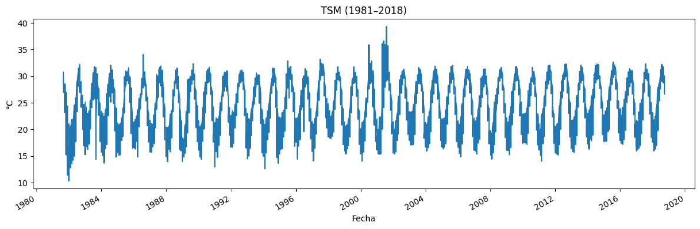

# Introducción

En este notebook realizaremos un análisis exploratorio y estadístico de dos variables oceánicas clave en la zona costera occidental del Golfo de California:

1. **Temperatura Superficial del Mar (TSM)**  
   – Periodo de estudio: **enero 1981 – diciembre 2018**  
   – Objetivo: caracterizar su variabilidad interanual, intranual y estacional, y encontrar sus frecuencias dominantes de oscilación.

2. **Concentración de Clorofila a (Chl a)**  
   – Periodo de estudio: **enero 1997 – diciembre 2018**  
   – Objetivo: cuantificar su variabilidad temporal y determinar sus ciclos de variación principales.

Además, profundizaremos en:

- **Regionalización** de la costa noroeste de México, agrupando subregiones con comportamientos climatológicos similares, mediante técnicas de reducción de dimensionalidad y clustering multivariante.
- **Efecto del ENSO** (El Niño–Oscilación del Sur):  
  - Cartografía de fases ENSO (Niño, Neutro, Niña) sobre los datos.  
  - Comparación de medias y varianzas de TSM y Chl a en cada fase.  
  - Análisis estacional dentro de cada fase para detectar respuesta diferencial en ciclos anuales.

## Análisis de Frecuencias Dominantes mediante Periodograma

Con el objetivo de identificar los ciclos que explican la mayor parte de la variabilidad en las variables TSM (Temperatura Superficial del Mar) y Chl a (Clorofila a), utilizaremos el periodograma como herramienta principal de análisis espectral.

### Etapas del análisis

1. **Cálculo global de frecuencias dominantes**  
   Se aplicará el periodograma sobre las series temporales completas de TSM y Chl a, integrando los datos de todas las estaciones.  
   Esto nos permitirá detectar frecuencias comunes de oscilación, como ciclos anuales, semestrales u otros patrones relevantes que afectan a toda la región.

2. **Análisis por estación individual**  
   Posteriormente, se realizará un análisis estación por estación, permitiendo observar si existen diferencias locales en los ciclos dominantes.  
   Este paso es clave para entender si ciertas regiones del Golfo de California presentan patrones únicos o asincronías respecto al comportamiento promedio.

### Objetivo final

- Detectar frecuencias dominantes (por ejemplo, 12, 6 o 3 meses) que expliquen la mayor parte de la variabilidad en las series.  
- Identificar diferencias entre estaciones para futuras etapas de regionalización climática.

## Exploración Temporal de TSM y Chl a

Comenzamos visualizando el comportamiento temporal de las variables TSM (Temperatura Superficial del Mar) y Chl a (Concentración de Clorofila a) a lo largo del periodo de estudio.

### Qué hacemos

Graficamos las series temporales de ambas variables para observar cómo evolucionan con el tiempo. Esto nos permite:

- Detectar posibles tendencias o estacionalidades.
- Identificar anomalías o valores extremos.
- Evaluar visualmente la cobertura y continuidad de los datos.

### Cómo lo hacemos

Usamos datos agregados por mes (o por año) combinando todas las estaciones, para tener una vista general del comportamiento regional. En esta etapa:

- Para **TSM**, consideramos el periodo de enero de 1981 a diciembre de 2018.
- Para **Chl a**, usamos datos desde enero de 1997 hasta diciembre de 2018.

    

    

    

    

## Cálculo del Periodograma para Todas las Estaciones

Ahora pasamos al análisis espectral. Lo que hacemos en esta etapa es calcular el **periodograma** utilizando los datos combinados de **todas las estaciones**.

### Qué buscamos

Queremos identificar las **frecuencias dominantes** en las series de TSM y Chl a, es decir, los ciclos que explican la mayor parte de su variabilidad temporal.

### Cómo lo hacemos

Aplicamos el periodograma sobre las series temporales agregadas de TSM y Chl a, para obtener una visión general de los ciclos presentes en toda la región de estudio. Este análisis nos permitirá detectar patrones recurrentes como:

- Ciclos **anuales** (12 meses)
- Ciclos **semestrales** (6 meses)
- Otros periodos relevantes

Una vez identificadas las frecuencias principales a nivel regional, más adelante repetiremos este análisis **por estación individual** para comparar los comportamientos locales.

    

    

## Frecuencias Dominantes Identificadas

A continuación, mostramos las **frecuencias dominantes** encontradas mediante el análisis espectral con periodograma para las series combinadas de todas las estaciones.

Estas frecuencias representan los **ciclos que explican la mayor parte de la variabilidad** en las variables TSM (Temperatura Superficial del Mar) y Chla (Concentración de Clorofila).

Los resultados que se presentan a continuación corresponden a las componentes más significativas de cada serie temporal, ordenadas por su potencia espectral. Esto nos permitirá enfocar el análisis posterior en los periodos más relevantes.

    Freq = 0.0049 ciclos/mes → periodo ≃ 204.9 meses (17.1 años); potencia = 125733
    Freq = 0.0588 ciclos/mes → periodo ≃ 17.0 meses (1.4 años); potencia = 7030
    Freq = 0.0050 ciclos/mes → periodo ≃ 199.5 meses (16.6 años); potencia = 5840
    Freq = 0.0047 ciclos/mes → periodo ≃ 210.6 meses (17.6 años); potencia = 2588
    Freq = 0.0539 ciclos/mes → periodo ≃ 18.5 meses (1.5 años); potencia = 2495

    Freq = 0.0588 ciclos/mes → periodo ≃ 17.0 meses (1.4 años); potencia = 732
    Freq = 0.0049 ciclos/mes → periodo ≃ 205.6 meses (17.1 años); potencia = 499
    Freq = 0.2353 ciclos/mes → periodo ≃ 4.2 meses (0.4 años); potencia = 211
    Freq = 0.1765 ciclos/mes → periodo ≃ 5.7 meses (0.5 años); potencia = 163
    Freq = 0.0686 ciclos/mes → periodo ≃ 14.6 meses (1.2 años); potencia = 115

# Interpretación de las Frecuencias Dominantes

Tras calcular el periodograma y extraer los cinco picos principales de cada serie, obtuvimos estas listas de pares **(frecuencia, potencia)**:

- **TSM (1981–2018)**  

[
(0.00487998, 125 733),
(0.05882353, 7 029.9),
(0.00501187, 5 839.9),
(0.00474809, 2 588.5),
(0.05394355, 2 494.5)
]

- **Clorofila a (1997–2018)**  

[
(0.05882353, 732.07),
(0.00486336, 498.69),
(0.23529412, 211.22),
(0.17647059, 162.74),
(0.06855025, 114.84)
]

A continuación desglosamos cada componente:

| Serie   | Frecuencia (ciclos/mes) | Potencia       | Periodo ≃ (meses) | Periodo ≃ (años) | Interpretación                                        |
|---------|-----------------------------|----------------|----------------------|---------------------|-------------------------------------------------------|
| **TSM** | 0.00488                     | 125 733        | 1 / 0.00488 ≃ 205    | 17.1                | **Tendencia multianual** (calentamiento paulatino)    |
| **TSM** | 0.00501                     | 5 840          | 1 / 0.00501 ≃ 200    | 16.7                | Refuerzo de la componente decadal                     |
| **TSM** | 0.00475                     | 2 588          | 1 / 0.00475 ≃ 211    | 17.6                | Otra estimación de la oscilación de fondo (decadal)   |
| **TSM** | 0.05882                     | 7 029.9        | 1 / 0.05882 ≃ 17     | 1.4                 | **Ciclo ENSO / interanual** (≈15–18 meses)             |
| **TSM** | 0.05394                     | 2 494.5        | 1 / 0.05394 ≃ 18.5   | 1.5                 | Segundo pico ENSO–ligado (variación interanual)       |
| **Chl a** | 0.05882                   | 732.07         | 1 / 0.05882 ≃ 17     | 1.4                 | **Ciclo ENSO / interanual** (≃17 meses)               |
| **Chl a** | 0.00486                   | 498.69         | 1 / 0.00486 ≃ 206    | 17.2                | **Tendencia decadal** (ciclo multianual de fondo)     |
| **Chl a** | 0.23529                   | 211.22         | 1 / 0.23529 ≃ 4.25   | 0.35                | **Subciclo estacional** temprano (≈4 meses)           |
| **Chl a** | 0.17647                   | 162.74         | 1 / 0.17647 ≃ 5.67   | 0.47                | **Subciclo semestral** (≈6 meses)                     |
| **Chl a** | 0.06855                   | 114.84         | 1 / 0.06855 ≃ 14.6   | 1.2                 | **Ciclo anual** o estacional (~12–15 meses)           |

---

## Detalle de los términos

- **Frecuencia (ciclos/mes)**  
Número de ciclos completos que ocurren en un mes. Por ejemplo, 0.0833 ciclos/mes equivale a un ciclo cada 12 meses.

- **Potencia**  
Mide cuánta varianza de la señal está concentrada en esa frecuencia. Picos de potencia alta indican oscilaciones muy relevantes.

- **Periodo**  
Inverso de la frecuencia:  
  $\text{periodo (meses)} = \frac{1}{\text{frecuencia (ciclos/mes)}}$
 
Y en años:  
  $\text{periodo (años)} = \frac{\text{periodo (meses)}}{12}.$

---

## Conclusiones clave

1. **Ciclos multianuales (≈16–18 años)**  
 Reúnen la mayor parte de la potencia en TSM y Chl a → reflejan la **tendencia de fondo** o variaciones decenales.

2. **Oscilación ENSO (≈15–18 meses)**  
 Aparece con alta potencia en ambas series → es el **componente interanual** dominante vinculado al fenómeno El Niño–Oscilación del Sur.

3. **Subciclos estacionales en Clorofila a (4–6 meses)**  
 Indican pulsos biológicos y de mezcla en la columna de agua, propios de dinámicas costeras más rápidas.

Con esta tabla y explicaciones tienes un mapeo claro de **cuáles** y **cada cuánto** se repiten las variaciones más importantes en tu zona de estudio. 

## Análisis Espectral por Estación

Después de identificar las frecuencias dominantes a nivel regional, ahora nos enfocamos en calcular el **periodograma de forma individual para cada estación**.

### Objetivo

El propósito de este análisis es detectar **diferencias locales** en los patrones de variación. Aunque ya conocemos las frecuencias que dominan a nivel general, es posible que algunas estaciones presenten:

- Frecuencias adicionales o distintas
- Intensidades diferentes en los ciclos
- Comportamientos asincrónicos respecto al promedio regional

### Qué hacemos

Aplicamos el periodograma sobre la serie temporal de cada estación, tanto para TSM como para Chl a. Esto nos permitirá comparar el comportamiento espectral entre estaciones y evaluar si existen zonas con dinámicas propias, lo cual será útil para la posterior **regionalización**.

    

    

<table border="1" class="dataframe">
  <thead>
    <tr style="text-align: right;">
      <th></th>
      <th>estacion</th>
      <th>freq_tsm</th>
    </tr>
  </thead>
  <tbody>
    <tr>
      <th>0</th>
      <td>est_1</td>
      <td>0.08296</td>
    </tr>
    <tr>
      <th>5</th>
      <td>est_2</td>
      <td>0.08296</td>
    </tr>
    <tr>
      <th>10</th>
      <td>est_3</td>
      <td>0.08296</td>
    </tr>
    <tr>
      <th>15</th>
      <td>est_4</td>
      <td>0.08296</td>
    </tr>
    <tr>
      <th>20</th>
      <td>est_5</td>
      <td>0.08296</td>
    </tr>
    <tr>
      <th>25</th>
      <td>est_6</td>
      <td>0.08296</td>
    </tr>
    <tr>
      <th>30</th>
      <td>est_7</td>
      <td>0.08296</td>
    </tr>
    <tr>
      <th>35</th>
      <td>est_8</td>
      <td>0.08296</td>
    </tr>
    <tr>
      <th>40</th>
      <td>est_9</td>
      <td>0.08296</td>
    </tr>
    <tr>
      <th>45</th>
      <td>est_10</td>
      <td>0.08296</td>
    </tr>
    <tr>
      <th>50</th>
      <td>est_11</td>
      <td>0.08296</td>
    </tr>
    <tr>
      <th>55</th>
      <td>est_12</td>
      <td>0.08296</td>
    </tr>
    <tr>
      <th>60</th>
      <td>est_13</td>
      <td>0.08296</td>
    </tr>
    <tr>
      <th>65</th>
      <td>est_14</td>
      <td>0.08296</td>
    </tr>
    <tr>
      <th>70</th>
      <td>est_15</td>
      <td>0.08296</td>
    </tr>
    <tr>
      <th>75</th>
      <td>est_16</td>
      <td>0.08296</td>
    </tr>
    <tr>
      <th>80</th>
      <td>est_17</td>
      <td>0.08296</td>
    </tr>
  </tbody>
</table>

## Frecuencia Dominante en TSM — Estaciones 1 a 17

Al analizar los periodogramas de la Temperatura Superficial del Mar (TSM) para las 17 estaciones del Golfo de California, se observó un patrón notable: **todas las estaciones comparten la misma frecuencia dominante**.

### Frecuencia dominante común

- **Frecuencia**: 0.08296 ciclos/mes  
- **Período equivalente**:  
  
  $\frac{1}{0.08296} \approx 12.05 \text{ meses} \approx 1 \text{ año}$

### Interpretación

- Esta frecuencia indica un **ciclo anual perfectamente definido** en todas las estaciones.
- El hecho de que sea exactamente la misma en las 17 ubicaciones sugiere una **respuesta homogénea al ciclo estacional**, probablemente impulsada por factores climáticos como la radiación solar, temperatura atmosférica y dinámica oceánica.
- La consistencia de esta frecuencia refuerza la idea de que la TSM en el Golfo de California está fuertemente condicionada por la **estacionalidad climática**.

### Conclusión

Este resultado estadístico demuestra que, independientemente de la ubicación geográfica dentro del golfo, la TSM sigue un patrón **predominantemente anual**, lo cual es fundamental para la modelación de procesos físicos, biológicos y climáticos en la región.

<table border="1" class="dataframe">
  <thead>
    <tr style="text-align: right;">
      <th></th>
      <th>estacion</th>
      <th>freq_tsm</th>
    </tr>
  </thead>
  <tbody>
    <tr>
      <th>1</th>
      <td>est_1</td>
      <td>0.085202</td>
    </tr>
    <tr>
      <th>6</th>
      <td>est_2</td>
      <td>0.085202</td>
    </tr>
    <tr>
      <th>11</th>
      <td>est_3</td>
      <td>0.085202</td>
    </tr>
    <tr>
      <th>16</th>
      <td>est_4</td>
      <td>0.085202</td>
    </tr>
    <tr>
      <th>21</th>
      <td>est_5</td>
      <td>0.085202</td>
    </tr>
    <tr>
      <th>26</th>
      <td>est_6</td>
      <td>0.085202</td>
    </tr>
    <tr>
      <th>31</th>
      <td>est_7</td>
      <td>0.085202</td>
    </tr>
    <tr>
      <th>36</th>
      <td>est_8</td>
      <td>0.085202</td>
    </tr>
    <tr>
      <th>41</th>
      <td>est_9</td>
      <td>0.085202</td>
    </tr>
    <tr>
      <th>46</th>
      <td>est_10</td>
      <td>0.085202</td>
    </tr>
    <tr>
      <th>51</th>
      <td>est_11</td>
      <td>0.085202</td>
    </tr>
    <tr>
      <th>56</th>
      <td>est_12</td>
      <td>0.085202</td>
    </tr>
    <tr>
      <th>61</th>
      <td>est_13</td>
      <td>0.085202</td>
    </tr>
    <tr>
      <th>66</th>
      <td>est_14</td>
      <td>0.085202</td>
    </tr>
    <tr>
      <th>71</th>
      <td>est_15</td>
      <td>0.085202</td>
    </tr>
    <tr>
      <th>76</th>
      <td>est_16</td>
      <td>0.085202</td>
    </tr>
    <tr>
      <th>81</th>
      <td>est_17</td>
      <td>0.085202</td>
    </tr>
  </tbody>
</table>

## Segunda Frecuencia Dominante en TSM — Estaciones 1 a 17

Además de la frecuencia dominante anual (≈ 0.0830 ciclos/mes), el análisis espectral revela que **todas las estaciones comparten una segunda frecuencia significativa común**:

### Frecuencia secundaria común

- **Frecuencia**: 0.085202 ciclos/mes  
- **Período equivalente**:  
  $\frac{1}{0.085202} \approx 11.74 \text{ meses}$

### Interpretación

- Esta frecuencia está muy cerca del valor anual, pero con una **ligera variación** respecto a la frecuencia principal (≈ 0.0830).
- Su presencia en todas las estaciones sugiere que el ciclo anual **no es perfectamente armónico**, sino que puede estar **modulado o distorsionado** por efectos locales como:
  - variaciones interanuales,
  - fases del ENSO,
  - o procesos oceanográficos regionales.

- También es posible que esta frecuencia represente un **armónico secundario del ciclo anual**, capturado debido a pequeñas fluctuaciones o no linealidades en la serie temporal.

### Conclusión

La existencia de una **segunda frecuencia cercana al ciclo anual** en todas las estaciones refuerza la idea de que la TSM está influida principalmente por patrones estacionales, aunque no de forma perfectamente sinusoidal. Este hallazgo apunta hacia una **estructura periódica compleja**, pero coherente a lo largo de toda la región del Golfo de California.

<table border="1" class="dataframe">
  <thead>
    <tr style="text-align: right;">
      <th></th>
      <th>estacion</th>
      <th>freq_tsm</th>
    </tr>
  </thead>
  <tbody>
    <tr>
      <th>2</th>
      <td>est_1</td>
      <td>0.080717</td>
    </tr>
    <tr>
      <th>7</th>
      <td>est_2</td>
      <td>0.080717</td>
    </tr>
    <tr>
      <th>12</th>
      <td>est_3</td>
      <td>0.080717</td>
    </tr>
    <tr>
      <th>17</th>
      <td>est_4</td>
      <td>0.087444</td>
    </tr>
    <tr>
      <th>22</th>
      <td>est_5</td>
      <td>0.080717</td>
    </tr>
    <tr>
      <th>27</th>
      <td>est_6</td>
      <td>0.087444</td>
    </tr>
    <tr>
      <th>32</th>
      <td>est_7</td>
      <td>0.080717</td>
    </tr>
    <tr>
      <th>37</th>
      <td>est_8</td>
      <td>0.080717</td>
    </tr>
    <tr>
      <th>42</th>
      <td>est_9</td>
      <td>0.080717</td>
    </tr>
    <tr>
      <th>47</th>
      <td>est_10</td>
      <td>0.080717</td>
    </tr>
    <tr>
      <th>52</th>
      <td>est_11</td>
      <td>0.080717</td>
    </tr>
    <tr>
      <th>57</th>
      <td>est_12</td>
      <td>0.087444</td>
    </tr>
    <tr>
      <th>62</th>
      <td>est_13</td>
      <td>0.080717</td>
    </tr>
    <tr>
      <th>67</th>
      <td>est_14</td>
      <td>0.078475</td>
    </tr>
    <tr>
      <th>72</th>
      <td>est_15</td>
      <td>0.080717</td>
    </tr>
    <tr>
      <th>77</th>
      <td>est_16</td>
      <td>0.080717</td>
    </tr>
    <tr>
      <th>82</th>
      <td>est_17</td>
      <td>0.080717</td>
    </tr>
  </tbody>
</table>

## Tercera Frecuencia Dominante en TSM — Estaciones 1 a 17

A partir del análisis espectral de TSM, la tercera frecuencia dominante muestra **mayor variabilidad** entre estaciones, a diferencia de las dos primeras que eran completamente consistentes.

### Distribución de la tercera frecuencia

| Frecuencia (ciclos/mes) | Estaciones donde aparece | Período aproximado |
|--------------------------|---------------------------|---------------------|
| 0.080717                 | est_1, est_2, est_3, est_5, est_7, est_8, est_9, est_10, est_11, est_13, est_15, est_16, est_17 | ≈ 12.39 meses |
| 0.087444                 | est_4, est_6, est_12       | ≈ 11.44 meses |
| 0.078475                 | est_14                     | ≈ 12.74 meses |

### Interpretación

- Aunque las frecuencias siguen siendo cercanas al **ciclo anual**, ya no son idénticas en todas las estaciones.
- Esto indica que existen **pequeñas diferencias en la estructura de la señal anual**, posiblemente causadas por:
  - efectos geográficos locales (latitud, profundidad),
  - condiciones atmosféricas particulares,
  - o características propias de la dinámica marina en ciertas estaciones.
- En todos los casos, el período asociado sigue rondando los **12 meses**, por lo que el carácter estacional continúa siendo dominante, pero con **matices específicos por ubicación**.

### Conclusión

El análisis de la tercera frecuencia dominante en TSM revela una **transición hacia una mayor heterogeneidad espacial**. Esto puede ser importante para modelos más detallados que busquen capturar **variaciones locales** en la respuesta térmica del océano en el Golfo de California.

<table border="1" class="dataframe">
  <thead>
    <tr style="text-align: right;">
      <th></th>
      <th>estacion</th>
      <th>freq_tsm</th>
    </tr>
  </thead>
  <tbody>
    <tr>
      <th>3</th>
      <td>est_1</td>
      <td>0.165919</td>
    </tr>
    <tr>
      <th>8</th>
      <td>est_2</td>
      <td>0.087444</td>
    </tr>
    <tr>
      <th>13</th>
      <td>est_3</td>
      <td>0.165919</td>
    </tr>
    <tr>
      <th>18</th>
      <td>est_4</td>
      <td>0.165919</td>
    </tr>
    <tr>
      <th>23</th>
      <td>est_5</td>
      <td>0.165919</td>
    </tr>
    <tr>
      <th>28</th>
      <td>est_6</td>
      <td>0.080717</td>
    </tr>
    <tr>
      <th>33</th>
      <td>est_7</td>
      <td>0.165919</td>
    </tr>
    <tr>
      <th>38</th>
      <td>est_8</td>
      <td>0.165919</td>
    </tr>
    <tr>
      <th>43</th>
      <td>est_9</td>
      <td>0.087444</td>
    </tr>
    <tr>
      <th>48</th>
      <td>est_10</td>
      <td>0.087444</td>
    </tr>
    <tr>
      <th>53</th>
      <td>est_11</td>
      <td>0.087444</td>
    </tr>
    <tr>
      <th>58</th>
      <td>est_12</td>
      <td>0.080717</td>
    </tr>
    <tr>
      <th>63</th>
      <td>est_13</td>
      <td>0.087444</td>
    </tr>
    <tr>
      <th>68</th>
      <td>est_14</td>
      <td>0.080717</td>
    </tr>
    <tr>
      <th>73</th>
      <td>est_15</td>
      <td>0.087444</td>
    </tr>
    <tr>
      <th>78</th>
      <td>est_16</td>
      <td>0.087444</td>
    </tr>
    <tr>
      <th>83</th>
      <td>est_17</td>
      <td>0.087444</td>
    </tr>
  </tbody>
</table>

## Cuarta Frecuencia Dominante en TSM — Estaciones 1 a 17

A medida que descendemos en el orden de importancia de las frecuencias (rank 4), se observa una mayor diversidad entre estaciones, aunque siguen apareciendo algunos patrones recurrentes.

### Distribución de la cuarta frecuencia

| Frecuencia (ciclos/mes) | Estaciones donde aparece          | Período aproximado |
|--------------------------|-----------------------------------|---------------------|
| 0.165919                 | est_1, est_3, est_4, est_5, est_7, est_8 | ≈ 6.03 meses |
| 0.087444                 | est_2, est_9, est_10, est_11, est_13, est_15, est_16, est_17 | ≈ 11.44 meses |
| 0.080717                 | est_6, est_12, est_14             | ≈ 12.39 meses |

### Interpretación

- La frecuencia **0.165919 ciclos/mes** aparece en 6 estaciones y corresponde aproximadamente a **un ciclo semestral**, lo cual podría reflejar:
  - fenómenos intraanuales como **variaciones de productividad biológica**,
  - **alternancia de masas de agua**,
  - o efectos climáticos regionales con una periodicidad de 6 meses.
  
- La frecuencia **0.087444 ciclos/mes**, aunque cercana al ciclo anual, persiste como una señal secundaria en varias estaciones, indicando posibles **modulaciones del ciclo anual**.

- La frecuencia **0.080717 ciclos/mes**, también cercana al año, aparece en otras estaciones como una alternativa dominante secundaria.

### Conclusión

La cuarta frecuencia dominante revela patrones **más variables y localizados**, pero sigue mostrando coherencia con escalas temporales anuales y semestrales. El ciclo semestral comienza a emerger con más claridad en algunas estaciones, lo que podría ser relevante para estudios de productividad primaria, surgencias, o influencia de vientos estacionales en el Golfo de California.

<table border="1" class="dataframe">
  <thead>
    <tr style="text-align: right;">
      <th></th>
      <th>estacion</th>
      <th>freq_tsm</th>
    </tr>
  </thead>
  <tbody>
    <tr>
      <th>4</th>
      <td>est_1</td>
      <td>0.087444</td>
    </tr>
    <tr>
      <th>9</th>
      <td>est_2</td>
      <td>0.165919</td>
    </tr>
    <tr>
      <th>14</th>
      <td>est_3</td>
      <td>0.087444</td>
    </tr>
    <tr>
      <th>19</th>
      <td>est_4</td>
      <td>0.080717</td>
    </tr>
    <tr>
      <th>24</th>
      <td>est_5</td>
      <td>0.087444</td>
    </tr>
    <tr>
      <th>29</th>
      <td>est_6</td>
      <td>0.089686</td>
    </tr>
    <tr>
      <th>34</th>
      <td>est_7</td>
      <td>0.087444</td>
    </tr>
    <tr>
      <th>39</th>
      <td>est_8</td>
      <td>0.078475</td>
    </tr>
    <tr>
      <th>44</th>
      <td>est_9</td>
      <td>0.165919</td>
    </tr>
    <tr>
      <th>49</th>
      <td>est_10</td>
      <td>0.165919</td>
    </tr>
    <tr>
      <th>54</th>
      <td>est_11</td>
      <td>0.165919</td>
    </tr>
    <tr>
      <th>59</th>
      <td>est_12</td>
      <td>0.165919</td>
    </tr>
    <tr>
      <th>64</th>
      <td>est_13</td>
      <td>0.029148</td>
    </tr>
    <tr>
      <th>69</th>
      <td>est_14</td>
      <td>0.087444</td>
    </tr>
    <tr>
      <th>74</th>
      <td>est_15</td>
      <td>0.165919</td>
    </tr>
    <tr>
      <th>79</th>
      <td>est_16</td>
      <td>0.078475</td>
    </tr>
    <tr>
      <th>84</th>
      <td>est_17</td>
      <td>0.165919</td>
    </tr>
  </tbody>
</table>

## Quinta Frecuencia Dominante en TSM — Estaciones 1 a 17

En el análisis de la quinta frecuencia más significativa de la Temperatura Superficial del Mar (TSM), observamos una mayor dispersión en los valores de frecuencia. Sin embargo, algunas frecuencias se repiten en varias estaciones, manteniéndose patrones semestrales y anuales relevantes.

### Distribución de la quinta frecuencia

| Frecuencia (ciclos/mes) | Estaciones donde aparece          | Período aproximado |
|--------------------------|-----------------------------------|---------------------|
| 0.087444                 | est_1, est_3, est_5, est_7, est_14 | ≈ 11.44 meses |
| 0.165919                 | est_2, est_9, est_10, est_11, est_12, est_15, est_17 | ≈ 6.03 meses |
| 0.080717                 | est_4                             | ≈ 12.39 meses |
| 0.089686                 | est_6                             | ≈ 11.15 meses |
| 0.078475                 | est_8, est_16                     | ≈ 12.75 meses |
| 0.029148                 | est_13                            | ≈ 34.29 meses (~2.9 años) |

### Interpretación

- La frecuencia **0.165919 ciclos/mes** (semestre) es nuevamente la más común, lo que refuerza su importancia como **componente cíclico secundario** en muchas estaciones.
- La frecuencia **0.087444 ciclos/mes**, que ya había aparecido antes, vuelve a manifestarse como **armónico cercano al ciclo anual**, presente en 5 estaciones.
- Aparecen nuevas frecuencias como **0.029148 ciclos/mes** (≈2.9 años) en la estación 13, lo que puede indicar la presencia de **ciclos multianuales** poco frecuentes pero potencialmente significativos, posiblemente ligados a fenómenos como ENSO.
- La diversidad creciente de frecuencias sugiere que las **señales menos potentes** (rango bajo del periodograma) pueden capturar patrones más complejos o ruido local.

### Conclusión

El análisis de la quinta frecuencia dominante evidencia un balance entre **ciclos estacionales persistentes** (anuales y semestrales) y la aparición de **ciclos específicos por estación**, algunos de ellos de mayor escala temporal. Esto refuerza la necesidad de enfoques localizados o multiescalares en la modelación de la TSM en el Golfo de California.

## Periodograma por Estación: Clorofila a (Chla)

Ahora iniciamos el análisis espectral individual por estación para la variable **Clorofila a (Chla)**.

### Objetivo

Identificar las **frecuencias dominantes** en cada estación de forma separada, con el fin de:

- Detectar diferencias locales en los ciclos de variación de la productividad oceánica.
- Comparar el comportamiento espectral entre estaciones y con el análisis global.
- Evaluar la posible existencia de patrones únicos en ciertas zonas de la región costera occidental del Golfo de California.

Este análisis complementa el enfoque regional y sienta las bases para una futura **agrupación o regionalización** en función de las dinámicas espectrales observadas.

<table border="1" class="dataframe">
  <thead>
    <tr style="text-align: right;">
      <th></th>
      <th>estacion</th>
      <th>freq_chla</th>
    </tr>
  </thead>
  <tbody>
    <tr>
      <th>0</th>
      <td>est_1</td>
      <td>0.082677</td>
    </tr>
    <tr>
      <th>5</th>
      <td>est_2</td>
      <td>0.082677</td>
    </tr>
    <tr>
      <th>10</th>
      <td>est_3</td>
      <td>0.082677</td>
    </tr>
    <tr>
      <th>15</th>
      <td>est_4</td>
      <td>0.082677</td>
    </tr>
    <tr>
      <th>20</th>
      <td>est_5</td>
      <td>0.082677</td>
    </tr>
    <tr>
      <th>25</th>
      <td>est_6</td>
      <td>0.082677</td>
    </tr>
    <tr>
      <th>30</th>
      <td>est_7</td>
      <td>0.082677</td>
    </tr>
    <tr>
      <th>35</th>
      <td>est_8</td>
      <td>0.082677</td>
    </tr>
    <tr>
      <th>40</th>
      <td>est_9</td>
      <td>0.082677</td>
    </tr>
    <tr>
      <th>45</th>
      <td>est_10</td>
      <td>0.082677</td>
    </tr>
    <tr>
      <th>50</th>
      <td>est_11</td>
      <td>0.165354</td>
    </tr>
    <tr>
      <th>55</th>
      <td>est_12</td>
      <td>0.165354</td>
    </tr>
    <tr>
      <th>60</th>
      <td>est_13</td>
      <td>0.165354</td>
    </tr>
    <tr>
      <th>65</th>
      <td>est_14</td>
      <td>0.165354</td>
    </tr>
    <tr>
      <th>70</th>
      <td>est_15</td>
      <td>0.082677</td>
    </tr>
    <tr>
      <th>75</th>
      <td>est_16</td>
      <td>0.082677</td>
    </tr>
    <tr>
      <th>80</th>
      <td>est_17</td>
      <td>0.082677</td>
    </tr>
  </tbody>
</table>

## Frecuencia Dominante en Clorofila — Estaciones 1 a 17

El análisis espectral mediante periodograma para la serie de **Clorofila a** revela dos frecuencias dominantes distintas entre las estaciones, lo que indica la presencia de **dos patrones cíclicos predominantes** según la ubicación geográfica.

### Distribución de la frecuencia dominante (rank 1)

| Frecuencia (ciclos/mes) | Estaciones donde aparece                       | Período aproximado |
|--------------------------|------------------------------------------------|---------------------|
| 0.082677                 | est_1, est_2, est_3, est_4, est_5, est_6, est_7, est_8, est_9, est_10, est_15, est_16, est_17 | ≈ 12.09 meses |
| 0.165354                 | est_11, est_12, est_13, est_14                 | ≈ 6.05 meses |

### Interpretación

- La frecuencia **0.082677 ciclos/mes** es la dominante en 13 de las 17 estaciones, indicando un ciclo de aproximadamente **12 meses**, característico de una **estacionalidad anual** fuerte.
- La frecuencia **0.165354 ciclos/mes**, dominante en 4 estaciones, corresponde a un ciclo de **6 meses**, lo cual sugiere un patrón **semestral** en esas regiones específicas.
- Esta división sugiere que, a diferencia de la TSM (donde todas las estaciones compartían un ciclo anual dominante), la **clorofila presenta una mayor variabilidad espacial en su comportamiento periódico**.

### Conclusión

El ciclo **anual** sigue siendo el más común en la dinámica de la clorofila en el Golfo de California, pero la presencia de estaciones donde domina un ciclo **semestral** indica posibles diferencias en **dinámica biológica o en la disponibilidad de nutrientes**. Esto podría deberse a condiciones locales como surgencias, mezclas verticales o influencias de vientos estacionales en ciertas zonas del golfo.

<table border="1" class="dataframe">
  <thead>
    <tr style="text-align: right;">
      <th></th>
      <th>estacion</th>
      <th>freq_chla</th>
    </tr>
  </thead>
  <tbody>
    <tr>
      <th>1</th>
      <td>est_1</td>
      <td>0.165354</td>
    </tr>
    <tr>
      <th>6</th>
      <td>est_2</td>
      <td>0.086614</td>
    </tr>
    <tr>
      <th>11</th>
      <td>est_3</td>
      <td>0.165354</td>
    </tr>
    <tr>
      <th>16</th>
      <td>est_4</td>
      <td>0.165354</td>
    </tr>
    <tr>
      <th>21</th>
      <td>est_5</td>
      <td>0.086614</td>
    </tr>
    <tr>
      <th>26</th>
      <td>est_6</td>
      <td>0.086614</td>
    </tr>
    <tr>
      <th>31</th>
      <td>est_7</td>
      <td>0.086614</td>
    </tr>
    <tr>
      <th>36</th>
      <td>est_8</td>
      <td>0.086614</td>
    </tr>
    <tr>
      <th>41</th>
      <td>est_9</td>
      <td>0.086614</td>
    </tr>
    <tr>
      <th>46</th>
      <td>est_10</td>
      <td>0.165354</td>
    </tr>
    <tr>
      <th>51</th>
      <td>est_11</td>
      <td>0.082677</td>
    </tr>
    <tr>
      <th>56</th>
      <td>est_12</td>
      <td>0.169291</td>
    </tr>
    <tr>
      <th>61</th>
      <td>est_13</td>
      <td>0.082677</td>
    </tr>
    <tr>
      <th>66</th>
      <td>est_14</td>
      <td>0.082677</td>
    </tr>
    <tr>
      <th>71</th>
      <td>est_15</td>
      <td>0.165354</td>
    </tr>
    <tr>
      <th>76</th>
      <td>est_16</td>
      <td>0.086614</td>
    </tr>
    <tr>
      <th>81</th>
      <td>est_17</td>
      <td>0.165354</td>
    </tr>
  </tbody>
</table>

## Segunda Frecuencia Dominante en Clorofila — Estaciones 1 a 17

La segunda frecuencia más importante del espectro de Clorofila a muestra un **mayor grado de variabilidad** entre estaciones respecto a la frecuencia dominante, aunque ciertos valores se repiten en múltiples ubicaciones.

### Distribución de la segunda frecuencia (rank 2)

| Frecuencia (ciclos/mes) | Estaciones donde aparece                                 | Período aproximado |
|--------------------------|----------------------------------------------------------|---------------------|
| 0.165354                 | est_1, est_3, est_4, est_10, est_15, est_17              | ≈ 6.05 meses |
| 0.086614                 | est_2, est_5, est_6, est_7, est_8, est_9, est_16         | ≈ 11.55 meses |
| 0.082677                 | est_11, est_13, est_14                                   | ≈ 12.09 meses |
| 0.169291                 | est_12                                                   | ≈ 5.91 meses |

### Interpretación

- La frecuencia **0.165354 ciclos/mes** (≈ 6 meses) continúa siendo relevante en varias estaciones, mostrando persistencia de un patrón semestral.
- Las frecuencias **0.086614** y **0.082677** son cercanas al ciclo anual, lo que indica una **modulación secundaria del ciclo estacional**.
- La aparición de **0.169291** en est_12 podría deberse a una variante local del patrón semestral o una mezcla de señales.

### Conclusión

Mientras que la frecuencia dominante en Clorofila se agrupaba principalmente en dos valores (anual o semestral), la segunda frecuencia muestra un **conjunto más rico de variaciones**, lo cual sugiere que:
- Las estaciones pueden estar influenciadas por **múltiples procesos periódicos superpuestos**, 
- y que existe **heterogeneidad espacial** en la forma en que la estacionalidad impacta la biomasa fitoplanctónica.

Este tipo de análisis es útil para detectar diferencias entre regiones del golfo y puede orientar investigaciones sobre procesos ecológicos específicos que afectan la productividad primaria.

<table border="1" class="dataframe">
  <thead>
    <tr style="text-align: right;">
      <th></th>
      <th>estacion</th>
      <th>freq_chla</th>
    </tr>
  </thead>
  <tbody>
    <tr>
      <th>2</th>
      <td>est_1</td>
      <td>0.086614</td>
    </tr>
    <tr>
      <th>7</th>
      <td>est_2</td>
      <td>0.165354</td>
    </tr>
    <tr>
      <th>12</th>
      <td>est_3</td>
      <td>0.086614</td>
    </tr>
    <tr>
      <th>17</th>
      <td>est_4</td>
      <td>0.086614</td>
    </tr>
    <tr>
      <th>22</th>
      <td>est_5</td>
      <td>0.165354</td>
    </tr>
    <tr>
      <th>27</th>
      <td>est_6</td>
      <td>0.070866</td>
    </tr>
    <tr>
      <th>32</th>
      <td>est_7</td>
      <td>0.251969</td>
    </tr>
    <tr>
      <th>37</th>
      <td>est_8</td>
      <td>0.003937</td>
    </tr>
    <tr>
      <th>42</th>
      <td>est_9</td>
      <td>0.003937</td>
    </tr>
    <tr>
      <th>47</th>
      <td>est_10</td>
      <td>0.086614</td>
    </tr>
    <tr>
      <th>52</th>
      <td>est_11</td>
      <td>0.169291</td>
    </tr>
    <tr>
      <th>57</th>
      <td>est_12</td>
      <td>0.082677</td>
    </tr>
    <tr>
      <th>62</th>
      <td>est_13</td>
      <td>0.169291</td>
    </tr>
    <tr>
      <th>67</th>
      <td>est_14</td>
      <td>0.169291</td>
    </tr>
    <tr>
      <th>72</th>
      <td>est_15</td>
      <td>0.086614</td>
    </tr>
    <tr>
      <th>77</th>
      <td>est_16</td>
      <td>0.003937</td>
    </tr>
    <tr>
      <th>82</th>
      <td>est_17</td>
      <td>0.086614</td>
    </tr>
  </tbody>
</table>

## Tercera Frecuencia Dominante en Clorofila — Estaciones 1 a 17

La tercera frecuencia más relevante en el espectro de Clorofila muestra una **amplia diversidad** entre estaciones, incluyendo tanto componentes estacionales como señales de muy baja frecuencia.

### Distribución de la tercera frecuencia (rank 3)

| Frecuencia (ciclos/mes) | Estaciones donde aparece                     | Período aproximado |
|--------------------------|----------------------------------------------|---------------------|
| 0.086614                 | est_1, est_3, est_4, est_10, est_15, est_17  | ≈ 11.55 meses |
| 0.165354                 | est_2, est_5                                 | ≈ 6.05 meses |
| 0.070866                 | est_6                                        | ≈ 14.11 meses |
| 0.251969                 | est_7                                        | ≈ 3.97 meses |
| 0.003937                 | est_8, est_9, est_16                         | ≈ 254 meses (~21 años) |
| 0.169291                 | est_11, est_13, est_14                       | ≈ 5.91 meses |
| 0.082677                 | est_12                                       | ≈ 12.09 meses |

### Interpretación

- Las frecuencias **0.086614 y 0.082677** cercanas al ciclo anual siguen presentes en múltiples estaciones, manteniendo la **influencia de la estacionalidad**.
- La frecuencia **0.165354** (≈6 meses) también persiste como componente cíclico clave.
- La aparición de **frecuencias muy bajas** como **0.003937 ciclos/mes** (~21 años de periodo) sugiere la presencia de **tendencias de largo plazo o componentes ruidosos** mal diferenciados, que podrían corresponder a efectos de aliasing o cambios de régimen.
- La frecuencia **0.251969** (≈4 meses) en est_7 podría reflejar fenómenos cíclicos **intraestacionales**, como eventos recurrentes de productividad o perturbaciones locales.

### Conclusión

El análisis de la tercera frecuencia dominante en Clorofila evidencia una señal más compleja y heterogénea en comparación con TSM:
- Aunque las señales anuales y semestrales se mantienen, aparecen **componentes de frecuencia baja y alta** que sugieren fenómenos más transitorios o de más largo plazo.
- Esto resalta la **mayor variabilidad en los procesos biológicos** que regulan la clorofila, en contraste con los más estables procesos físicos que dominan la temperatura del mar.

Este nivel de análisis es crucial para comprender la diversidad de factores que afectan la dinámica del fitoplancton en distintas zonas del Golfo de California.

<table border="1" class="dataframe">
  <thead>
    <tr style="text-align: right;">
      <th></th>
      <th>estacion</th>
      <th>freq_chla</th>
    </tr>
  </thead>
  <tbody>
    <tr>
      <th>3</th>
      <td>est_1</td>
      <td>0.015748</td>
    </tr>
    <tr>
      <th>8</th>
      <td>est_2</td>
      <td>0.169291</td>
    </tr>
    <tr>
      <th>13</th>
      <td>est_3</td>
      <td>0.015748</td>
    </tr>
    <tr>
      <th>18</th>
      <td>est_4</td>
      <td>0.074803</td>
    </tr>
    <tr>
      <th>23</th>
      <td>est_5</td>
      <td>0.019685</td>
    </tr>
    <tr>
      <th>28</th>
      <td>est_6</td>
      <td>0.173228</td>
    </tr>
    <tr>
      <th>33</th>
      <td>est_7</td>
      <td>0.003937</td>
    </tr>
    <tr>
      <th>38</th>
      <td>est_8</td>
      <td>0.251969</td>
    </tr>
    <tr>
      <th>43</th>
      <td>est_9</td>
      <td>0.070866</td>
    </tr>
    <tr>
      <th>48</th>
      <td>est_10</td>
      <td>0.027559</td>
    </tr>
    <tr>
      <th>53</th>
      <td>est_11</td>
      <td>0.019685</td>
    </tr>
    <tr>
      <th>58</th>
      <td>est_12</td>
      <td>0.019685</td>
    </tr>
    <tr>
      <th>63</th>
      <td>est_13</td>
      <td>0.086614</td>
    </tr>
    <tr>
      <th>68</th>
      <td>est_14</td>
      <td>0.161417</td>
    </tr>
    <tr>
      <th>73</th>
      <td>est_15</td>
      <td>0.169291</td>
    </tr>
    <tr>
      <th>78</th>
      <td>est_16</td>
      <td>0.169291</td>
    </tr>
    <tr>
      <th>83</th>
      <td>est_17</td>
      <td>0.169291</td>
    </tr>
  </tbody>
</table>

## Cuarta Frecuencia Dominante en Clorofila — Estaciones 1 a 17

La cuarta frecuencia más significativa en la serie temporal de Clorofila a muestra una **dispersión considerable** entre estaciones. Esta variabilidad refleja la influencia de múltiples escalas temporales en la dinámica del fitoplancton.

### Distribución de la cuarta frecuencia (rank 4)

| Frecuencia (ciclos/mes) | Estaciones donde aparece                 | Período aproximado       |
|--------------------------|------------------------------------------|---------------------------|
| 0.169291                 | est_2, est_15, est_16, est_17            | ≈ 5.91 meses              |
| 0.015748                 | est_1, est_3                              | ≈ 63.5 meses (~5.3 años)  |
| 0.019685                 | est_5, est_11, est_12                    | ≈ 50.8 meses (~4.2 años)  |
| 0.074803                 | est_4                                    | ≈ 13.4 meses              |
| 0.173228                 | est_6                                    | ≈ 5.77 meses              |
| 0.003937                 | est_7                                    | ≈ 254 meses (~21 años)    |
| 0.251969                 | est_8                                    | ≈ 3.97 meses              |
| 0.070866                 | est_9                                    | ≈ 14.1 meses              |
| 0.027559                 | est_10                                   | ≈ 36.3 meses (~3 años)    |
| 0.086614                 | est_13                                   | ≈ 11.55 meses             |
| 0.161417                 | est_14                                   | ≈ 6.2 meses               |

### Interpretación

- Las frecuencias **0.169291** y **0.173228** (≈6 meses) siguen destacando como un patrón recurrente en varias estaciones, apuntando a un **ciclo semestral persistente**.
- Aparecen varias **frecuencias de muy baja magnitud** como **0.015748**, **0.019685**, **0.003937**, y **0.027559**, las cuales representan **ciclos multianuales**:
  - Estas pueden estar relacionadas con **tendencias a largo plazo**, cambios de régimen climático, o incluso **ruido estructural**.
- Por otro lado, algunas estaciones presentan **ciclos cortos** como **0.251969** (≈4 meses), indicando posibles **fluctuaciones rápidas** en la concentración de clorofila.

### Conclusión

El rango de frecuencias observado en la cuarta posición evidencia que la variabilidad de la clorofila es influenciada por procesos de **corto, mediano y largo plazo**. A diferencia de la TSM, donde los patrones eran altamente consistentes entre estaciones, la clorofila presenta una señal **más fragmentada y diversa**. Esto refuerza la naturaleza más dinámica y localmente modulada de los procesos biológicos frente a los procesos físicos.

Este nivel de detalle es útil para estudios que buscan **identificar drivers locales** de productividad biológica en el Golfo de California.

<table border="1" class="dataframe">
  <thead>
    <tr style="text-align: right;">
      <th></th>
      <th>estacion</th>
      <th>freq_chla</th>
    </tr>
  </thead>
  <tbody>
    <tr>
      <th>4</th>
      <td>est_1</td>
      <td>0.169291</td>
    </tr>
    <tr>
      <th>9</th>
      <td>est_2</td>
      <td>0.015748</td>
    </tr>
    <tr>
      <th>14</th>
      <td>est_3</td>
      <td>0.074803</td>
    </tr>
    <tr>
      <th>19</th>
      <td>est_4</td>
      <td>0.003937</td>
    </tr>
    <tr>
      <th>24</th>
      <td>est_5</td>
      <td>0.090551</td>
    </tr>
    <tr>
      <th>29</th>
      <td>est_6</td>
      <td>0.090551</td>
    </tr>
    <tr>
      <th>34</th>
      <td>est_7</td>
      <td>0.090551</td>
    </tr>
    <tr>
      <th>39</th>
      <td>est_8</td>
      <td>0.303150</td>
    </tr>
    <tr>
      <th>44</th>
      <td>est_9</td>
      <td>0.251969</td>
    </tr>
    <tr>
      <th>49</th>
      <td>est_10</td>
      <td>0.019685</td>
    </tr>
    <tr>
      <th>54</th>
      <td>est_11</td>
      <td>0.161417</td>
    </tr>
    <tr>
      <th>59</th>
      <td>est_12</td>
      <td>0.157480</td>
    </tr>
    <tr>
      <th>64</th>
      <td>est_13</td>
      <td>0.157480</td>
    </tr>
    <tr>
      <th>69</th>
      <td>est_14</td>
      <td>0.070866</td>
    </tr>
    <tr>
      <th>74</th>
      <td>est_15</td>
      <td>0.059055</td>
    </tr>
    <tr>
      <th>79</th>
      <td>est_16</td>
      <td>0.165354</td>
    </tr>
    <tr>
      <th>84</th>
      <td>est_17</td>
      <td>0.003937</td>
    </tr>
  </tbody>
</table>

## Quinta Frecuencia Dominante en Clorofila — Estaciones 1 a 17

La quinta frecuencia dominante en las series temporales de Clorofila a revela la mayor dispersión de valores, lo cual sugiere que, más allá de los patrones estacionales, existen **múltiples escalas temporales activas**, muchas de ellas específicas por estación.

### Distribución de la quinta frecuencia (rank 5)

| Frecuencia (ciclos/mes) | Estaciones donde aparece                 | Período aproximado       |
|--------------------------|------------------------------------------|---------------------------|
| 0.169291                 | est_1                                    | ≈ 5.91 meses              |
| 0.015748                 | est_2                                    | ≈ 63.5 meses (~5.3 años)  |
| 0.074803                 | est_3                                    | ≈ 13.4 meses              |
| 0.003937                 | est_4, est_17                             | ≈ 254 meses (~21 años)    |
| 0.090551                 | est_5, est_6, est_7                       | ≈ 11.05 meses             |
| 0.303150                 | est_8                                    | ≈ 3.3 meses               |
| 0.251969                 | est_9                                    | ≈ 4.0 meses               |
| 0.019685                 | est_10                                   | ≈ 50.8 meses (~4.2 años)  |
| 0.161417                 | est_11                                   | ≈ 6.2 meses               |
| 0.157480                 | est_12, est_13                            | ≈ 6.35 meses              |
| 0.070866                 | est_14                                   | ≈ 14.1 meses              |
| 0.059055                 | est_15                                   | ≈ 16.9 meses              |
| 0.165354                 | est_16                                   | ≈ 6.05 meses              |

### Interpretación

- Las frecuencias **0.157–0.169 ciclos/mes** (≈6 meses) siguen presentes como un patrón intermedio común, incluso en el rango de menor potencia relativa.
- Se detectan **frecuencias de muy baja magnitud** (0.003937, 0.015748, 0.019685), que pueden indicar:
  - **Tendencias de largo plazo**,
  - Ruido estructurado,
  - O bien fenómenos multianuales como El Niño–La Niña (ENSO).
- Las frecuencias **0.251969 y 0.303150** sugieren la existencia de **variabilidad intraestacional** en ciertas estaciones (≈3–4 meses), tal vez relacionada con eventos de surgencia o pulsos productivos breves.
- Algunas frecuencias como **0.090551** (~11 meses) y **0.074803** (~13.4 meses) se acercan al ciclo anual, pero ligeramente desplazadas, indicando posible **modulación o asincronía** respecto a la estacionalidad estricta.

### Conclusión

Esta última capa del análisis espectral muestra una **señal sumamente rica y compleja** en la serie de Clorofila a. A diferencia de la TSM, donde las cinco principales frecuencias fueron altamente consistentes y estacionales, en la clorofila encontramos un **mosaico de patrones** que van desde lo subestacional hasta lo multianual, reforzando su sensibilidad a procesos locales, climáticos y biogeoquímicos.

Estos resultados resaltan la necesidad de un enfoque multiescalar y espacialmente explícito para modelar la productividad biológica en el Golfo de California.

## Conclusiones del Análisis de Frecuencias Dominantes

### 1. Patrones regionales consistentes

A nivel global (todas las estaciones combinadas), tanto **TSM** como **Chla** presentan frecuencias dominantes bien definidas:

- En **TSM**, se destacan frecuencias cercanas a **0.005 ciclos/mes** (~200 meses) y **0.0588 ciclos/mes** (~17 meses), lo que indica la presencia de ciclos **interanuales** como los asociados al ENSO, además de componentes anuales o semestrales.
- En **Chla**, la frecuencia más fuerte también es **0.0588 ciclos/mes**, que corresponde a un **ciclo anual**, seguida de frecuencias más bajas (~0.0048), que reflejan variabilidad de largo plazo o efectos interanuales.

### 2. Ciclos anuales dominantes en la mayoría de estaciones

En el análisis por estación, la mayoría comparten una frecuencia dominante cercana a **0.08296–0.0852 ciclos/mes**, tanto en TSM como en Chla.

- Estas frecuencias equivalen a un **ciclo de 12 meses**, lo que confirma una **estacionalidad anual** marcada en toda la región de estudio.

### 3. Variabilidad localizada y presencia de ciclos secundarios

Aunque el ciclo anual es predominante, algunas estaciones muestran frecuencias adicionales:

- En **TSM**, aparecen frecuencias como **0.1659**, asociadas a **ciclos semestrales** o armónicos superiores.
- En **Chla**, se observa mayor diversidad espectral, con frecuencias como **0.2519**, **0.3031**, y algunas muy bajas (**0.0039**), que pueden reflejar dinámicas locales más complejas, como afloramientos o eventos de corta duración.

### 4. Mayor diversidad espectral en Chl a

La **Chla presenta mayor variabilidad entre estaciones** respecto a TSM. Esto es esperable, ya que la productividad biológica está más influenciada por factores locales como disponibilidad de nutrientes, luz, y circulación superficial.

### 5. Fundamento para la regionalización

Las diferencias espectrales encontradas entre estaciones constituyen una base sólida para aplicar técnicas de **agrupamiento regional** (PCA + clustering). Esto permitirá identificar zonas con comportamiento oceanográfico similar y avanzar en una **regionalización climática** del noroeste de México.
