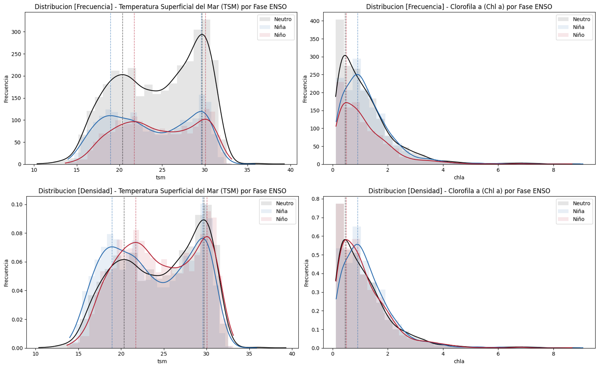
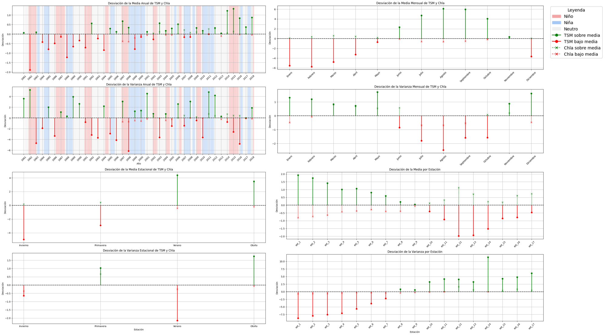
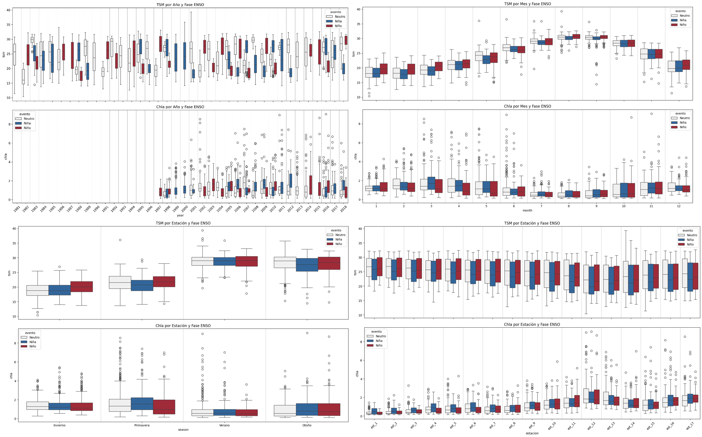
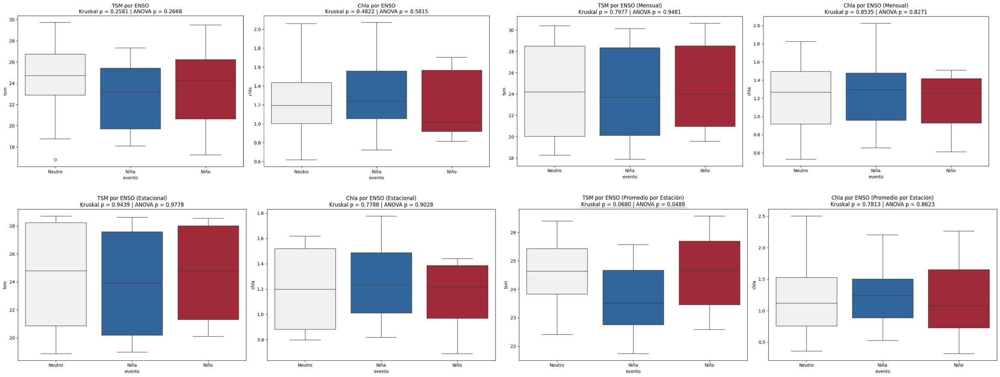
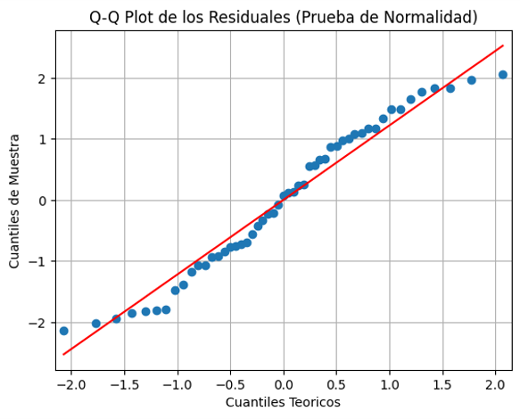
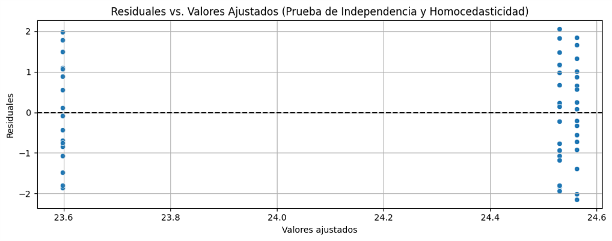
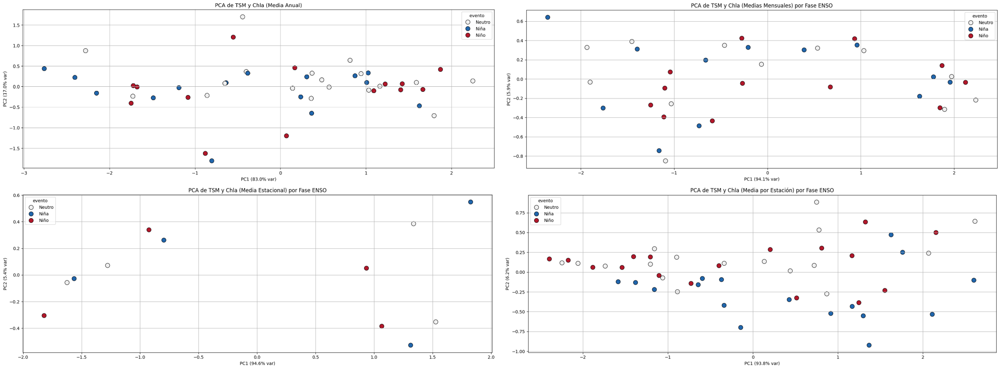
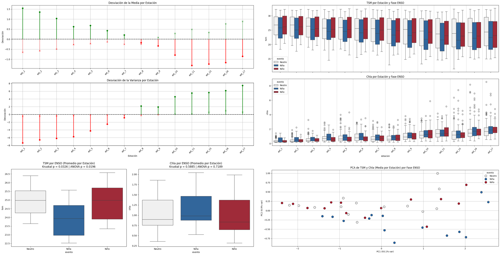

## Analisis del Efecto de las Fases **ENSO** en **TSM** y ****Chl a** a**

### Distribucion de las muestras segun Fase **ENSO**

Utilizando todas las muestras validas para ****TSM**** y ******Chl a** a**** a lo largo del periodo completo (**1981-2018**), y generando histogramas de frecuencia y densidad, uno para cada fase ****ENSO**** (Neutro, Niña y Niño), es posible destacar los siguientes puntos:

* La distribución de la **TSM** muestra una forma bimodal, con un pico alrededor de los 18–20 grados y otro en los 30 °C. Podria deberse a los cambios entre estaciones frías y cálidas, con alguna aportacion de las fases **ENSO**.
* En eventos Niño las **TSM** tienden a valores más altos, mientras que en eventos Niña se observan ligeros desplazamientos hacia valores más bajos.
* Para la ****Chl a** a**, la distribución tiene sesgo hacia la derecha, con alta frecuencia en valores bajos. Los eventos Niña presentan niveles de ****Chl a** a** un poco mayores en comparación con eventos Neutro y Niño. Esto podria significar una mayor presencia en temperaturas frías.
* A pesar de existir diferencias visuales en la distribución, la separación entre curvas no es muy grande, lo que podria sugerir que **ENSO** influye más no tiene un efecto directo o contundente en la variabilidad de **TSM** y ****Chl a** a**.

Es entonces que podriamos inferir que las fases **ENSO** sí inducen desplazamientos en las distribuciones de **TSM** y ****Chl a** a**, aunque los efectos varían en magnitud y dirección, dependiendo de la variable analizada.

### Fases **ENSO** a lo largo del tiempo en el Golfo de California

Antes de analizar el efecto de las fases **ENSO** en ****TSM**** y ******Chl a** a**** respecto a distintos intervalos de tiempo, se considero podria resultar interesante visualizar los periodos que abarca cada una de las fases a lo largo de los años incluidos en los datos. Para ello se representaron barras con resolución de mes a mes, donde podemos visualizar aproximadamente cuando comenzó una nueva fase y su duración.

Es notorio como se han tenido multiples periodos para cada una de las fases **ENSO**, predominando los periodos neutros.

Los periodos de fase Neutra suelen alcanzar mayores duraciones, de aproximadamente 2 años, solo competido por un periodo de fase Niña entre 1998 y 2001, el resto para Niña y Niño suelen estar por debajo del anio y medio de duración.

### Desviacion para **TSM** y ****Chl a** a** respecto a la Media y Varianza Media por agrupamientos temporales y espaciales

De acorde a los objetivos específicos del proyecto, se optó por agrupar los datos por distintos criterios temporales y espaciales.

Los grupos fueron:

* Interanual (Temporal - Comparativa entre años)
* Intraanual (Temporal - Comparativa por meses del anio)
* Estacional (Temporal - Comparativa por las 4 estaciones climatologicas del anio)
* Por Estacion de Medicion - (Espacial - Comparativas por las 17 estaciones de medicion ubicadas en el Golfo de California)

A continuacion se muestra una figura que contiene dos graficos de paleta para cada grupo. Cada gráfico contiene la información tanto de la **TSM** como de ****Chl a** a**, sin embargo la diferencia reside en que el gráfico ubicado en la parte superior muestra la desviacion respecto a la Media de los valores propios de cada variable, mientras que el gráfico de la parte inferior muestra la desviacion respecto a la Media de la Varianza para cada variable.

Observaciones por cada grupo:

* Interanual:
    * Se ven desviaciones negativas de la **TSM** en años con eventos Niña (1989 o 1999), haciendos sentido baja de **temperatura** usual de esta fase.
    * Durante eventos Niño (1997 o 2015), las desviaciones de **TSM** son en su mayoria positivas, indicando un incremento de **temperatura** significativo.
    * La **Chl a** tiene puntos de mayor variabilidad, pero disminuye en eventos Niño.

* Intraanual:
    * Los meses de verano (jul-sept) muestran desviaciones positivas más notorias en la **TSM**, concordando con el ciclo estacional y ademas podría estar acentuado en algunas instancias por eventos Niño.
    * La ****Chl a** a** muestra desviaciones negativas durante la segunda mitad del año, lo que podría relacionarse al incremento en la **TSM**.
    * La **TSM** responde en mayor medida al ciclo estacional, ****Chl a** a** muestra un comportamiento menos lineal o proporcional.

* Estacional:
    * Verano muestra las mayoria de las desviaciones positivas de la **TSM**.
    * Primavera e invierno muestran desviaciones negativas en ****Chl a** a** (menos calor y luz?)
    * El otoño es interesante puesto que mientras la **TSM** se mantiene estable, la ****Chl a** a** tiene mayor dispersión. Esto podria indicar la presencia de factores que no estamos contemplando.

* Por Estacion de Medicion:
    * La desviación de la **TSM** tiene diferencias entre estaciones, aunque reducidas. La distribucion parece ser más amplia en estaciones cercanas al norte.
    * Las estaciones de medicion al norte del Golfo muestran mayor variabilidad en ****Chl a** a** (geografia ?).
    * Esto sugiere que la variabilidad entre estaciones de medicion para la ****Chl a** a** es más marcada que para la **TSM**.

### Variacion en distribucion en relacion a tiempo y estaciones

Sabemos que la distribucion de los datos varia al categorizar por fase **ENSO**, y tambien se identificaron algunos patrones de cambio con los graficos de paleta.

Un proximo paso logico es analizar el cambio en la distribucion de los datos agrupados nuevamente por fase **ENSO**, pero a traves de los grupos espacio-temporales que estamos trabajando.

En este conjunto de graficos de caja podemos observar que:

* La ****Chl a** a** presenta una gran cantidad de valores extremos y outliers, especialmente durante eventos Neutro. Esto podria significar que hay otros factores que sobresalen cuando no hay eventos Niño o Niña.
* La comparación por mes refuerza el efecto del ciclo anual sobre el aumento en la **media** de la **TSM**, con valores consistentemente mayores en verano y otoño, mientras que ****Chl a** a** parece tener un efecto de reducir la variabilidad en ese mismo periodo.
* Al verlo por estaciones de medicion observamos que tanto la **media** de la **TSM** como de la ****Chl a** a** varian dependiendo la estacion, pero responden a las fases **ENSO** de forma variada y sin un efecto dramatico.

### Distribucion de las muestras segun Fase **ENSO**

En pasos previos, se profundizo un poco y se logro una mejor idea del comportamiento de las variables de la **TSM** y los niveles de Chla versus fases **ENSO**. Ahora bien, resulta interesante dar otro vistazo macro, agrupando el total de las muestras de ambas variables por grupo espacio-temporaln y por fase **ENSO** en graficos de caja.

Aqui se puede observar como:

* Los gráficos de caja permiten confirmar que el efecto de las fases **ENSO** es más notorio en **TSM**, con eventos Niña mostrando valores consistentemente más bajos.
* La ****Chl a** a** no presenta diferencias tan marcadas entre fases **ENSO** en la mayoría de agrupaciones.
* La única excepción estadísticamente relevante es el caso de la **TSM** por estación de medición, donde se obtuvo un p-valor de 0.0488 (**ANOVA**), sugiriendo diferencias significativas entre fases.

Como se menciona en el ultimo punto, ademas de los graficos, se realizaron analisis de **varianza**: **ANOVA** (parametrico) y **Kruskal-Wallis** (no parametrico). Los resultados se encuentran ubicados debajo del titulo de cada gráfico.

Es claro inspeccionando visualmente y en los **p-valores** resultantes de los analisis, que en la mayoria de los escenarios no existe una **varianza** notoria entre las medias de cada agrupación por fase **ENSO**. La excepcion es el caso de la **TSM** al agrupar los datos por estacion de medicion, y por fase **ENSO**.

Ahi se observa como los eventos Niña si aparentan una **media** más baja que el resto. Y los **p-valores** son muy cercanos al 0.05, de manera que hemos de ir nuevamente de lo general a lo particular, y validar los supuestos del **ANOVA**, de manera que determinemos la validez de lo observado.

### Pruebas - Validacion de Supuestos para **ANOVA**

#### Prueba de **Shapiro-Wilk** (**Normalidad**)

**Shapiro-Wilk**: W = 0.955, p = 0.0512

El valor de p = 0.0512 indica que no se puede rechazar la hipótesis nula de normalidad de los residuales al 95 % de confianza, aunque se encuentra justo en el límite. Esto sugiere que la distribución es aproximadamente normal, pero se debe complementar con visualizaciones.

El Q-Q plot muestra que los residuales se alinean bien con la línea de referencia, reforzando la validez del supuesto de normalidad.

#### Prueba de **Levene** (**Homocedasticidad**)

**Levene**: W = 0.295, p = 0.7460

El valor p = 0.7460 en la prueba de **Levene** indica que no hay evidencia suficiente para afirmar que las varianzas son distintas entre grupos, por lo tanto se asume homocedasticidad.

El gráfico de **residuos** vs. valores ajustados no evidencia patrón alguno ni heterocedasticidad, lo que respalda la validez del modelo **ANOVA**.

En conjunto, los supuestos del **ANOVA** se cumplen de manera razonable, generando mayor confianza al resultado encontrado en la **TSM** por estación de medicion versus fase **ENSO**.

### Pruebas con Analisis de Componentes Principales (**PCA**)

El análisis **PCA** para cada una de las agrupaciones espacio-temporales que hemos estado manejando revela que las dos primeras componentes explican entre 90–95 % de la **varianza** en la mayoría de los casos. Esto podria representar una alta capacidad de resumir la variabilidad.

Aunque no se observa una separación clara entre fases **ENSO**, si es posible apreciar una agrupación parcial de eventos Niño y eventos Niña hacia valores positivos y negativos del PC2, respectivamente.

Esto podria sugerir que el **ENSO** tiene un **impacto** multivariado, pero que dicho **impacto** puede estar enmascarado por factores verse favorecida con variables adicionales (geograficas, climaticas, etc.).

### Adicional - Repeticion de Pruebas Eliminando Estaciones de Medicion 12, 13 y 14

Se optó por realizar una prueba adicional con el caso estadisticamente significativo de **TSM** en Estaciones de Mediciones con fases **ENSO**. Se obtuvieron los siguientes resultados:

Podemos ver que a pesar de la eliminacion de estaciones, este caso sigue resaltando, pues ahora inclusive se redujeron más los **p-valores** para los analisis de **varianza** **ANOVA** y Kruskall-Wallis.

Esto sugiere que el efecto de las fases **ENSO** puede ser distinto en distintas zonas del Golfo de California, en este caso el evento Niña mostrando mayor influencia en las estaciones de medicion del norte.